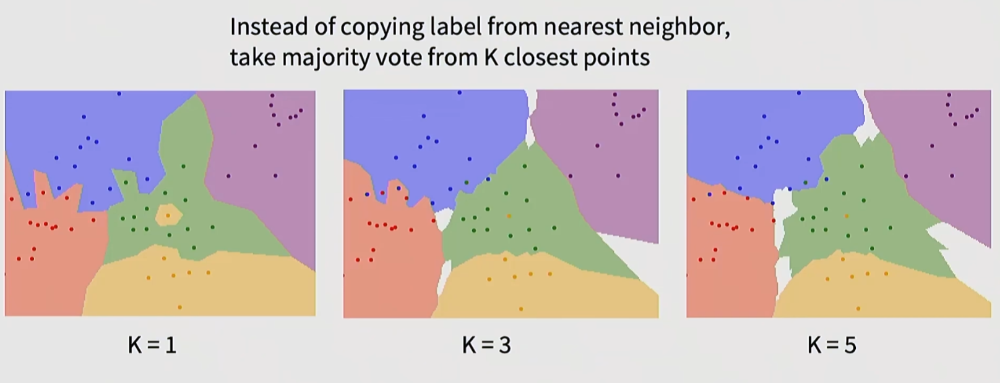
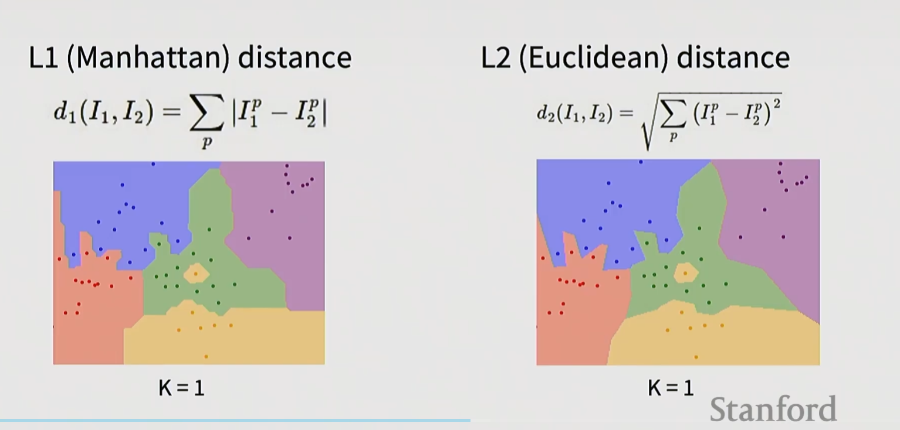
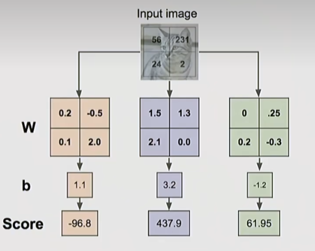
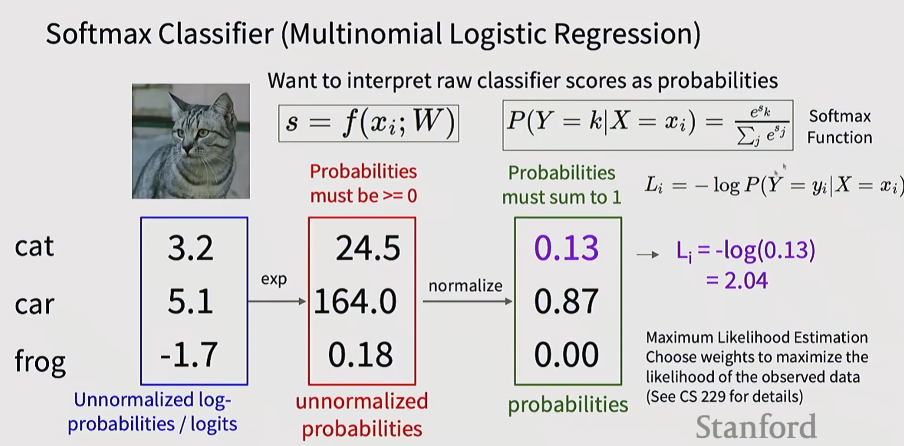

## Machine Learning: Data-Driven Approach

1. Collect a dataset of images and labels  
2. Use Machine Learning algorithms to train a classifier  
3. Evaluate the classifier on new images  

## K-nearest neighbors

### Distance metrix

## Linear

## Softmax classifier

1. Measuring the Gap Between Prediction and Truth  
A linear classifier outputs a prediction (e.g., a score or probability).  
The loss function quantifies the error between the **predicted value** and the **true label**.  
Example: If the true label is $1$ but the model outputs a probability of $0.2$, the loss function will assign a relatively large penalty.

2. Guiding Model Learning (Optimization Objective)  
The training objective is to **minimize the loss function**.  
In Gradient Descent, the loss function indicates "which direction to adjust parameters to make predictions closer to true labels".  
Without a loss function, the model would have no learning objective.
