# 课程笔记：自监督学习（Lecture 10）

## 一、自监督学习概述

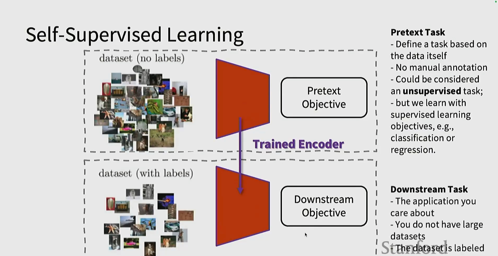

**核心思想**：
- 使用无标签数据集（dataset without labels）
- 基于数据本身定义一个**预训练任务（Pretext Task）**
- 无需人工标注
- 可视为一种**无监督任务**，但使用有监督学习目标（如分类或回归）进行训练

**两阶段流程**：
1. **预训练阶段**：在大量无标签数据上训练编码器，学习通用表示
2. **下游任务**：在少量有标签数据上微调，应用于实际关心的任务

**下游任务（Downstream Task）**：
- 你真正关心的应用
- 通常没有大规模数据集
- 数据集已标注

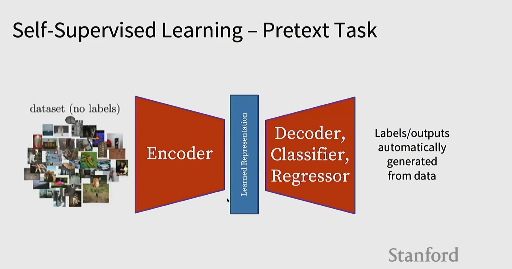

**典型架构**：
- 编码器（Encoder）→ 学习表示（Learned Representation）→ 解码器/分类器/回归器（Decoder, Classifier, Regressor）
- 标签/输出从数据本身自动生成

## 二、常见预训练任务

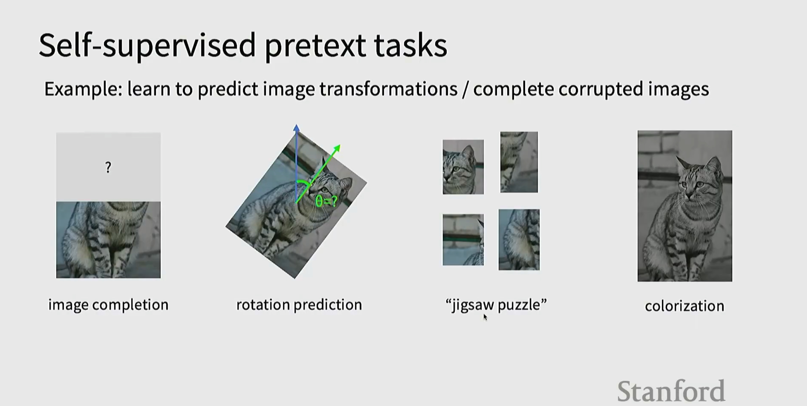

**经典预训练任务**：
1. **图像补全（Image Completion）**：根据部分图像预测缺失区域
2. **旋转预测（Rotation Prediction）**：预测图像旋转角度（如 90°）
3. **拼图还原（Jigsaw Puzzle）**：将打乱的图像块重新排序
4. **上色（Colorization）**：从灰度图预测彩色图

## 三、自监督学习评估方法

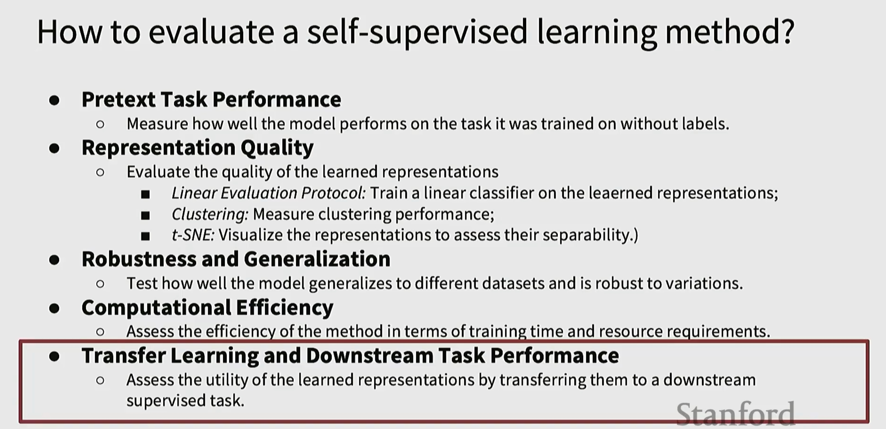

**主要评估维度**：

1. **预训练任务性能（Pretext Task Performance）**
   - 衡量模型在无标签训练任务上的表现

2. **表示质量（Representation Quality）**
   - **线性评估协议（Linear Evaluation Protocol）**：在学习的表示上训练线性分类器
   - **聚类（Clustering）**：衡量聚类性能
   - **t-SNE**：可视化表示以评估其可分离性

3. **鲁棒性和泛化能力（Robustness and Generalization）**
   - 测试模型在不同数据集上的泛化能力和对变化的鲁棒性

4. **计算效率（Computational Efficiency）**
   - 评估训练时间和资源需求

5. **迁移学习和下游任务性能（Transfer Learning and Downstream Task Performance）**
   - 通过迁移到下游监督任务来评估学习表示的实用性

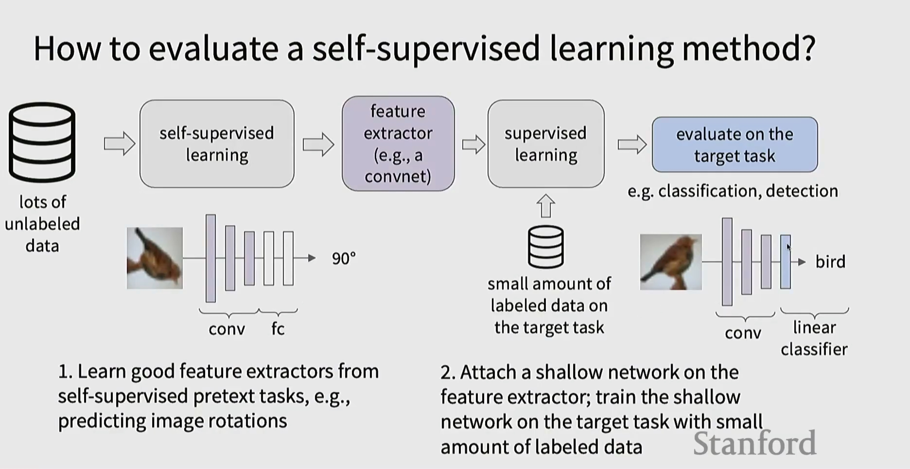

**标准评估流程**：
1. 大量无标签数据 → 自监督学习 → 特征提取器（如卷积网络）
2. 少量有标签数据 → 监督学习（冻结特征提取器，仅训练浅层网络）
3. 在目标任务上评估（如分类、检测）

**两步策略**：
1. 从自监督预训练任务中学习良好的特征提取器（如预测图像旋转）
2. 在特征提取器上附加浅层网络；在目标任务上用少量标注数据训练浅层网络

## 四、具体预训练任务详解

### 4.1 预测相对图块位置

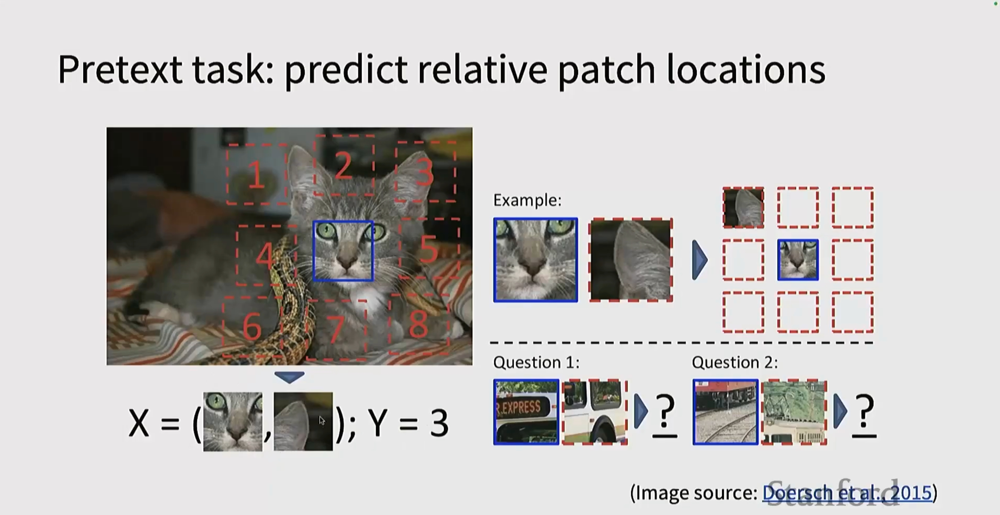

**任务描述**：
- 将图像分成网格（如 3×3），从中提取两个 patch
- 输入：两个 patch（X = (patch1, patch2)）
- 输出：预测它们的相对位置关系（Y = 位置索引）

**示例问题**：
- 给定参考 patch 和目标 patch，预测目标 patch 在哪个位置

*参考*：Doersch et al., 2015

### 4.2 解拼图谜题（Jigsaw Puzzle）

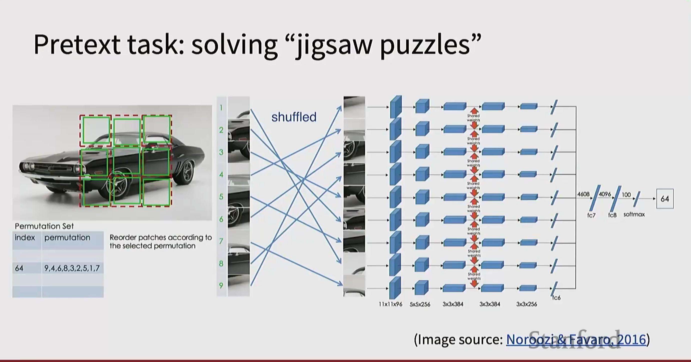

**任务流程**：
1. 将图像分割成多个 patch（如 3×3 网格）
2. 随机打乱 patch 顺序（置换）
3. 网络需要预测正确的置换索引

**网络架构**：
- 每个打乱的 patch 输入独立的卷积分支
- 特征在中间层共享权重
- 最终输出置换集合的索引（如 64 种预定义置换中的哪一种）

*参考*：Noroozi & Favaro, 2016

### 4.3 图像修复（Inpainting）

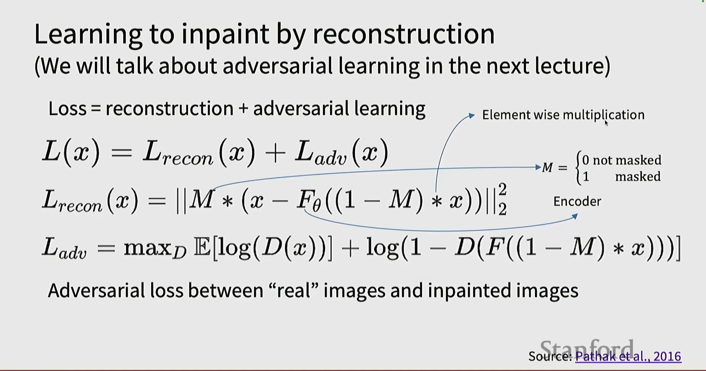

**损失函数**：重建损失 + 对抗损失

$$L(x) = L_{recon}(x) + L_{adv}(x)$$

**重建损失**：
$$L_{recon}(x) = ||M * (x - F_\theta((1-M) * x))||_2^2$$

- M：掩码（0 = 未掩码，1 = 已掩码）
- $F_\theta$：编码器
- 逐元素相乘

**对抗损失**：
$$L_{adv} = \max_D \mathbb{E}[\log(D(x))] + \log(1 - D(F((1-M) * x)))$$

在"真实"图像和修复图像之间的对抗损失。

*参考*：Pathak et al., 2016

### 4.4 图像上色

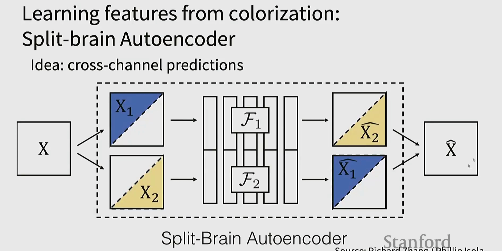

**Split-Brain Autoencoder 思想**：跨通道预测

- 将图像 X 分成两部分：$X_1$（如亮度通道）和 $X_2$（如色度通道）
- 两个独立的编码器 $\mathcal{F}_1$ 和 $\mathcal{F}_2$
- 交叉预测：$X_1 \rightarrow \hat{X}_2$，$X_2 \rightarrow \hat{X}_1$

**目标**：学习能够相互预测的特征表示。

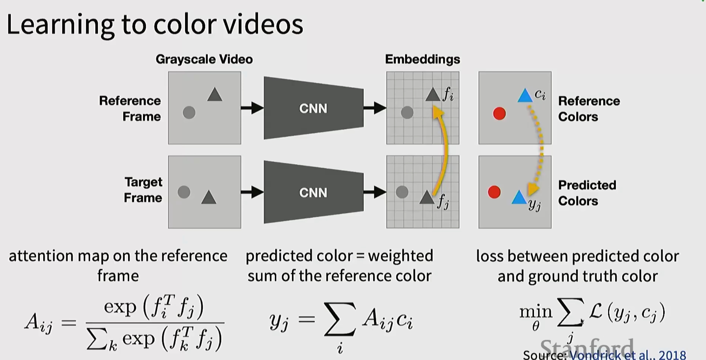

**视频上色任务**：
- 参考帧（Reference Frame）和目标帧（Target Frame）分别输入 CNN
- 生成嵌入（Embeddings）
- 在参考帧上计算注意力图：$A_{ij} = \frac{\exp(f_i^T f_j)}{\sum_k \exp(f_k^T f_j)}$
- 预测颜色 = 参考颜色的加权和：$y_j = \sum_i A_{ij} c_i$
- 损失：预测颜色与真实颜色之间的差异

*参考*：Vondrick et al., 2018

### 4.5 掩码自编码器（Masked Autoencoders, MAE）

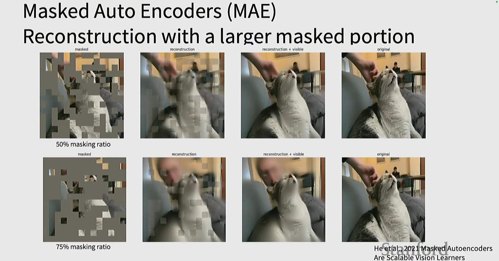

**核心思想**：用更大的掩码比例进行重建

**示例**：
- 50% 掩码率和 75% 掩码率的重建效果
- 展示从掩码图像 → 重建 → 重建+可见 → 原图的过程

*参考*：He et al., 2021 "Masked Autoencoders Are Scalable Vision Learners"

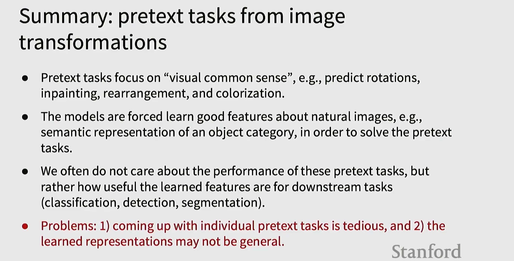

**预训练任务总结**：
- 预训练任务关注"视觉常识"，如预测旋转、修复、重排和上色
- 模型被迫学习自然图像的良好特征，如对象类别的语义表示，以解决预训练任务
- 我们通常不关心这些预训练任务的性能，而是关心学习的特征对下游任务（分类、检测、分割）的有用性

**问题**：
1. 设计单个预训练任务很繁琐
2. 学习的表示可能不够通用

## 五、对比表示学习（Contrastive Representation Learning）

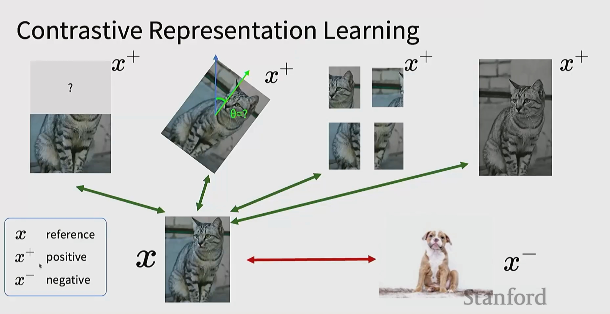

**核心思想**：
- 给定参考样本 $x$
- 生成正样本 $x^+$（与 $x$ 相似的样本）
- 负样本 $x^-$（与 $x$ 不同的样本）

**目标**：
- 让正样本在特征空间中靠近参考样本
- 让负样本在特征空间中远离参考样本

**样本生成**：
- $x^+$：通过图像变换（如旋转、裁剪、拼图、上色等）
- $x^-$：其他图像（如狗的图像）

### 5.1 对比学习的数学表述

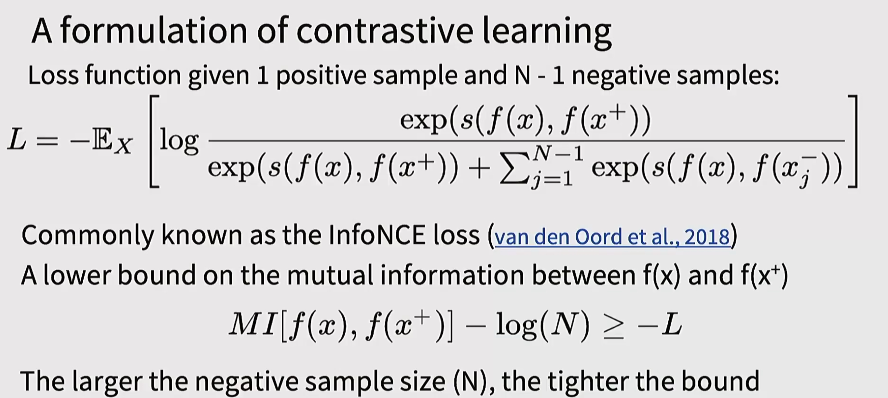

**InfoNCE 损失函数**：

给定 1 个正样本和 N-1 个负样本：

$$L = -\mathbb{E}_X \left[ \log \frac{\exp(s(f(x), f(x^+)))}{\exp(s(f(x), f(x^+))) + \sum_{j=1}^{N-1} \exp(s(f(x), f(x_j^-)))} \right]$$

**解释**：
- 常被称为 **InfoNCE 损失**（van den Oord et al., 2018）
- 是 $f(x)$ 和 $f(x^+)$ 之间互信息的下界：

$$MI[f(x), f(x^+)] - \log(N) \geq -L$$

**关键性质**：负样本数量（N）越大，界越紧

*参考*：van den Oord et al., 2018

### 5.2 MAE 解码器

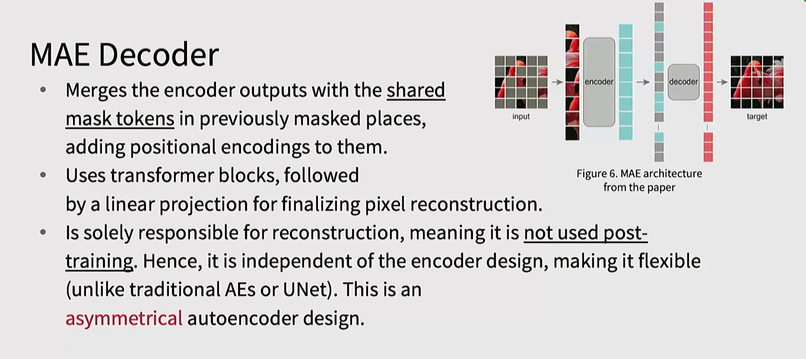

**MAE 解码器特点**：
- 将编码器输出与共享的掩码 token 合并到之前被掩码的位置
- 为它们添加位置编码
- 使用 Transformer 块，然后线性投影以完成像素重建
- 仅负责重建，训练后**不使用**
- 因此独立于编码器设计，使其灵活（不像传统 AE 或 U-Net）
- 这是一种**非对称自编码器设计**

---

**关键要点**：
- 自监督学习通过预训练任务从无标签数据中学习有用表示
- 常见预训练任务包括图像补全、旋转预测、拼图、上色等
- 对比学习通过拉近相似样本、推远不同样本来学习表示
- InfoNCE 损失是对比学习的核心，负样本越多效果越好
- MAE 通过大比例掩码重建实现高效的自监督学习
- 评估重点在于下游任务性能，而非预训练任务本身

*图片来源*：Stanford CS231n 课程材料
