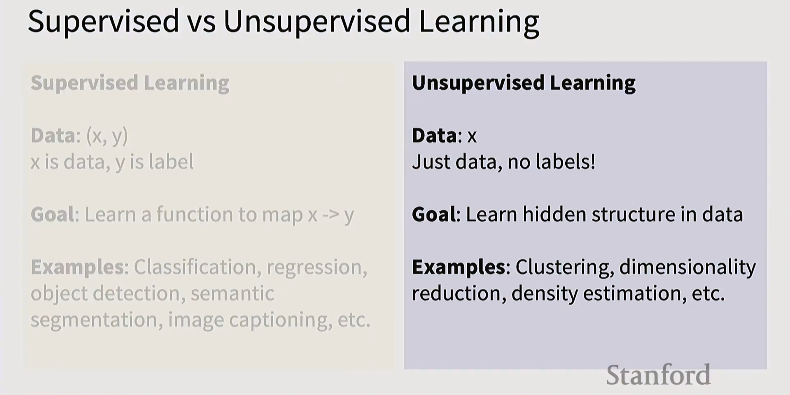
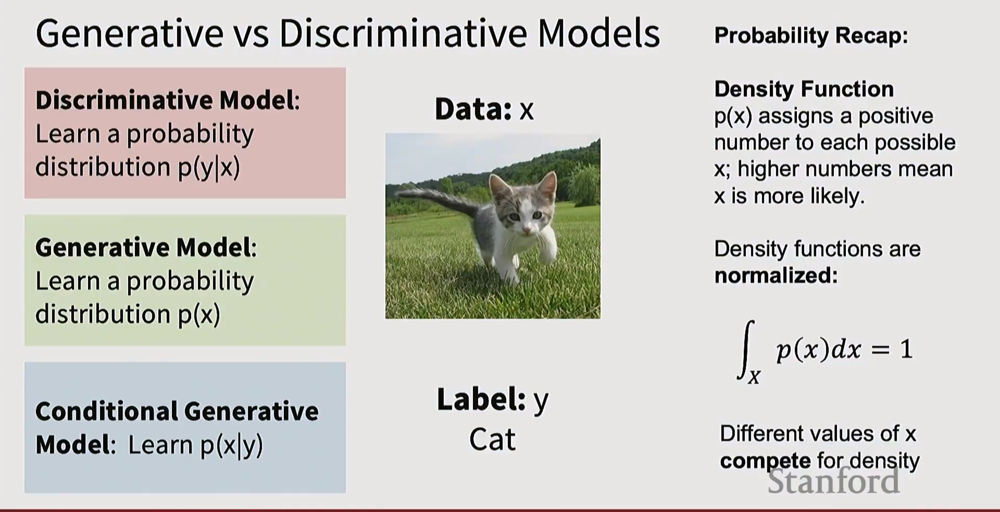
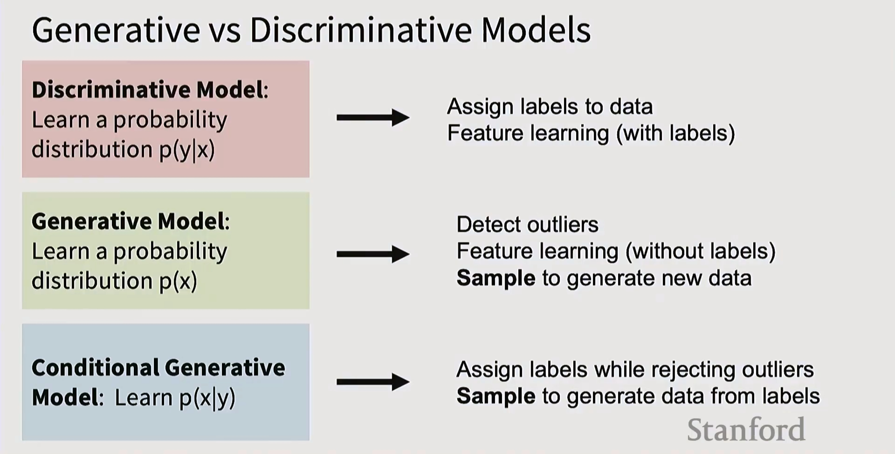
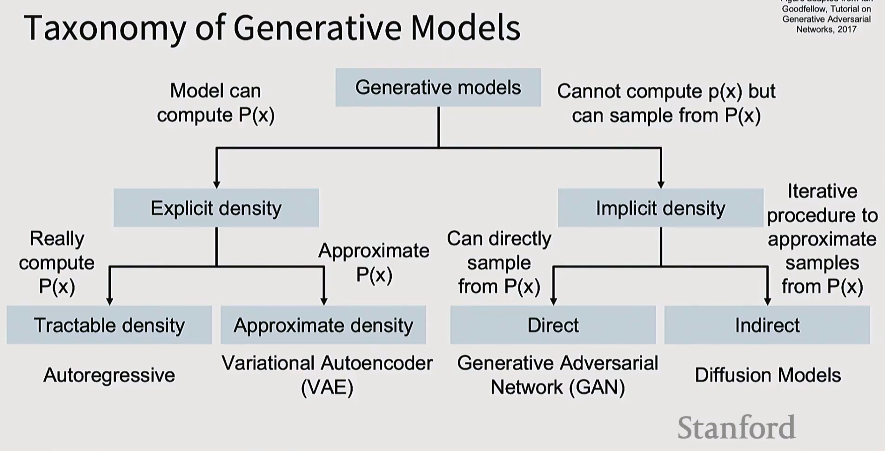
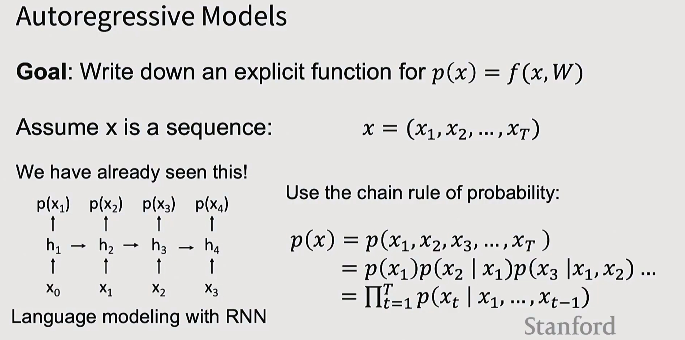
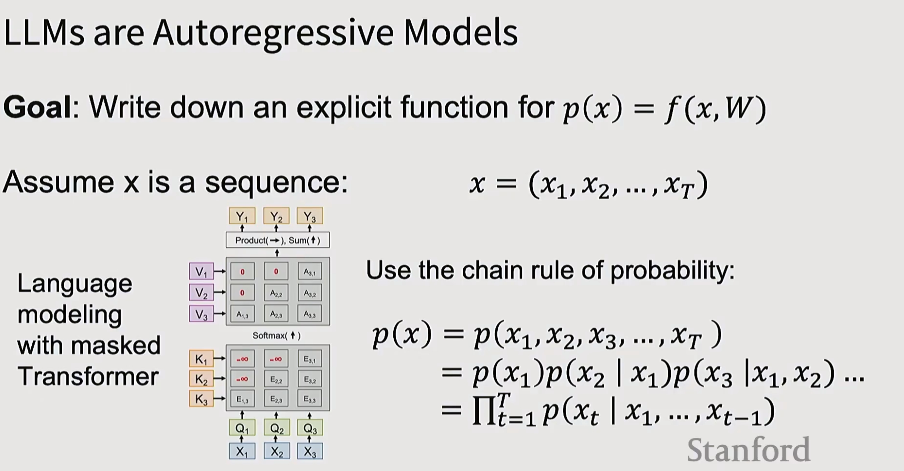
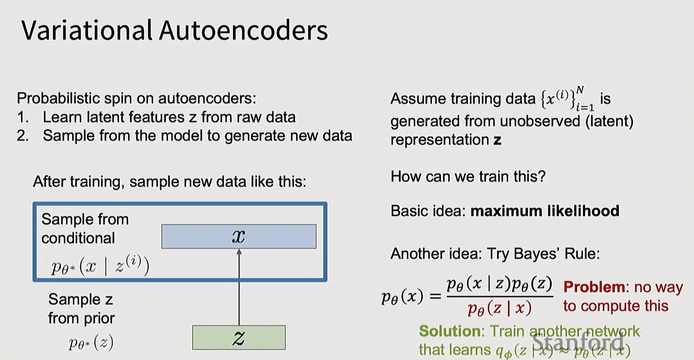
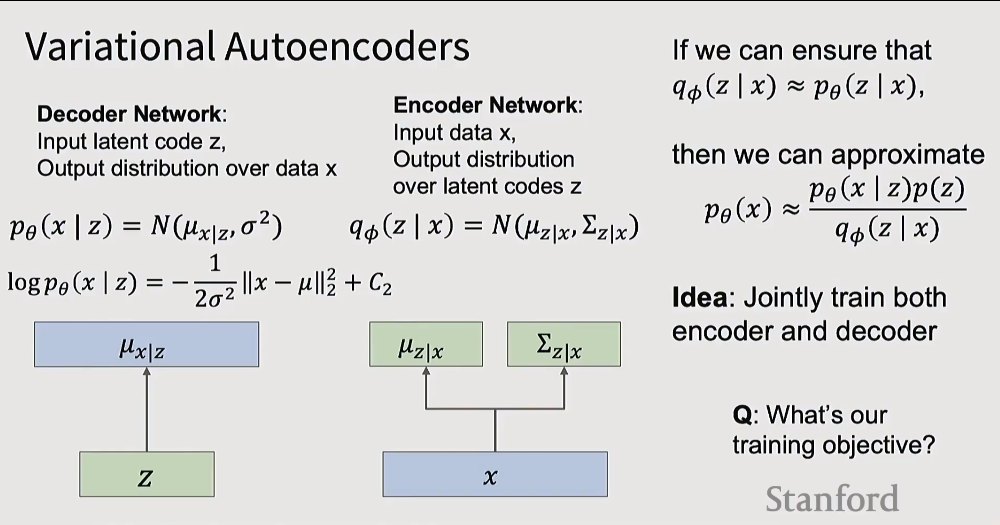
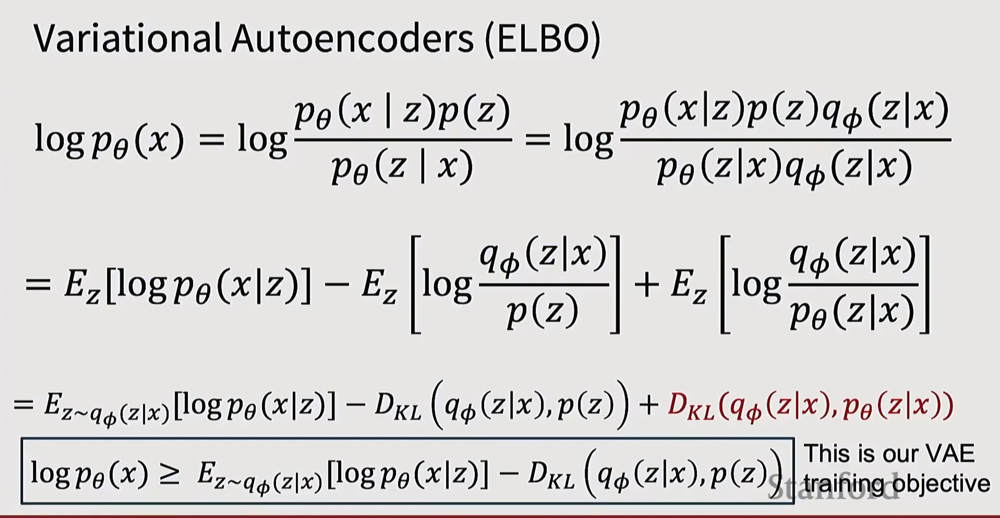
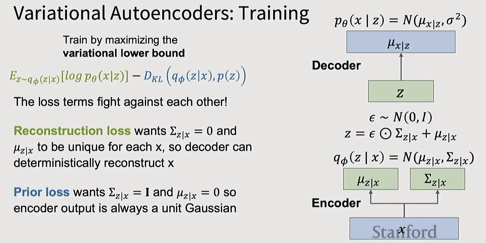

# 课程笔记：生成模型（Lecture 11）

## 一、监督学习 vs 无监督学习



### 监督学习（Supervised Learning）

**数据**：(x, y)
- x 是数据，y 是标签

**目标**：学习一个函数来映射 x → y

**示例**：分类、回归、目标检测、语义分割、图像描述等

### 无监督学习（Unsupervised Learning）

**数据**：x
- 只有数据，没有标签！

**目标**：学习数据中的隐藏结构

**示例**：聚类、降维、密度估计等

## 二、判别模型 vs 生成模型



### 三种模型类型

**判别模型（Discriminative Model）**：
- 学习概率分布 p(y|x)
- 给定数据 x，预测标签 y

**生成模型（Generative Model）**：
- 学习概率分布 p(x)
- 对数据本身建模

**条件生成模型（Conditional Generative Model）**：
- 学习 p(x|y)
- 给定标签 y，生成数据 x

### 概率回顾：密度函数

**密度函数（Density Function）**：
- p(x) 为每个可能的 x 分配一个正数
- 数值越大意味着 x 越可能出现

**密度函数是归一化的**：
$$\int_X p(x)dx = 1$$

不同的 x 值竞争密度（概率质量）

---


**生成模型的挑战**：

所有可能的图像都在竞争概率质量。

**需要深刻理解**：
- 狗更可能坐着还是站着？
- 三条腿的狗比三条手臂的猴子更可能吗？

这需要对视觉世界有深入的理解。

---



### 三种模型的应用场景

**判别模型**：学习 p(y|x)
- → 为数据分配标签
- → 特征学习（有标签）

**生成模型**：学习 p(x)
- → 检测异常值
- → 特征学习（无标签）
- → **采样生成新数据**

**条件生成模型**：学习 p(x|y)
- → 在拒绝异常值的同时分配标签
- → **从标签中采样生成数据**

## 三、生成模型分类法



**生成模型的两大类**：

1. **显式密度（Explicit Density）**
   - 模型可以计算 P(x)
   - **可处理密度（Tractable Density）**：真正能计算 P(x)
     - 示例：**自回归模型（Autoregressive）**
   - **近似密度（Approximate Density）**：近似 P(x)
     - 示例：**变分自编码器（VAE）**

2. **隐式密度（Implicit Density）**
   - 不能计算 p(x)，但可以从 P(x) 采样
   - **直接采样（Direct）**：可以直接从 P(x) 采样
     - 示例：**生成对抗网络（GAN）**
   - **间接采样（Indirect）**：通过迭代过程近似从 P(x) 采样
     - 示例：**扩散模型（Diffusion Models）**

*参考*：改编自 Goodfellow 的 GAN 教程，2017

## 四、自回归模型（Autoregressive Models）



**目标**：为 $p(x) = f(x, W)$ 写下一个显式函数

**假设 x 是一个序列**：$x = (x_1, x_2, ..., x_T)$

我们已经见过这个了！使用**概率链式法则**：

$$p(x) = p(x_1, x_2, x_3, ..., x_T)$$
$$= p(x_1)p(x_2 | x_1)p(x_3 | x_1, x_2) ...$$
$$= \prod_{t=1}^{T} p(x_t | x_1, ..., x_{t-1})$$

**示例**：使用 RNN 的语言建模
- 每个时间步预测下一个 token：p(x₁) → p(x₂) → p(x₃) → p(x₄)

---



**大语言模型（LLMs）是自回归模型**

**目标**：为 $p(x) = f(x, W)$ 写下一个显式函数

**假设 x 是一个序列**：$x = (x_1, x_2, ..., x_T)$

**使用概率链式法则**：

$$p(x) = p(x_1, x_2, x_3, ..., x_T)$$
$$= p(x_1)p(x_2 | x_1)p(x_3 | x_1, x_2) ...$$
$$= \prod_{t=1}^{T} p(x_t | x_1, ..., x_{t-1})$$

**示例**：使用掩码 Transformer 的语言建模
- Transformer 架构图展示了 V、K、Q 的计算流程
- 通过 Softmax 和注意力机制预测下一个 token

## 五、变分自编码器（Variational Autoencoders, VAE）



**自编码器的概率化版本**：
1. 从原始数据学习潜在特征 z
2. 从模型采样生成新数据

**训练后，采样新数据的方式**：

```
从先验采样 z: p_θ*(z)
从条件分布采样 x: p_θ*(x | z^(i))
```

**假设训练数据** $\{x^{(i)}\}_{i=1}^{N}$ 是从未观测到的（潜在）表示 z 生成的。

**如何训练？**

**基本思想：最大似然（Maximum Likelihood）**

**另一个思路：尝试贝叶斯规则**：

$$p_\theta(x) = \frac{p_\theta(x | z)p_\theta(z)}{p_\theta(z | x)}$$

**问题**：无法计算这个

**解决方案**：训练另一个网络来学习 $q_\phi(z | x) \approx p_\theta(z | x)$

---



**解码器网络（Decoder Network）**：
- 输入潜在编码 z
- 输出数据 x 上的分布

$$p_\theta(x | z) = N(\mu_{x|z}, \sigma^2)$$

$$\log p_\theta(x | z) = -\frac{1}{2\sigma^2} ||x - \mu||_2^2 + C_2$$

**编码器网络（Encoder Network）**：
- 输入数据 x
- 输出潜在编码 z 上的分布

$$q_\phi(z | x) = N(\mu_{z|x}, \Sigma_{z|x})$$

**如果我们能确保** $q_\phi(z | x) \approx p_\theta(z | x)$，

**那么我们可以近似**：

$$p_\theta(x) \approx \frac{p_\theta(x | z)p(z)}{q_\phi(z | x)}$$

**思路**：联合训练编码器和解码器

**Q：我们的训练目标是什么？**

---



**变分自编码器（ELBO）**

通过数学推导，最终得到 VAE 的训练目标：

$$\log p_\theta(x) = \log \frac{p_\theta(x | z)p(z)}{p_\theta(z | x)} = \log \frac{p_\theta(x|z)p(z)q_\phi(z|x)}{p_\theta(z|x)q_\phi(z|x)}$$

$$= E_z[\log p_\theta(x|z)] - E_z\left[\log \frac{q_\phi(z|x)}{p(z)}\right] + E_z\left[\log \frac{q_\phi(z|x)}{p_\theta(z|x)}\right]$$

$$= E_{z \sim q_\phi(z|x)}[\log p_\theta(x|z)] - D_{KL}(q_\phi(z|x), p(z)) + D_{KL}(q_\phi(z|x), p_\theta(z|x))$$

**证据下界（Evidence Lower Bound, ELBO）**：

$$\boxed{\log p_\theta(x) \geq E_{z \sim q_\phi(z|x)}[\log p_\theta(x|z)] - D_{KL}(q_\phi(z|x), p(z))}$$

**这就是我们的 VAE 训练目标**

---



**变分自编码器：训练**

$$p_\theta(x | z) = N(\mu_{x|z}, \sigma^2)$$

**通过最大化变分下界来训练**：

$$E_{z \sim q_\phi(z|x)}[\log p_\theta(x|z)] - D_{KL}(q_\phi(z|x), p(z))$$

**两个损失项相互对抗！**

**重建损失（Reconstruction Loss）** 希望 $\Sigma_{z|x} = 0$ 且 $\mu_{z|x}$ 对每个 x 都是唯一的，这样解码器可以确定性地重建 x

**先验损失（Prior Loss）** 希望 $\Sigma_{z|x} = I$ 且 $\mu_{z|x} = 0$，这样编码器输出始终是单位高斯分布

**架构图**：
- 输入 x → 编码器 → $\mu_{z|x}$, $\Sigma_{z|x}$
- z = ε ⊙ Σ_{z|x} + μ_{z|x}，其中 ε ~ N(0, I)
- z → 解码器 → $\mu_{x|z}$
- 计算 $q_\phi(z | x) = N(\mu_{z|x}, \Sigma_{z|x})$

---

**关键要点**：
- 监督学习使用标签，无监督学习发现数据结构
- 生成模型学习数据分布 p(x)，可用于生成新样本
- 自回归模型通过链式法则显式建模序列概率
- VAE 通过编码器-解码器结构学习潜在表示
- VAE 优化 ELBO（证据下界）作为训练目标
- 重建损失和先验损失在 VAE 中相互平衡

*图片来源*：Stanford CS231n 课程材料
