# 课程笔记：生成对抗网络与扩散模型（Lecture 12）


## 一、生成对抗网络（Generative Adversarial Networks, GAN）

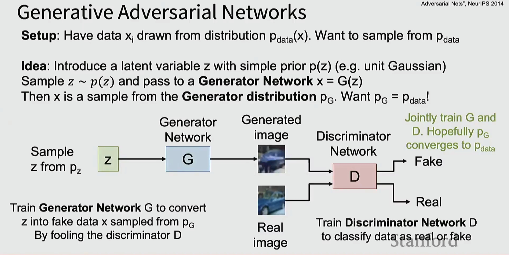

### GAN 基本原理

**设置**：有数据 $x_i$ 从分布 $p_{data}(x)$ 中抽取，想要从 $p_{data}$ 采样

**核心思想**：引入一个潜在变量 z，具有简单的先验 p(z)（如单位高斯分布）
- 从 $z \sim p(z)$ 采样，并传递给**生成器网络** $x = G(z)$
- 那么 x 就是从**生成器分布** $p_G$ 中的样本
- **目标**：$p_G = p_{data}$！

### GAN 训练机制

**联合训练 G 和 D**，希望 $p_G$ 收敛到 $p_{data}$

**架构**：
- 从 $p_z$ 采样 z → 生成器网络 G → 生成图像 → 判别器网络 D → 输出 Fake
- 真实图像 → 判别器网络 D → 输出 Real

**两个网络的任务**：
1. 训练**生成器网络 G**：将 z 转换为假数据 x（从 $p_G$ 采样），通过欺骗判别器 D
2. 训练**判别器网络 D**：将数据分类为真实或虚假

*参考*：Goodfellow et al, "Generative Adversarial Nets", NeurIPS 2014

---

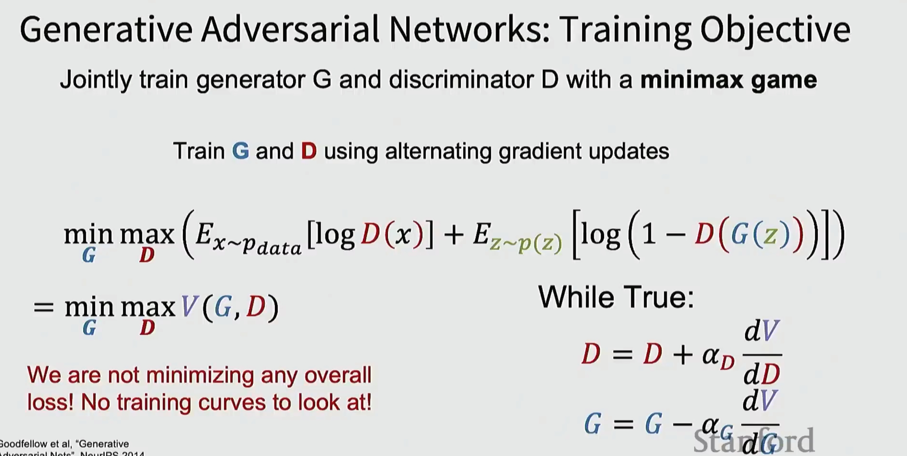

### GAN 训练目标

联合训练生成器 G 和判别器 D，使用 **minimax 博弈**

使用交替梯度更新训练 G 和 D：

$$\min_G \max_D \left( E_{x \sim p_{data}}[\log D(x)] + E_{z \sim p(z)}[\log(1 - D(G(z)))] \right)$$

$$= \min_G \max_D V(G, D)$$

**训练循环**：
```
While True:
    D = D + α_D * dV/dD
    G = G - α_G * dV/dG
```

**我们不是在最小化任何总体损失！没有训练曲线可看！**

*参考*：Goodfellow et al, "Generative Adversarial Nets", NeurIPS 2014

---

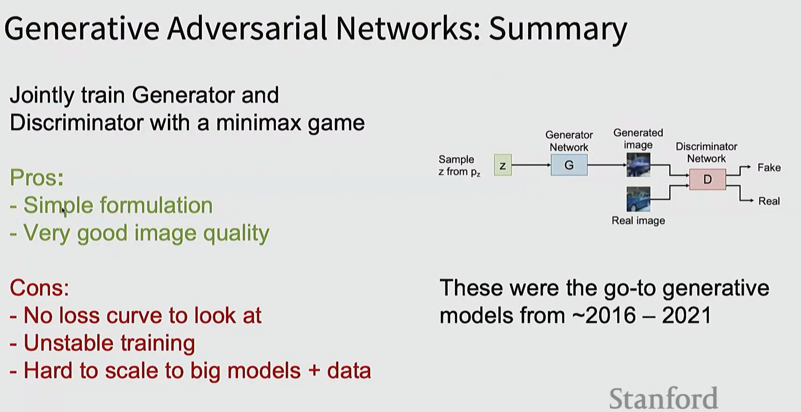

### GAN 总结

联合训练生成器和判别器，使用 minimax 博弈

**优点**：
- 简单的公式
- 非常好的图像质量

**缺点**：
- 没有损失曲线可看
- 训练不稳定
- 难以扩展到大模型 + 数据

**历史地位**：这些是 ~2016 – 2021 年的主流生成模型

## 二、扩散模型（Diffusion Models）

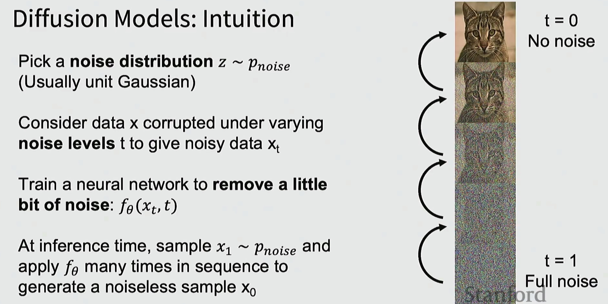

### 扩散模型：直觉

**选择一个噪声分布** $z \sim p_{noise}$（通常是单位高斯分布）

**考虑数据 x 在不同噪声水平 t 下被破坏**，得到噪声数据 $x_t$

**训练一个神经网络来去除一点点噪声**：$f_\theta(x_t, t)$

**在推理时**，采样 $x_1 \sim p_{noise}$，然后多次依序应用 $f_\theta$ 来生成无噪声样本 $x_0$

**可视化示例**：
- t = 0：无噪声（清晰的猫图像）
- 逐步添加噪声...
- t = 1：完全噪声（纯噪声图像）

---

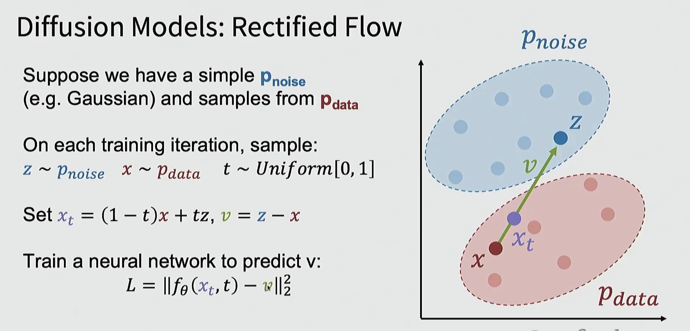

### 扩散模型：Rectified Flow

假设我们有一个简单的 $p_{noise}$（如高斯分布）和来自 $p_{data}$ 的样本

**在每次训练迭代中，采样**：
- $z \sim p_{noise}$
- $x \sim p_{data}$
- $t \sim Uniform[0, 1]$

**设置** $x_t = (1-t)x + tz$，$v = z - x$

**训练神经网络预测 v**：
$$L = ||f_\theta(x_t, t) - v||_2^2$$

**几何解释**：
- 蓝色区域：$p_{noise}$ 分布
- 红色区域：$p_{data}$ 分布
- 向量 v 指向从数据点 x 到噪声点 z 的方向
- $x_t$ 是两者之间的插值点

---

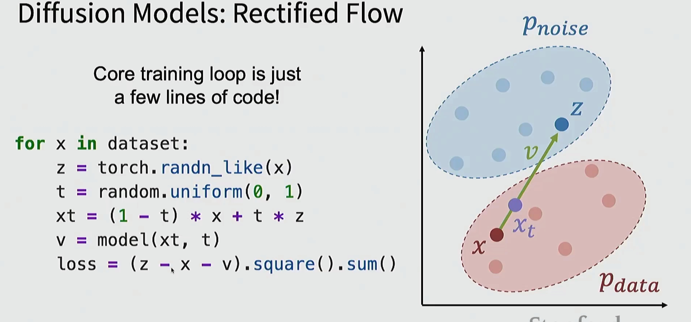

### Rectified Flow：实现

**核心训练循环只需几行代码！**

```python
for x in dataset:
    z = torch.randn_like(x)
    t = random.uniform(0, 1)
    xt = (1 - t) * x + t * z
    v = model(xt, t)
    loss = (z - x - v).square().sum()
```

**简洁优雅的实现**

---

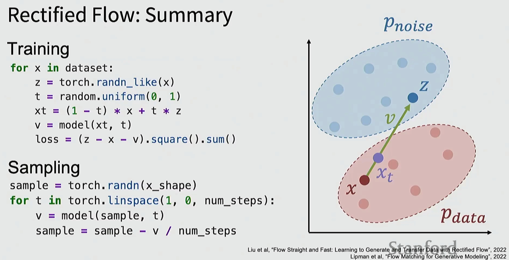

### Rectified Flow：总结

**训练**：
```python
for x in dataset:
    z = torch.randn_like(x)
    t = random.uniform(0, 1)
    xt = (1 - t) * x + t * z
    v = model(xt, t)
    loss = (z - x - v).square().sum()
```

**采样**：
```python
sample = torch.randn(x_shape)
for t in torch.linspace(1, 0, num_steps):
    v = model(sample, t)
    sample = sample - v / num_steps
```

**几何解释**：
- 从噪声分布 $p_{noise}$ 开始
- 通过学习的向量场 v 逐步移动到数据分布 $p_{data}$

*参考*：
- Liu et al, "Flow Straight and Fast: Learning to Generate and Transfer Data with Rectified Flow", 2022
- Lipman et al, "Flow Matching for Generative Modeling", 2022

---

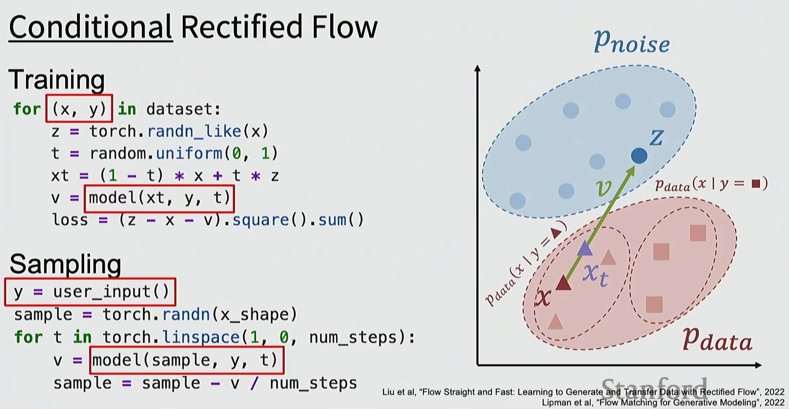

### 条件 Rectified Flow

**训练**：
```python
for (x, y) in dataset:
    z = torch.randn_like(x)
    t = random.uniform(0, 1)
    xt = (1 - t) * x + t * z
    v = model(xt, y, t)
    loss = (z - x - v).square().sum()
```

**采样**：
```python
y = user_input()
sample = torch.randn(x_shape)
for t in torch.linspace(1, 0, num_steps):
    v = model(sample, y, t)
    sample = sample - v / num_steps
```

**关键修改**：
- 训练时传入标签 y：`model(xt, y, t)`
- 采样时由用户指定 y

**几何解释**：
- 可以为不同的类别 y 学习不同的数据分布 $p_{data}(x | y = \square)$

*参考*：Liu et al, "Flow Straight and Fast: Learning to Generate and Transfer Data with Rectified Flow", 2022

---

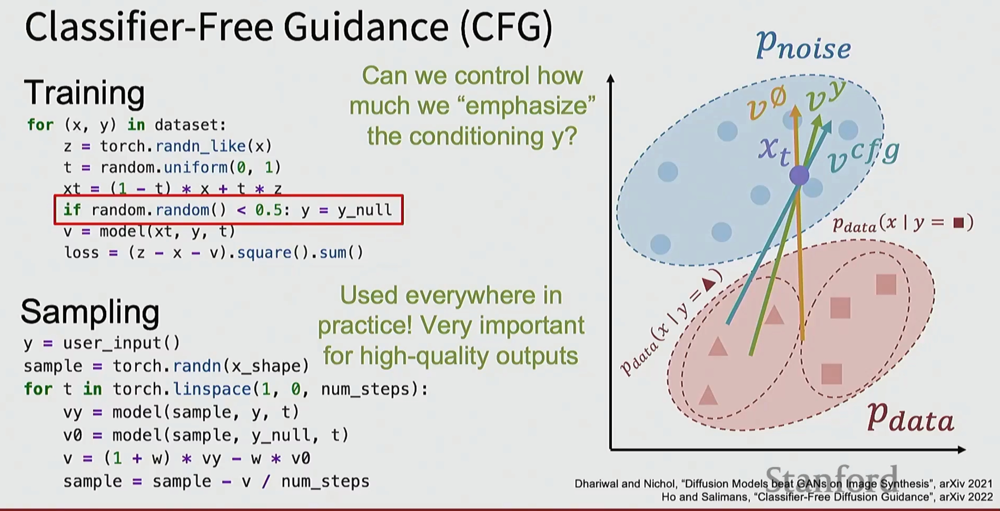

### 无分类器引导（Classifier-Free Guidance, CFG）

**训练**：
```python
for (x, y) in dataset:
    z = torch.randn_like(x)
    t = random.uniform(0, 1)
    xt = (1 - t) * x + t * z
    if random.random() < 0.5: y = y_null
    v = model(xt, y, t)
    loss = (z - x - v).square().sum()
```

**采样**：
```python
y = user_input()
sample = torch.randn(x_shape)
for t in torch.linspace(1, 0, num_steps):
    vy = model(sample, y, t)
    v0 = model(sample, y_null, t)
    v = (1 + w) * vy - w * v0
    sample = sample - v / num_steps
```

**核心思想**：我们能否控制对条件 y 的"强调"程度？

**关键修改**：
- 训练时随机将 y 设为 null：`if random.random() < 0.5: y = y_null`
- 采样时计算两个向量并加权组合：`v = (1 + w) * vy - w * v0`

**CFG 在实践中无处不在！对高质量输出非常重要**

**几何解释**：
- $v^y$：条件向量
- $v^0$：无条件向量
- $v^{cfg}$：CFG 引导向量，加强条件影响

*参考*：
- Dhariwal and Nichol, "Diffusion Models Beat GANs on Image Synthesis", arXiv 2021
- Ho and Salimans, "Classifier-Free Diffusion Guidance", arXiv 2022

## 三、潜在扩散模型（Latent Diffusion Models, LDMs）

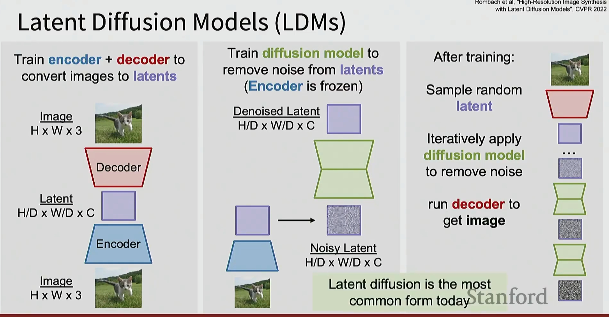

### 潜在扩散模型（LDMs）

**三阶段流程**：

1. **训练编码器 + 解码器**：将图像转换为潜在表示
   - 图像 (H × W × 3) → 编码器 → 潜在表示 (H/D × W/D × C)

2. **训练扩散模型**：从潜在表示中去除噪声（编码器冻结）
   - 去噪潜在表示 (H/D × W/D × C) → 扩散模型 → 噪声潜在表示

3. **训练后**：
   - 采样随机潜在表示
   - 迭代应用扩散模型去除噪声
   - 运行解码器得到图像

**优势**：潜在扩散是当今最常见的形式

*参考*：Rombach et al, "High-Resolution Image Synthesis with Latent Diffusion Models", CVPR 2022

---

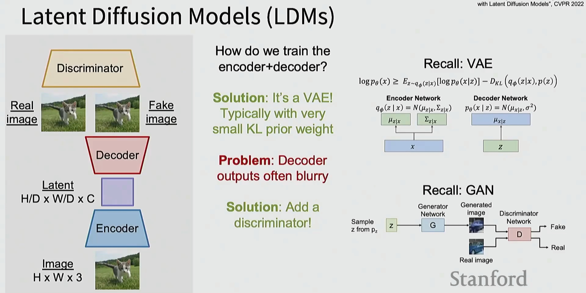

### LDM：如何训练编码器 + 解码器？

**问题场景**：
- 真实图像 → 编码器 → 潜在表示 → 解码器 → 真实/假图像
- 判别器判断真假

**方案 1：它是一个 VAE！**
- 通常使用非常小的 KL 先验权重

**回顾 VAE**：
$$\log p_\theta(x) \geq E_{z \sim q_\phi(z|x)}[\log p_\theta(x|z)] - D_{KL}(q_\phi(z|x), p(z))$$

编码器网络和解码器网络结构图

**问题**：解码器输出通常模糊

**方案 2：添加判别器！**

**回顾 GAN**：生成器 → 生成图像 → 判别器 → 判断真假

---

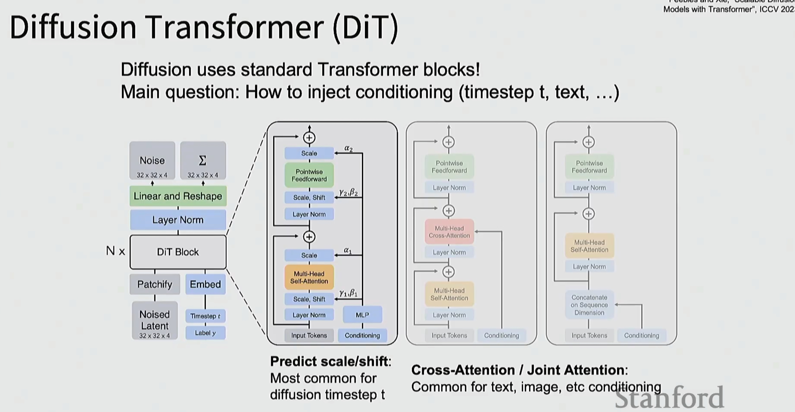

### 扩散 Transformer（DiT）

**扩散使用标准 Transformer 块！**

**主要问题**：如何注入条件信息（时间步 t、文本等）

**架构设计**：
- 噪声潜在表示 (32×32×4) + 时间步 t + 标签 y
- Patchify（分块）→ Embed（嵌入）
- N × DiT Block
- Linear and Reshape
- 最终输出

**DiT Block 内部**：
- 多种条件注入方式（Scale/Shift、Layer Norm、Multi-Head Self-Attention 等）

**条件注入方式**：

1. **预测 scale/shift**（最常见用于扩散时间步 t）
2. **交叉注意力 / 联合注意力**（常用于文本、图像等条件）

*参考*：Peebles and Xie, "Scalable Diffusion Models with Transformer", ICCV 2023

---

**关键要点**：
- GAN 通过对抗训练生成高质量图像，但训练不稳定
- 扩散模型通过迭代去噪过程生成样本
- Rectified Flow 提供了简洁的扩散模型实现
- CFG 通过控制条件强度显著提升生成质量
- 潜在扩散模型在压缩的潜在空间中工作，更高效
- Transformer 架构已成为现代扩散模型的主流选择

*图片来源*：Stanford CS231n 课程材料
