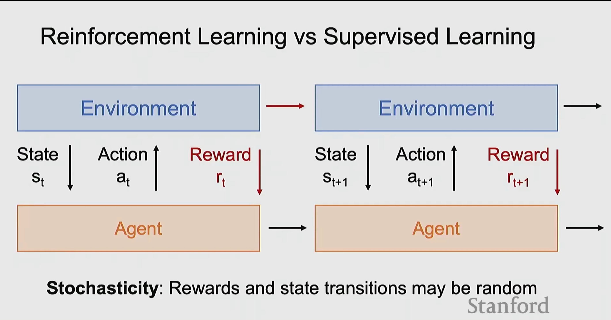
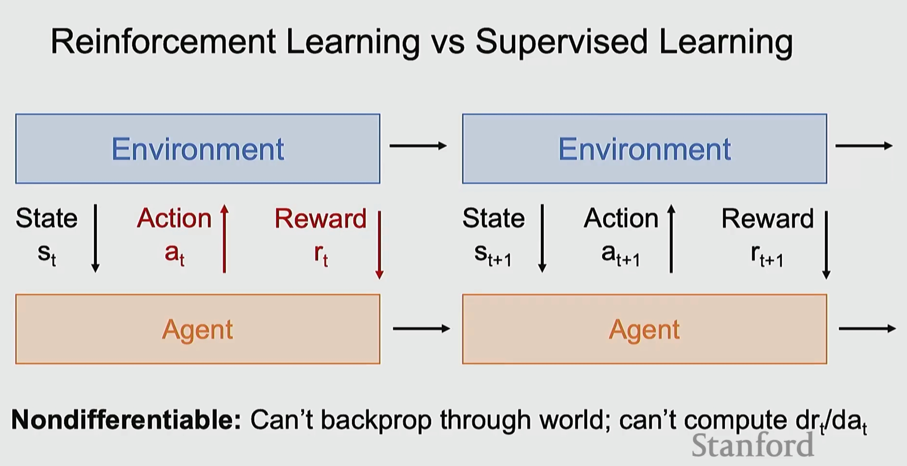
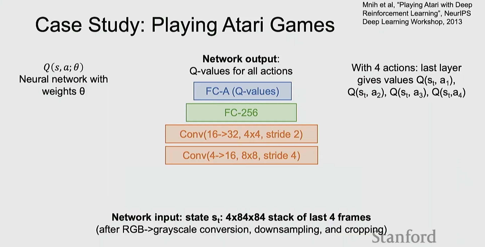
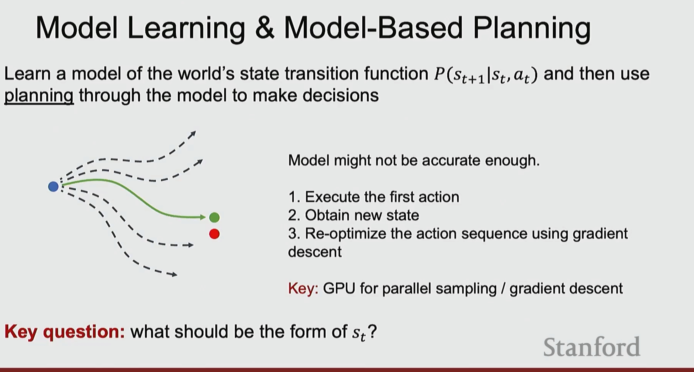
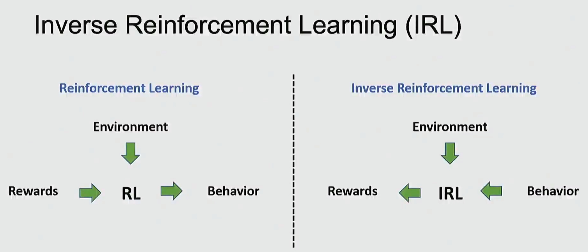
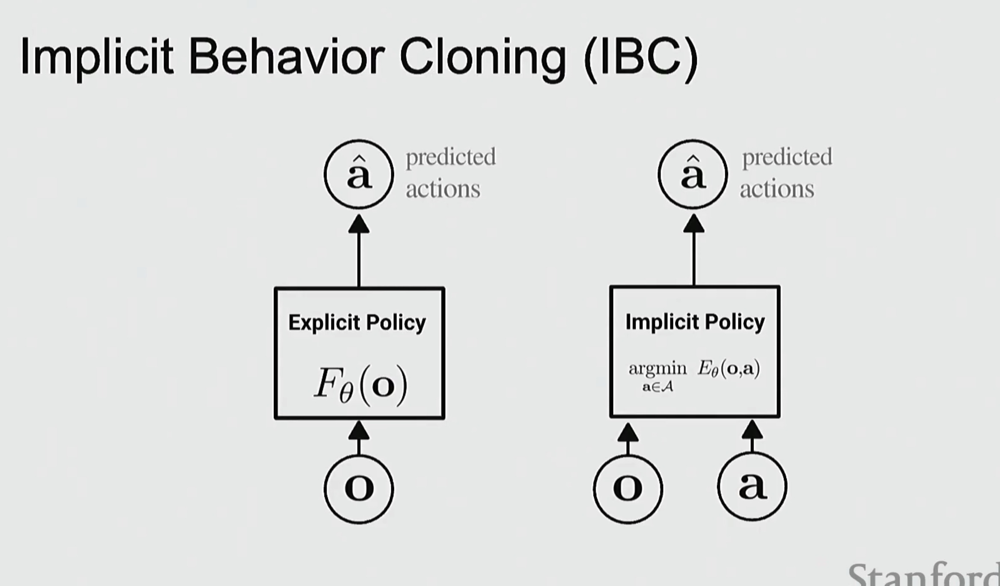
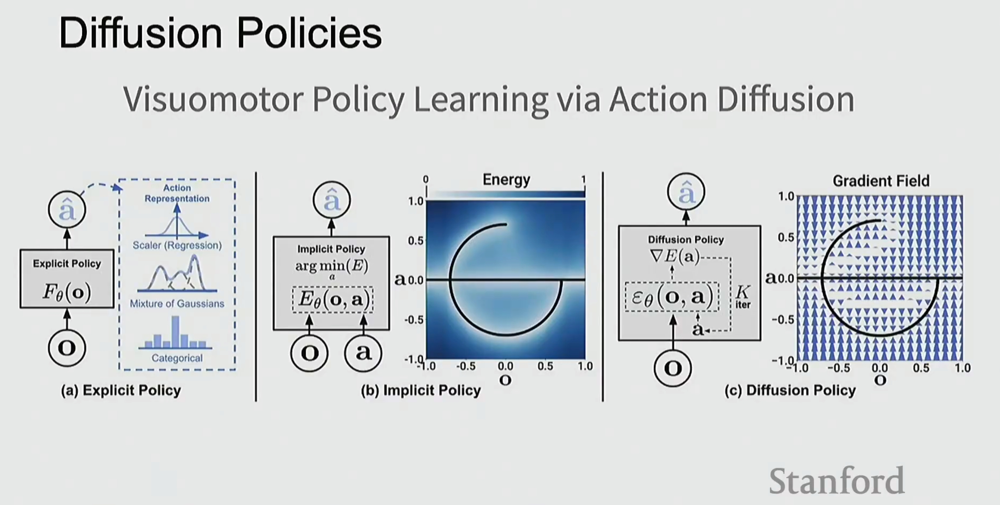
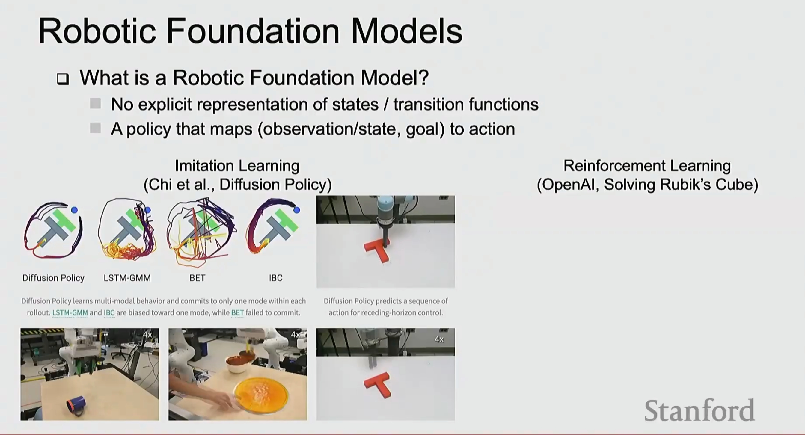

# 课程笔记：强化学习（Lecture 13）

## 一、强化学习 vs 监督学习

### 强化学习（Reinforcement Learning, RL）

**核心框架**：Agent 与 Environment 交互

**循环过程**：
- 环境（Environment）→ 状态 $s_t$ ↓
- Agent 接收状态 $s_t$ → 执行动作 $a_t$ ↑
- 环境返回奖励 $r_t$ ↓
- 进入下一状态 $s_{t+1}$ → 循环继续...

**随机性（Stochasticity）**：奖励和状态转移可能是随机的

---

### RL vs 监督学习的关键区别

**循环交互**：
- 环境 → 状态 $s_t$ → Agent → 动作 $a_t$ → 环境
- 环境返回奖励 $r_t$ 和下一状态 $s_{t+1}$

**核心特点**：
- **不可微分（Nondifferentiable）**：无法通过环境反向传播；无法计算 $dr_t/da_t$

这是强化学习与监督学习的根本区别！

## 二、深度 Q 学习：Atari 游戏案例

### 案例研究：玩 Atari 游戏

**网络架构** $Q(s, a; \theta)$：
- 神经网络，权重为 θ

**网络输出**：所有动作的 Q 值
- FC-A (Q-values)
- FC-256
- Conv(16→32, 4x4, stride 2)
- Conv(4→16, 8x8, stride 4)

**网络输入**：状态 $s_t$：4×84×84 堆叠的最后 4 帧
（经过 RGB→灰度转换、下采样和裁剪后）

**对于 4 个动作**：最后一层给出值 $Q(s_t, a_1)$, $Q(s_t, a_2)$, $Q(s_t, a_3)$, $Q(s_t, a_4)$

*参考*：Mnih et al, "Playing Atari with Deep Reinforcement Learning", NeurIPS Deep Learning Workshop, 2013

## 三、模型学习与基于模型的规划

### Model Learning & Model-Based Planning

**核心思想**：学习世界状态转移函数 $P(s_{t+1}|s_t, a_t)$ 的模型，然后通过模型进行规划来做决策

**挑战**：模型可能不够精确

**解决方案**：
1. 执行第一个动作
2. 获得新状态
3. 使用梯度下降重新优化动作序列

**关键优势**：GPU 用于并行采样 / 梯度下降

**关键问题**：$s_t$ 应该采用什么形式？

**可视化**：
- 蓝点：起始位置
- 虚线箭头：可能的规划路径
- 绿点：目标位置
- 红点：错误预测的目标

## 四、专家演示的迭代收集

### Iterative Collection of Expert Demonstrations

**循环流程**：

1. **专家提供反馈/演示**
   - 生成轨迹（trajectory）

2. **监督学习**
   - 从专家演示中学习策略（policy）

3. **在环境中推出（Rollout）**
   - 使用学习到的策略

4. 回到步骤 1，收集更多训练数据

这形成一个闭环的迭代优化过程。

## 五、逆强化学习（Inverse Reinforcement Learning, IRL）

### 强化学习 vs 逆强化学习

**强化学习（Reinforcement Learning）**：
- 环境 → 奖励 → RL → 行为

**逆强化学习（Inverse Reinforcement Learning）**：
- 环境 → 奖励 ← IRL ← 行为

**IRL 的目标**：从观察到的行为反推奖励函数

## 六、隐式行为克隆（Implicit Behavior Cloning, IBC）

### Implicit Behavior Cloning

**两种策略表示**：

**（左）显式策略（Explicit Policy）**：
- 观察 o → 显式策略 $F_\theta(o)$ → 预测动作 $\hat{a}$

**（右）隐式策略（Implicit Policy）**：
- 观察 o + 动作 a → 隐式策略 $\arg\min_{a \in \mathcal{A}} E_\theta(o, a)$ → 预测动作 $\hat{a}$

**关键区别**：
- 显式策略直接输出动作
- 隐式策略通过优化能量函数来选择动作

## 七、扩散策略（Diffusion Policies）

### 视觉运动策略学习：通过动作扩散

**三种策略类型**：

**（a）显式策略（Explicit Policy）**：
- 观察 o → 显式策略 $F_\theta(o)$
- 可以是标量（回归）、高斯混合、或类别分布
- → 预测动作 $\hat{a}$

**（b）隐式策略（Implicit Policy）**：
- 观察 o + 动作 a → 隐式策略 $\arg\min_a E$
- 能量函数 $E_\theta(o, a)$
- → 通过优化得到 $\hat{a}$

**（c）扩散策略（Diffusion Policy）**：
- 观察 o + 动作 a → 扩散策略 $\nabla E(a)$
- 能量函数 $E_\theta(o, a)$
- → 通过 K 次迭代梯度场得到 $\hat{a}$

**可视化**：
- 中间的能量景观图：显示能量函数的"碗"形状
- 右侧的梯度场图：显示梯度方向引导动作优化

## 八、机器人基础模型（Robotic Foundation Models）

### 什么是机器人基础模型？

**定义特征**：
- 没有显式的状态/转移函数表示
- 一个将（观察/状态，目标）映射到动作的策略

**两大范式**：

**1. 模仿学习（Imitation Learning）**
- 示例：Chi et al., Diffusion Policy

**2. 强化学习（Reinforcement Learning）**
- 示例：OpenAI, Solving Rubik's Cube

**可视化示例**：
- 扩散策略（Diffusion Policy）、LSTM-GMM、BET、IBC 等方法的轨迹对比
- 实际机器人操作场景：抓取物体、食品处理等任务

**说明**：
- Diffusion Policy 学习多模态行为，在每次推出中仅提交一个模式
- LSTM-GMM 和 IBC 偏向一个模式，而 BET 无法提交
- Diffusion Policy 预测了一系列动作用于后退视野控制

---

**关键要点**：
- 强化学习通过与环境交互学习策略，而非直接监督
- 环境的不可微分性是 RL 的核心挑战
- Q-learning 通过学习状态-动作值函数来指导决策
- 基于模型的规划通过学习状态转移函数来优化动作序列
- 逆强化学习从行为反推奖励函数
- 隐式策略通过能量函数建模动作分布
- 扩散策略将扩散模型应用于动作生成，展现多模态行为
- 机器人基础模型结合模仿学习和强化学习解决复杂任务

*图片来源*：Stanford CS231n 课程材料
