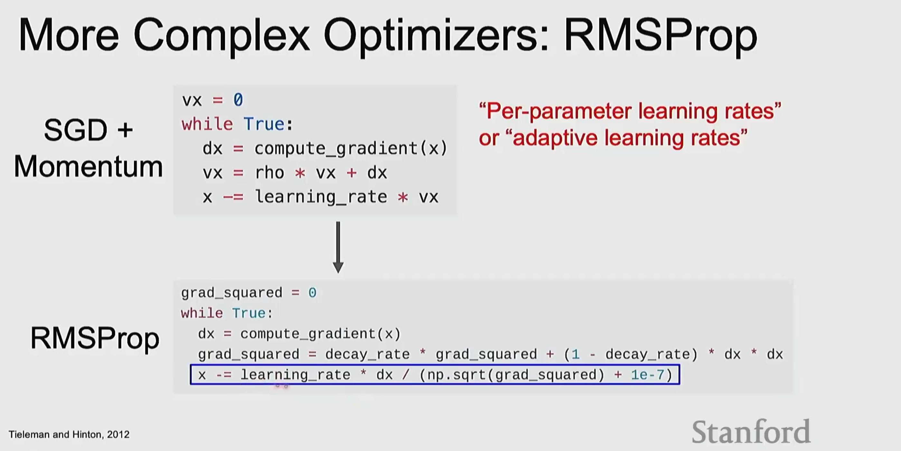
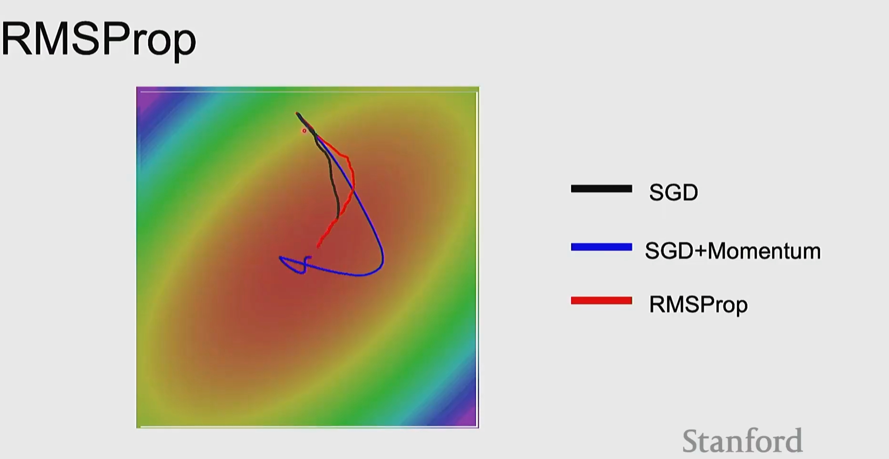
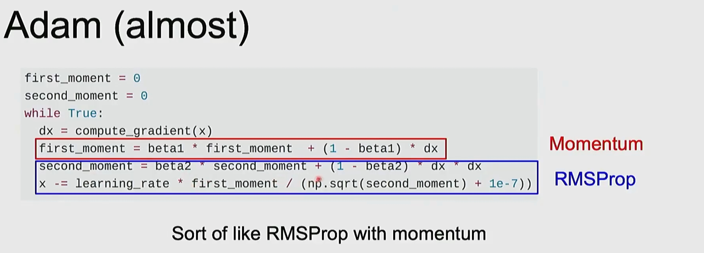
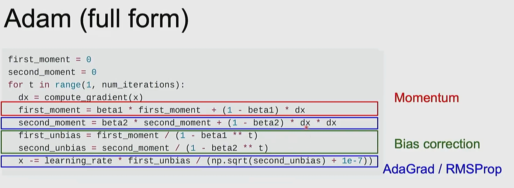
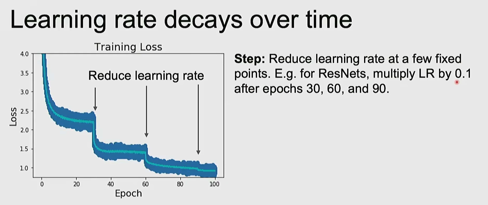
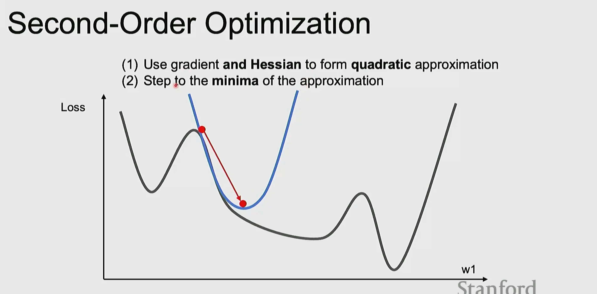
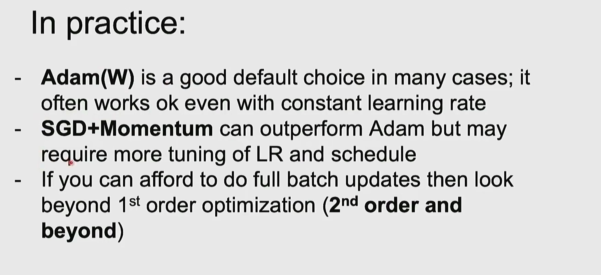

## 1 正则化（Regularization）

目的：减小模型在训练集上的过拟合，通过在目标（损失）上加入额外项来惩罚模型复杂度。

- L2 正则化（权重衰减）

  损失：
  $$J_{total}(W)=J_{data}(W)+\frac{\lambda}{2}\|W\|_2^2$$

  对权重的梯度影响：额外项在梯度上贡献为 $\lambda W$，常被实现为 weight decay（权重按比例衰减）。典型的 $\lambda$ 如 1e-4、1e-3 等，需调参。

- L1 正则化

  损失：
  $$J_{total}(W)=J_{data}(W)+\lambda\|W\|_1$$

  L1 会促使稀疏解（很多权重为 0）。

- Dropout 与 其它技巧

  Dropout、数据增强、早停（early stopping）等也属于正则化手段，从不同角度减少过拟合。

---

## 2 梯度下降与变种

目标：寻找能最小化训练损失（加上正则化项）的参数 W。

定义：设在当前参数 $W$ 处的（带正则化的）梯度为 $g = \nabla_W J_{total}(W)$。

### 2.1 梯度下降（SGD，含小批量）

伪代码：

```
while True:
    dx = compute_gradient(W)   # 或 minibatch 的梯度
    W -= learning_rate * dx
```

说明：学习率（learning_rate）是关键超参；过大导致不稳定，过小收敛慢。

### 2.2 动量（Momentum）

动量的想法是累积历史梯度，使参数更新具有惯性，能穿过鞍点并抑制振荡。

伪代码：

```
v = 0
while True:
    dx = compute_gradient(W)
    v = rho * v + dx         # rho (momentum) 常用 ~0.9
    W -= learning_rate * v
```

直观：当梯度方向稳定时，v 会增大（加速）；当梯度方向变化大时，v 抑制噪声。

### 2.3 RMSProp（自适应学习率）

RMSProp 对每个参数维护过去梯度平方的指数移动平均，用来缩放学习率：在梯度较大维度上使用较小步长，反之亦然。

伪代码：

```
grad_squared = 0
while True:
    dx = compute_gradient(W)
    grad_squared = decay_rate * grad_squared + (1 - decay_rate) * dx * dx
    W -= learning_rate * dx / (sqrt(grad_squared) + eps)
```

常用：decay_rate ≈ 0.9，eps ≈ 1e-7 或 1e-8。

优点：对稀疏或不均匀梯度尺度适应较好。


### 2.4 Adam（结合 Momentum 与 RMSProp，含偏差校正）

Adam 将一阶动量（均值）和二阶矩（近似方差）结合，并对这两个移动平均进行偏差校正。


伪代码（完整版）：

```
first_moment = 0      # m
second_moment = 0     # v
for t in range(1, num_iterations):
    dx = compute_gradient(W)
    first_moment = beta1 * first_moment + (1 - beta1) * dx
    second_moment = beta2 * second_moment + (1 - beta2) * (dx * dx)
    # bias correction
    m_hat = first_moment / (1 - beta1 ** t)
    v_hat = second_moment / (1 - beta2 ** t)
    W -= learning_rate * m_hat / (sqrt(v_hat) + eps)
```

典型超参：learning_rate ≈ 1e-3, beta1=0.9, beta2=0.999, eps=1e-8。

说明：Adam 是当前很常用的默认优化器，通常对学习率不那么敏感，但在某些任务（如非常大规模训练或最后精调）SGD+Momentum 仍可能更好。

---

## 3 学习率衰减（Learning rate schedule）


常见做法：

- Step decay：在若干固定 epoch 后乘以常数（例如 ResNet 在 epoch 30/60/90 处将 lr 乘 0.1）。
- 指数衰减（exponential decay）、余弦退火（cosine annealing）等。

图示（课件）：多次降低学习率会在训练集 loss 上看到明显跳跃并进入更稳定、更低的损失区间。

实践建议：对训练深层网络，合理的 lr schedule 常比单一 lr 更重要。

---

## 4 二阶方法（Second-order optimization，速览）

思路：使用 Hessian（或其近似）构造二次近似并直接步至该近似的最小值（例如牛顿法）。

优点：收敛快（每步考虑曲率）。缺点：计算和存储 Hessian（或逆）代价高，通常只在小模型或全量 batch 情况下可行。

当可以承受全量 batch 或有高效 Hessian 近似（如 K-FAC 等）时，可尝试二阶方法以加速收敛。

---

## 5 实践要点与推荐

- 默认选择：Adam（或 AdamW）通常是一个很好的起点，常用默认超参多数情况可工作。
- 若追求更好最终精度，SGD + Momentum（动量）配合合适的学习率和衰减策略常能超越 Adam，但需要更多的 lr/schedule 调参。
- 正则化：L2（weight decay）是最常用的正则化方式；在某些实现中需注意 Adam 与 weight decay 的交互（推荐使用 AdamW 的 decoupled weight decay）。
- 超参建议（经验值）：
  - learning_rate: Adam ~1e-3；SGD+Momentum 初始可 ~0.1（取决于批次大小），常配合 step decay。
  - momentum (rho/beta1): ~0.9
  - RMS decay / beta2: ~0.9 / 0.999
  - eps: 1e-8
  - weight decay (L2 lambda): 1e-4（根据模型/数据调整）

---

## 6 快速回顾

- 正则化通过在损失中增加惩罚项来减少过拟合（常见 L2/L1/Dropout）。
- SGD 是基础；Momentum 加速并缓冲噪声；RMSProp 自适应尺度；Adam 综合动量与自适应尺度并做偏差校正，是实践中常用的默认优化器。
- 学习率调度与正则化的合理配合，通常比单纯换优化器带来更大的性能提升。

