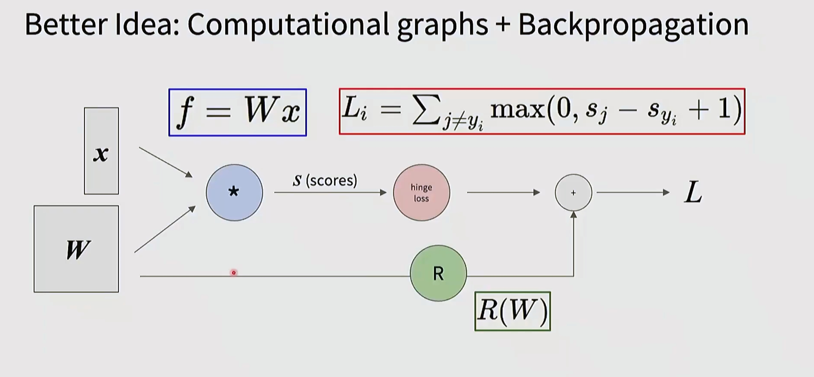
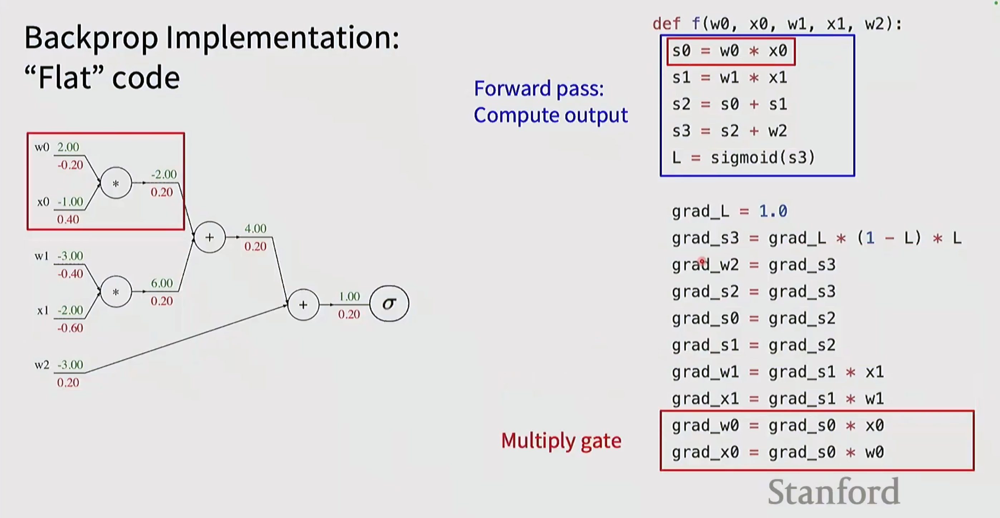
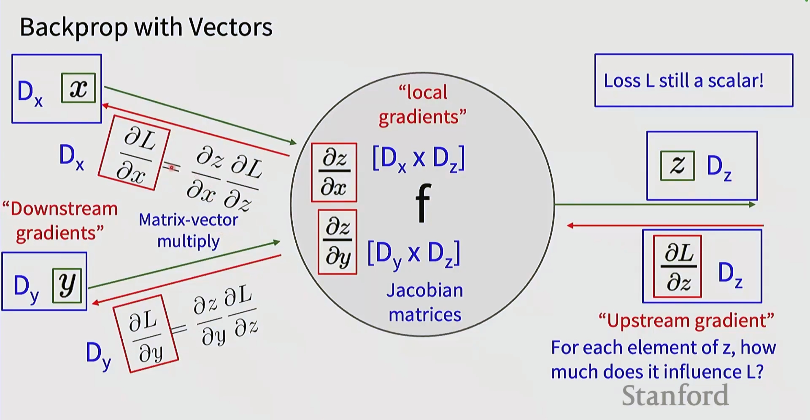
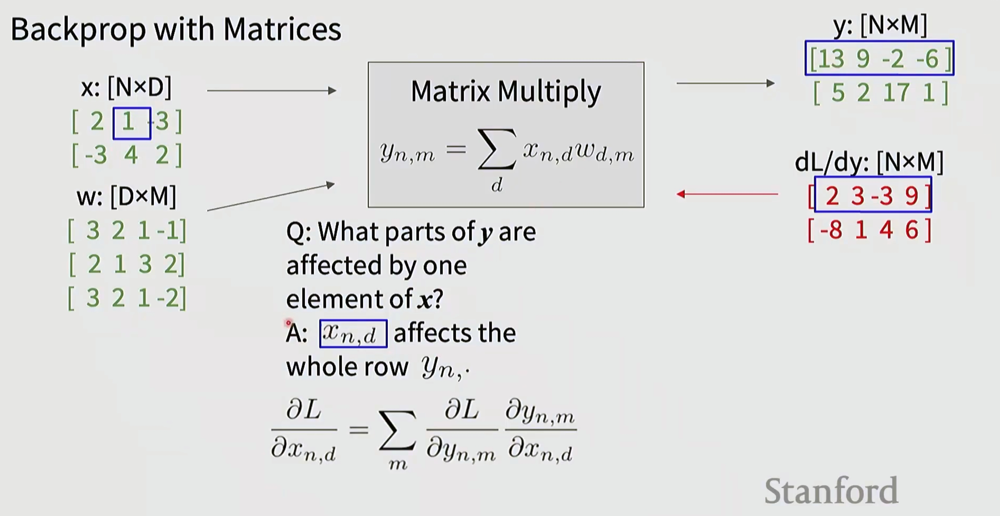
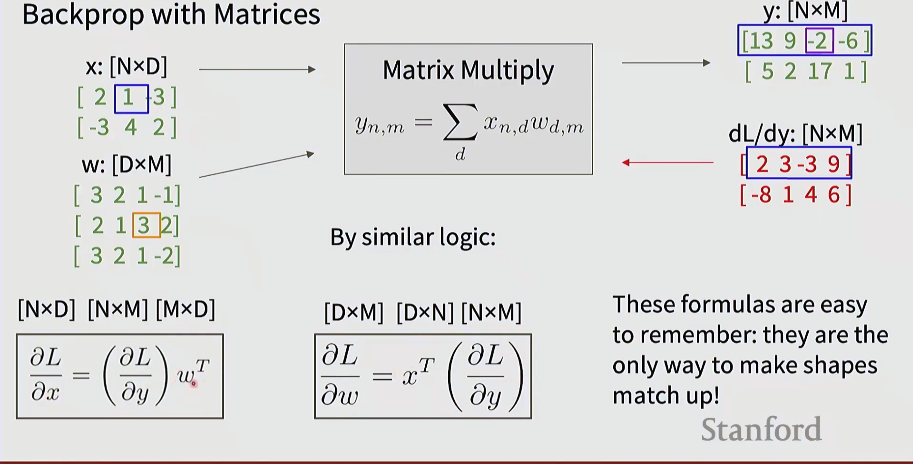

# 神经网络与反向传播（Backpropagation）详解笔记

本笔记详细介绍神经网络的反向传播算法，包括计算图视角、矩阵形式推导、向量形式与雅可比矩阵、以及具体代码实现。

---

## 1. 计算图与反向传播的核心思想

### 1.1 更好的思路：计算图 + 反向传播

神经网络可以用**计算图（Computational Graph）**表示，这是理解反向传播的最佳方式。



**计算图的核心要素：**

- **输入**：
  - $x$：输入数据
  - $W$：权重矩阵

- **前向计算**：
  - $f = Wx$：线性变换得到分数（scores）
  
- **损失函数**：
  - $L_i = \sum_{j \neq y_i} \max(0, s_j - s_{y_i} + 1)$：多类 SVM 损失（Hinge Loss）
  
- **正则化**：
  - $R(W)$：正则化项（通常是 L2 正则化 $\frac{\lambda}{2}\|W\|^2$）
  
- **总损失**：
  - $L = L_i + R(W)$

**反向传播的本质：**
通过计算图从后向前传播梯度，利用链式法则（Chain Rule）高效计算每个参数对损失的偏导数。

### 1.2 为什么使用计算图？

1. **模块化**：将复杂的函数分解为简单操作的组合
2. **局部计算**：每个节点只需计算局部梯度
3. **自动微分**：现代深度学习框架（PyTorch、TensorFlow）基于此自动计算梯度
4. **高效性**：避免重复计算，一次前向、一次反向即可得到所有梯度

---

## 2. 矩阵形式的反向传播

### 2.1 矩阵乘法的前向与反向传播

考虑矩阵乘法：$y = Wx$

**维度：**
- $x$：$[N \times D]$（N 个样本，D 个特征）
- $W$：$[D \times M]$（D 个输入维度，M 个输出维度）
- $y$：$[N \times M]$

**前向传播公式：**
$$y_{n,m} = \sum_d x_{n,d} w_{d,m}$$



### 2.2 反向传播的矩阵公式

已知**上游梯度** $\frac{\partial L}{\partial y}$（形状 $[N \times M]$），需要计算**下游梯度**：

**公式1：对输入 $x$ 的梯度**
$$\boxed{\frac{\partial L}{\partial x} = \left(\frac{\partial L}{\partial y}\right) W^T}$$

形状验证：$[N \times D] = [N \times M] \times [M \times D]$ ✓

**公式2：对权重 $W$ 的梯度**
$$\boxed{\frac{\partial L}{\partial W} = x^T \left(\frac{\partial L}{\partial y}\right)}$$

形状验证：$[D \times M] = [D \times N] \times [N \times M]$ ✓

**记忆技巧：**
> 这些公式很容易记住——它们是**唯一**能让形状匹配的方式！

- $\frac{\partial L}{\partial x}$ 必须与 $x$ 同形状 $[N \times D]$
- $\frac{\partial L}{\partial W}$ 必须与 $W$ 同形状 $[D \times M]$
- 通过转置和适当的矩阵乘法顺序，确保维度匹配

### 2.3 深入理解：元素级影响分析



**关键问题：** $x$ 的一个元素 $x_{n,d}$ 会影响 $y$ 的哪些部分？

**答案：** $x_{n,d}$ 影响整行 $y_{n,:}$（第 $n$ 个样本的所有 $M$ 个输出）

**推导：**
$$\frac{\partial L}{\partial x_{n,d}} = \sum_m \frac{\partial L}{\partial y_{n,m}} \frac{\partial y_{n,m}}{\partial x_{n,d}} = \sum_m \frac{\partial L}{\partial y_{n,m}} w_{d,m}$$

这正是矩阵乘法 $\frac{\partial L}{\partial y} W^T$ 在位置 $(n,d)$ 的结果！

---

## 3. 向量形式的反向传播与雅可比矩阵

### 3.1 向量到向量的函数

考虑向量函数 $z = f(x, y)$：

**维度：**
- $x \in \mathbb{R}^{D_x}$
- $y \in \mathbb{R}^{D_y}$
- $z \in \mathbb{R}^{D_z}$



### 3.2 雅可比矩阵（Jacobian Matrix）

**局部梯度**（local gradients）用**雅可比矩阵**表示：

- $\frac{\partial z}{\partial x}$：形状 $[D_z \times D_x]$（雅可比矩阵）
- $\frac{\partial z}{\partial y}$：形状 $[D_z \times D_y]$（雅可比矩阵）

雅可比矩阵的第 $(i,j)$ 元素是 $\frac{\partial z_i}{\partial x_j}$

### 3.3 反向传播公式（向量形式）

已知**上游梯度** $\frac{\partial L}{\partial z}$（形状 $[D_z]$，是行向量），计算**下游梯度**：

$$\boxed{\frac{\partial L}{\partial x} = \frac{\partial z}{\partial x}^T \frac{\partial L}{\partial z}}$$

$$\boxed{\frac{\partial L}{\partial y} = \frac{\partial z}{\partial y}^T \frac{\partial L}{\partial z}}$$

**术语说明：**
- **"Downstream gradients"（下游梯度）**：$\frac{\partial L}{\partial x}$ 和 $\frac{\partial L}{\partial y}$
- **"Upstream gradient"（上游梯度）**：$\frac{\partial L}{\partial z}$
- **"Local gradients"（局部梯度）**：$\frac{\partial z}{\partial x}$ 和 $\frac{\partial z}{\partial y}$（雅可比矩阵）

**链式法则的矩阵-向量形式：**
$$\frac{\partial L}{\partial x} = \frac{\partial z}{\partial x}^T \frac{\partial L}{\partial z} = \sum_i \frac{\partial z_i}{\partial x} \frac{\partial L}{\partial z_i}$$

**直观理解：**
- 问题：$z$ 的每个元素对损失 $L$ 的影响有多大？
- 答案：通过雅可比矩阵，将上游梯度传播到下游变量

**注意：**
- 损失 $L$ 是标量
- $\frac{\partial L}{\partial z}$ 是标量对向量的梯度（行向量）
- 通过雅可比矩阵的转置与上游梯度相乘，得到与 $x$ 同形状的下游梯度

---

## 4. 反向传播的具体代码实现

### 4.1 "Flat" 代码示例

展示一个简单计算图的手工反向传播实现：



**计算图结构：**
```
w0, x0 → [*] → s0 ─┐
                    ├→ [+] → s2 ─┐
w1, x1 → [*] → s1 ─┘            ├→ [+] → s3 → [σ] → L
                        w2 ─────┘
```

### 4.2 前向传播代码

```python
def f(w0, x0, w1, x1, w2):
    s0 = w0 * x0      # 乘法门
    s1 = w1 * x1      # 乘法门
    s2 = s0 + s1      # 加法门
    s3 = s2 + w2      # 加法门
    L = sigmoid(s3)   # sigmoid 激活
    return L
```

### 4.3 反向传播代码

```python
# ========== 前向传播（保存中间变量）==========
s0 = w0 * x0
s1 = w1 * x1
s2 = s0 + s1
s3 = s2 + w2
L = sigmoid(s3)

# ========== 反向传播 ==========
grad_L = 1.0  # dL/dL = 1（损失对自身的梯度）

# Sigmoid 的梯度：dL/ds3 = dL/dL * dL/ds3
grad_s3 = grad_L * (1 - L) * L  # sigmoid 导数: σ'(x) = σ(x)(1-σ(x))

# 加法门的梯度传递（梯度分配）
grad_w2 = grad_s3  # dL/dw2 = dL/ds3 * ds3/dw2 = grad_s3 * 1
grad_s2 = grad_s3  # dL/ds2 = dL/ds3 * ds3/ds2 = grad_s3 * 1

# 加法门的梯度传递（梯度分配）
grad_s0 = grad_s2  # dL/ds0 = dL/ds2 * ds2/ds0 = grad_s2 * 1
grad_s1 = grad_s2  # dL/ds1 = dL/ds2 * ds2/ds1 = grad_s2 * 1

# 乘法门的梯度（交叉相乘）
grad_w1 = grad_s1 * x1  # dL/dw1 = dL/ds1 * ds1/dw1 = grad_s1 * x1
grad_x1 = grad_s1 * w1  # dL/dx1 = dL/ds1 * ds1/dx1 = grad_s1 * w1

# 乘法门的梯度（交叉相乘）
grad_w0 = grad_s0 * x0  # dL/dw0 = dL/ds0 * ds0/dw0 = grad_s0 * x0
grad_x0 = grad_s0 * w0  # dL/dx0 = dL/ds0 * ds0/dx0 = grad_s0 * w0
```

**图中标注的关键点：**
- 红色框：突出显示的梯度计算（如 `s0 = w0 * x0` 和对应的 `grad_w0 = grad_s0 * x0`）
- **Multiply gate（乘法门）规则**：梯度需要乘以**另一个**输入

### 4.4 常见操作的梯度规则

| 操作 | 前向 | 反向（局部梯度） | 说明 |
|------|------|------------------|------|
| **加法** | $z = x + y$ | $\frac{\partial z}{\partial x} = 1, \frac{\partial z}{\partial y} = 1$ | 梯度直接传递（分配） |
| **乘法** | $z = x \cdot y$ | $\frac{\partial z}{\partial x} = y, \frac{\partial z}{\partial y} = x$ | 梯度交叉相乘 |
| **最大值** | $z = \max(x, y)$ | $\frac{\partial z}{\partial x} = \mathbb{1}(x > y)$ | 梯度传给最大值 |
| **ReLU** | $z = \max(0, x)$ | $\frac{\partial z}{\partial x} = \mathbb{1}(x > 0)$ | 正值传递，负值为0 |
| **Sigmoid** | $z = \frac{1}{1+e^{-x}}$ | $\frac{\partial z}{\partial x} = z(1-z)$ | sigmoid 的经典导数 |
| **矩阵乘法** | $Y = XW$ | $\frac{\partial L}{\partial X} = \frac{\partial L}{\partial Y} W^T$ <br> $\frac{\partial L}{\partial W} = X^T \frac{\partial L}{\partial Y}$ | 形状匹配原则 |

---

## 5. 反向传播的实践要点

### 5.1 模块化设计

现代深度学习框架（PyTorch、TensorFlow）将反向传播模块化：

1. **定义前向函数**：每个操作（层）定义前向计算
2. **自动计算梯度**：框架自动构建计算图并计算反向梯度
3. **梯度累积**：支持多次前向后一次反向（梯度累积）

### 5.2 反向传播的完整流程

1. **前向传播**：
   - 计算输出并**保存中间变量**（缓存）
   - 构建计算图

2. **计算损失**：
   - 评估模型预测与真实标签的差异

3. **反向传播**：
   - 从损失开始（$\frac{\partial L}{\partial L} = 1$）
   - 逐层向后传播梯度
   - 使用链式法则和局部梯度

4. **参数更新**：
   - 使用梯度和优化器（SGD、Adam等）更新权重

### 5.3 数值稳定性与技巧

- **梯度检查**：用数值梯度验证反向传播实现的正确性
- **梯度裁剪**：防止梯度爆炸（gradient clipping）
- **批归一化**：稳定梯度流动
- **残差连接**：缓解梯度消失（深层网络）

---

## 6. 结合优化器与正则化

### 6.1 反向传播 + 优化器

反向传播得到梯度后，使用优化器更新参数：

**基本流程：**
```python
# 1. 前向传播
output = model(input)
loss = criterion(output, target)

# 2. 反向传播（计算梯度）
loss.backward()  # PyTorch 自动反向传播

# 3. 优化器更新参数
optimizer.step()  # 使用梯度更新权重
optimizer.zero_grad()  # 清零梯度，准备下一次迭代
```

**常用优化器**（详见 `lec2_regularization_optimizers.md`）：
- **SGD**：$W \leftarrow W - \alpha \frac{\partial L}{\partial W}$
- **SGD + Momentum**：累积历史梯度，加速收敛
- **Adam**：自适应学习率，推荐默认选择
- **AdamW**：Adam + 解耦权重衰减

### 6.2 正则化项的梯度

L2 正则化：$R(W) = \frac{\lambda}{2} \|W\|_2^2$

**正则化项的梯度：**
$$\frac{\partial R}{\partial W} = \lambda W$$

**总梯度：**
$$\frac{\partial L_{total}}{\partial W} = \frac{\partial L_{data}}{\partial W} + \lambda W$$

在代码中，通常作为 **weight decay**（权重衰减）实现：
```python
# 方式1：在梯度上加正则化项
grad_W = grad_L_data + lambda * W

# 方式2：在优化器中指定 weight_decay
optimizer = torch.optim.Adam(model.parameters(), lr=1e-3, weight_decay=1e-4)
```

---

## 7. 总结与关键要点

### 7.1 核心概念回顾

1. **反向传播是神经网络训练的核心算法**
   - 通过计算图和链式法则高效计算梯度
   - 从损失开始，逐层向后传播梯度

2. **矩阵形式的反向传播**
   - 记住形状匹配规则
   - $\frac{\partial L}{\partial x} = \frac{\partial L}{\partial y} W^T$
   - $\frac{\partial L}{\partial W} = x^T \frac{\partial L}{\partial y}$

3. **向量形式与雅可比矩阵**
   - 通过雅可比矩阵传播梯度
   - $\frac{\partial L}{\partial x} = \frac{\partial z}{\partial x}^T \frac{\partial L}{\partial z}$

4. **代码实现**
   - 前向传播保存中间变量
   - 反向传播逐层计算并累积梯度
   - 加法门：梯度分配；乘法门：梯度交叉相乘

### 7.2 实践建议

- **使用自动微分框架**：PyTorch、TensorFlow 自动处理反向传播
- **理解原理有助于调试**：当梯度消失/爆炸时，知道问题出在哪里
- **梯度检查**：用数值梯度验证实现正确性
- **可视化梯度流**：使用 TensorBoard 等工具监控梯度

### 7.3 常见问题与解决方案

| 问题 | 原因 | 解决方案 |
|------|------|----------|
| 梯度消失 | 激活函数饱和（sigmoid）、网络过深 | 使用 ReLU、残差连接、批归一化 |
| 梯度爆炸 | 权重初始化不当、学习率过大 | 梯度裁剪、降低学习率、权重初始化 |
| 训练不稳定 | 数值精度问题 | 使用 float32、批归一化 |
| 过拟合 | 模型过于复杂 | L2 正则化、Dropout、数据增强 |

---

