# Lecture 4: Convolutional Neural Networks (卷积神经网络)


## 主要内容

### 1. 传统神经网络的问题

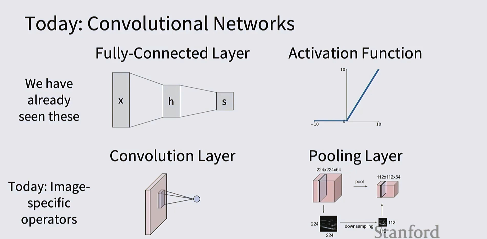
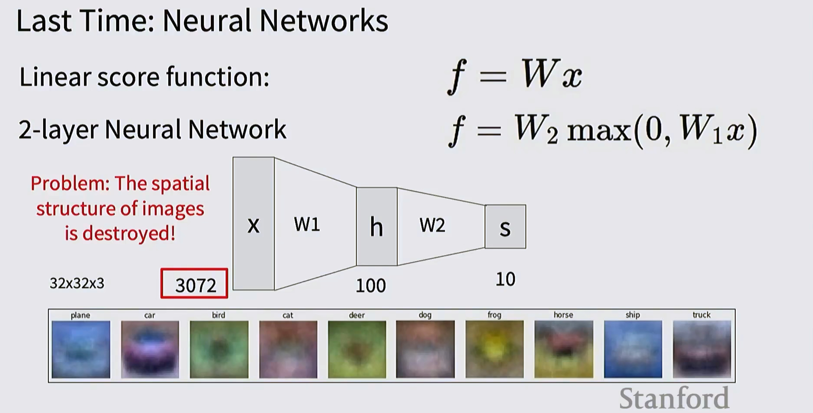

#### 全连接层的局限性

**线性评分函数：**
$$f = Wx$$

**2层神经网络：**
$$f = W_2 \max(0, W_1 x)$$

**核心问题：图像的空间结构被破坏！**

**示例分析：**
- 输入图像：32×32×3 = **3072 维向量**
- 第一层隐藏层：100 个神经元
- 输出层：10 个类别

当图像被展平成一维向量时，相邻像素的空间关系完全丢失，如下图所示，不同类别的图像在展平后变得难以区分。

---

### 2. 图像特征 vs. 卷积网络

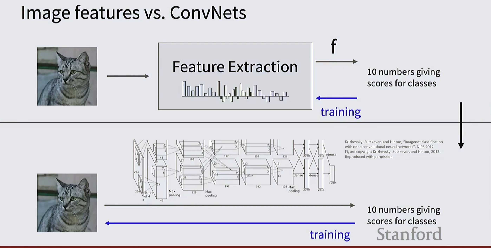

#### 两种处理图像的范式

**传统方法：特征提取**
```
图像 → 特征提取 → 特征向量 f → 10个类别分数
                                    ↑
                                  训练
```
- 手工设计特征（HOG、SIFT 等）
- 特征固定不变

**卷积网络方法：端到端学习**
```
图像 → [CONV-POOL层堆叠] → 10个类别分数
                           ↑
                         训练
```
- 自动学习特征层次结构
- 特征可训练

**引用：** Krizhevsky, Sutskever, and Hinton, "Imagenet classification with deep convolutional neural networks", NIPS 2012.

---

### 3. 卷积网络的基本组件


#### 四大核心组件

1. **全连接层 (Fully-Connected Layer)**
   - 已经学过的传统神经网络层
   - 公式：$s = Wx + b$

2. **激活函数 (Activation Function)**
   - ReLU、Sigmoid、Tanh 等
   - 引入非线性

3. **卷积层 (Convolution Layer)** ⭐
   - 图像特定的操作
   - 保留空间结构

4. **池化层 (Pooling Layer)** ⭐
   - 降采样操作
   - 减少空间维度

---

### 4. 卷积层详解

#### 4.1 卷积层的工作原理

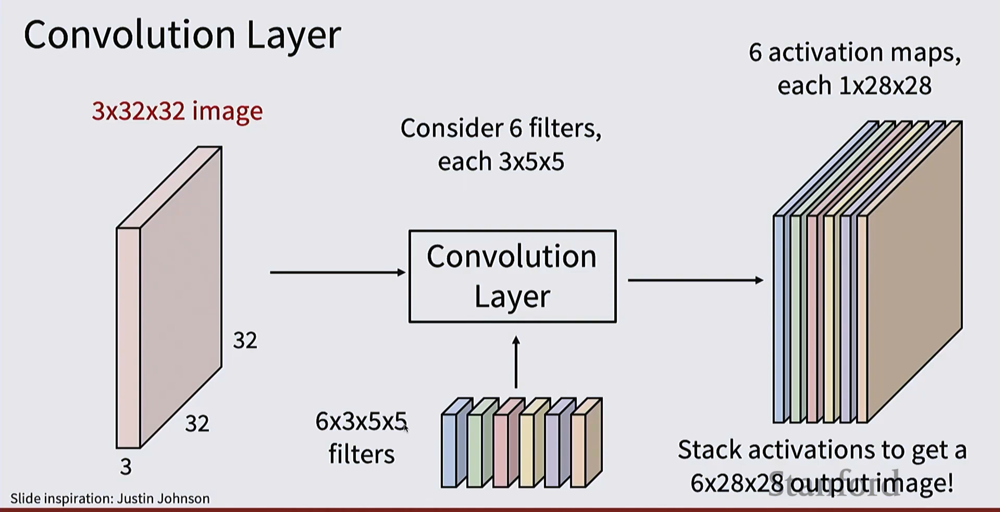

**示例：**
- 输入：3×32×32 图像（3个通道，32×32空间大小）
- 使用 6 个 3×5×5 的滤波器
- 输出：6 个激活图，每个 1×28×28

**关键过程：**
1. 6个滤波器（每个 3×5×5）在输入上滑动
2. 每个滤波器产生一个激活图
3. 堆叠激活图得到 6×28×28 的输出

#### 4.2 单个卷积操作

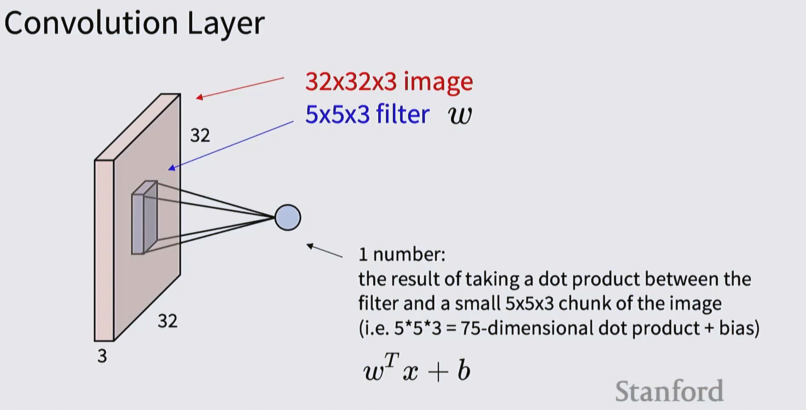

**计算细节：**
- 输入：32×32×3 图像
- 滤波器：5×5×3（w 权重矩阵）
- 计算：提取 5×5×3 的小块，与滤波器做点积

**公式：**
$$\text{1 个数值} = w^T x + b$$

其中：
- $x$：5×5×3 = 75维的图像块
- $w$：滤波器权重（75维）
- $b$：偏置项
- 结果：1个数值（点积 + 偏置）

---

### 5. 卷积操作的参数配置

#### 5.1 卷积层总结

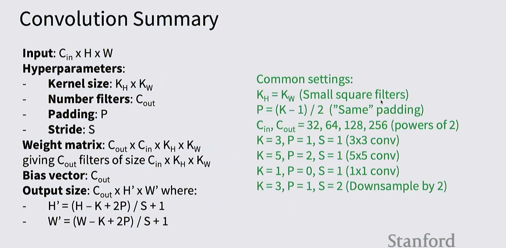


**输入规格：**
- Input: $C_{in} \times H \times W$

**超参数 (Hyperparameters)：**
1. **Kernel size (滤波器大小)**：$K_H \times K_W$
2. **Number of filters (滤波器数量)**：$C_{out}$
3. **Padding (填充)**：P
4. **Stride (步长)**：S

**权重矩阵：**
- Weight matrix: $C_{out} \times C_{in} \times K_H \times K_W$
- 包含 $C_{out}$ 个滤波器，每个大小为 $C_{in} \times K_H \times K_W$

**偏置向量：**
- Bias vector: $C_{out}$

**输出大小：**
$$H' = \frac{H - K + 2P}{S} + 1$$
$$W' = \frac{W - K + 2P}{S} + 1$$
- Output size: $C_{out} \times H' \times W'$

#### 5.2 常用配置

**Common settings (常见配置)：**

1. **小方形滤波器**
   - $K_H = K_W$（正方形滤波器）
   - $P = (K-1)/2$（"Same" padding，保持尺寸）

2. **通道数配置**
   - $C_{in}, C_{out} = 32, 64, 128, 256$（2的幂次）

3. **3×3 卷积**
   - $K=3, P=1, S=1$（最常用）

4. **5×5 卷积**
   - $K=5, P=2, S=1$

5. **1×1 卷积**
   - $K=1, P=0, S=1$（通道间交互）

6. **降采样卷积**
   - $K=3, P=1, S=2$（下采样 2倍）

---

### 6. Stride（步长）详解

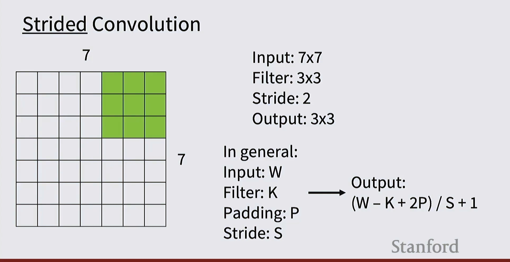

**步长示例：**

```
输入：7×7
滤波器：3×3
步长：2
输出：3×3
```

**通用公式：**
- Input: W
- Filter: K
- Padding: P
- Stride: S

**输出大小：**
$$\text{Output} = \frac{W - K + 2P}{S} + 1$$

**可视化说明：**
- 绿色区域表示滤波器的位置
- 步长=2 表示滤波器每次移动2个像素
- 输出尺寸从7×7降到3×3

---

### 7. Padding（填充）详解

#### 7.1 填充的必要性

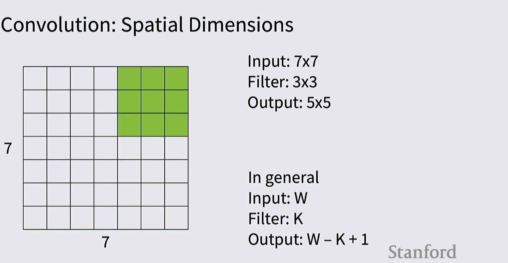
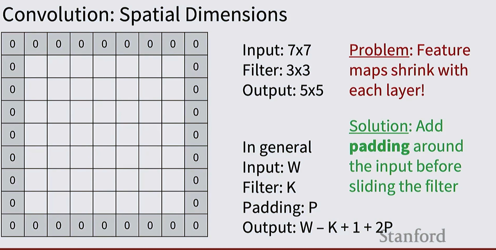

**问题：特征图逐层缩小！**

**示例：**
- Input: 7×7
- Filter: 3×3
- Output: 5×5

**一般情况：**
- Input: W
- Filter: K
- Output: $W - K + 1$

**问题分析：**
- 没有 padding 时，特征图会不断缩小
- 经过多层后，空间信息会大量丢失

#### 7.2 填充的解决方案

**解决方案：在输入周围添加 padding（用0填充）**

**示例：**
- Input: 7×7
- Filter: 3×3
- **Padding: P**
- Output: $W - K + 1 + 2P$

**"Same" Padding：**
- 目标：保持输出与输入大小相同
- 公式：$P = (K-1)/2$
- 示例：3×3滤波器需要 padding=1

**可视化：**
```
原始 7×7 → 加 padding 变成 9×9 → 卷积后仍为 7×7
```

---

### 8. ConvNet 架构示例

#### 8.1 基本ConvNet结构

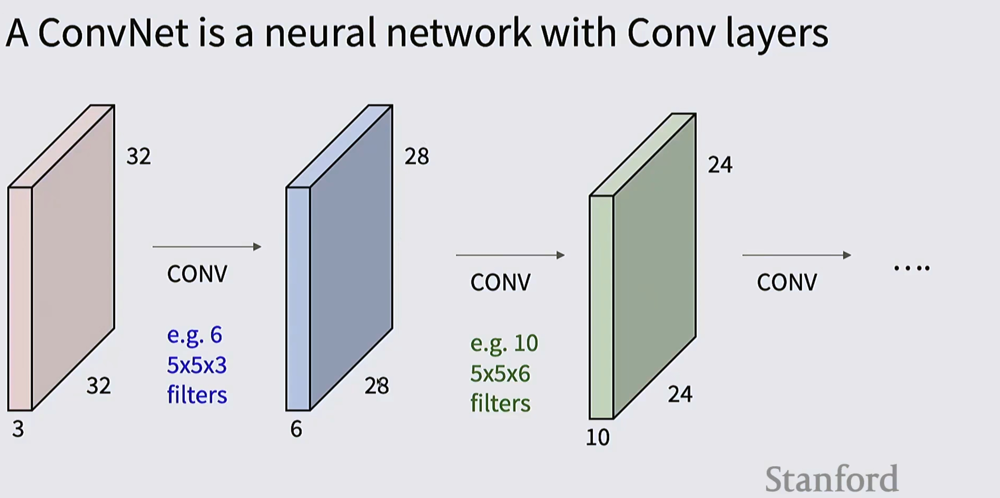
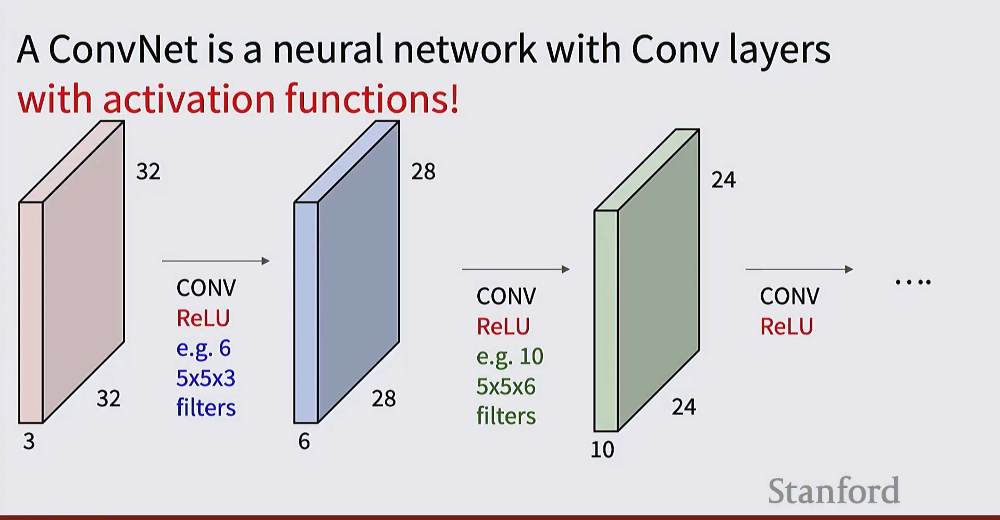

**典型架构：**

```
输入 (3×32×32)
    ↓
CONV + ReLU (6×28×28)
[6个 5×5×3 滤波器]
    ↓
CONV + ReLU (10×24×24)
[10个 5×5×6 滤波器]
    ↓
CONV + ReLU (继续...)
    ↓
...
```

**关键特点：**
- 每个卷积层后跟 ReLU 激活函数
- 通道数逐渐增加（3 → 6 → 10 → ...）
- 空间维度逐渐减小（32 → 28 → 24 → ...）

#### 8.2 简化的ConvNet结构


**不显示激活函数的架构图：**

```
输入 (3×32×32)
    ↓
CONV (6×28×28)
    ↓
CONV (10×24×24)
    ↓
CONV (继续...)
    ↓
...
```

**说明：**
- 实际上每个 CONV 层后都有激活函数
- 为简化图示，通常不画出

---

### 9. 池化层 (Pooling Layers)

#### 9.1 池化层的作用

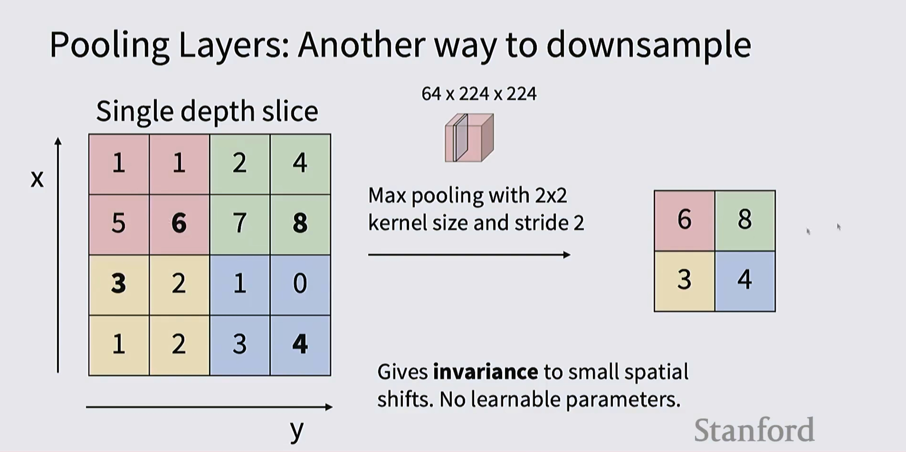

**池化层：另一种降采样方法**

**Max Pooling 示例：**

**输入（单个深度切片）：**
```
1  1  2  4
5  6  7  8
3  2  1  0
1  2  3  4
```

**2×2 Max Pooling, stride=2**

**输出：**
```
6  8
3  4
```

**说明：**
- 每个 2×2 区域取最大值
- 步长=2，不重叠
- 输出尺寸减半

**完整输入：64×224×224**

**完整处理：**
- 对每个深度切片（64个）独立进行池化
- 输出：64×112×112

**关键特性：**
- 提供对小空间平移的不变性
- **没有可学习参数**

#### 9.2 池化层的数学描述

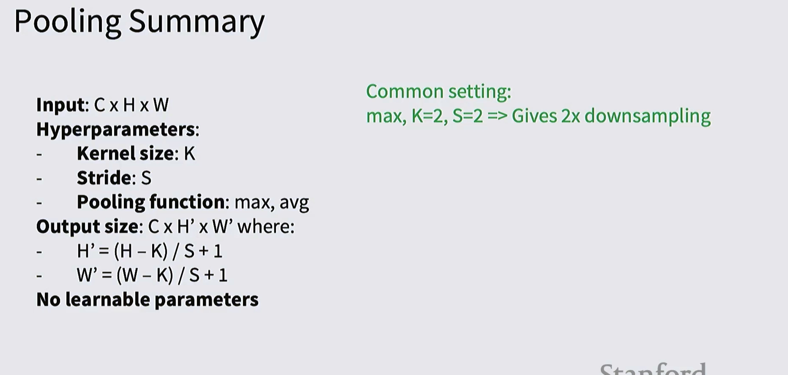

**输入：**
- Input: $C \times H \times W$

**超参数：**
1. **Kernel size (池化窗口大小)**：K
2. **Stride (步长)**：S
3. **Pooling function (池化函数)**：max 或 avg

**输出大小：**
$$H' = \frac{H - K}{S} + 1$$
$$W' = \frac{W - K}{S} + 1$$

- Output size: $C \times H' \times W'$

**常见配置：**
- **max, K=2, S=2** → 产生 2倍降采样

**关键特性：**
- **无可学习参数**
- 通道数不变

#### 9.3 池化层的可视化

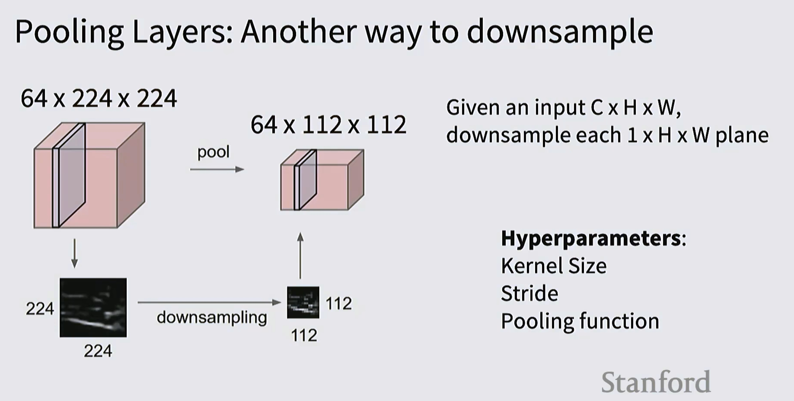

**降采样过程：**

```
64×224×224 
    ↓ pool
64×112×112
    ↓ downsampling
   (可视化显示)
112×112 输出图像
```

**处理流程：**
1. 给定输入 $C \times H \times W$
2. 对每个 $1 \times H \times W$ 平面进行降采样
3. 输出保持通道数不变

**超参数：**
- Kernel Size
- Stride  
- Pooling function (max/avg)

---

### 10. 从 Transformers 的演进

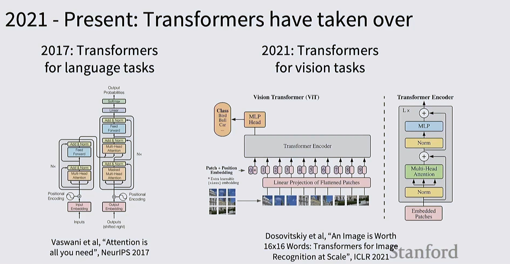

**深度学习架构的演进：**

#### 2017: Transformers for language tasks
- **论文：** Vaswani et al, "Attention is all you need", NeurIPS 2017
- Transformer 架构最初用于自然语言处理
- 核心机制：Multi-Head Attention
- 位置编码 + 前馈网络

#### 2021: Transformers for vision tasks
- **论文：** Dosovitskiy et al, "An Image is Worth 16x16 Words: Transformers for Image Recognition at Scale", ICLR 2021
- Vision Transformer (ViT) 将图像分割成 patches
- Patch + Position Embedding
- Transformer Encoder 处理图像序列

**重要趋势：**
- Transformers 正在接管计算机视觉领域
- 与卷积网络相比，更加灵活和强大
- 但本课程重点仍是 ConvNets 基础

---

## 关键要点总结

### 1. 卷积层核心概念

✅ **参数共享**
- 同一个滤波器在整个图像上滑动
- 大幅减少参数量

✅ **局部连接**
- 每个神经元只看局部感受野
- 保留空间结构信息

✅ **计算公式**
$$\text{Output size} = \frac{W - K + 2P}{S} + 1$$

### 2. 常用配置模式

| 类型 | K | P | S | 作用 |
|------|---|---|---|------|
| 3×3 conv | 3 | 1 | 1 | 标准卷积 |
| 5×5 conv | 5 | 2 | 1 | 较大感受野 |
| 1×1 conv | 1 | 0 | 1 | 通道变换 |
| Downsample | 3 | 1 | 2 | 降采样2倍 |

### 3. 池化层特点

🔹 **Max Pooling**：取区域最大值
🔹 **Average Pooling**：取区域平均值
🔹 **常用配置**：2×2, stride=2（2倍降采样）
🔹 **无可学习参数**
🔹 **通道数不变**

### 4. 设计原则

1. **空间维度** → 逐层减小
2. **通道数** → 逐层增加
3. **使用 padding** → 防止特征图过快缩小
4. **激活函数** → 每个卷积层后加 ReLU

---

## 代码实现示例

### 卷积层前向传播（NumPy）

```python
def conv_forward_naive(x, w, b, conv_param):
    """
    卷积层的前向传播（朴素实现）
    
    输入:
    - x: 输入数据 (N, C, H, W)
    - w: 滤波器权重 (F, C, HH, WW)
    - b: 偏置 (F,)
    - conv_param: 字典 {'stride': S, 'pad': P}
    
    输出:
    - out: 输出数据 (N, F, H', W')
    """
    N, C, H, W = x.shape
    F, _, HH, WW = w.shape
    stride = conv_param['stride']
    pad = conv_param['pad']
    
    # 填充输入
    x_padded = np.pad(x, ((0,0), (0,0), (pad,pad), (pad,pad)), 
                      mode='constant')
    
    # 计算输出尺寸
    H_out = (H + 2*pad - HH) // stride + 1
    W_out = (W + 2*pad - WW) // stride + 1
    
    # 初始化输出
    out = np.zeros((N, F, H_out, W_out))
    
    # 卷积操作
    for n in range(N):           # 每个样本
        for f in range(F):       # 每个滤波器
            for i in range(H_out):
                for j in range(W_out):
                    h_start = i * stride
                    w_start = j * stride
                    
                    # 提取感受野
                    x_slice = x_padded[n, :, 
                                      h_start:h_start+HH,
                                      w_start:w_start+WW]
                    
                    # 计算 w^T x + b
                    out[n, f, i, j] = np.sum(x_slice * w[f]) + b[f]
    
    return out
```

### Max Pooling 实现

```python
def max_pool_forward_naive(x, pool_param):
    """
    Max Pooling 前向传播
    
    输入:
    - x: 输入数据 (N, C, H, W)
    - pool_param: 字典 {'pool_height': HH, 'pool_width': WW, 'stride': S}
    
    输出:
    - out: 输出数据 (N, C, H', W')
    """
    N, C, H, W = x.shape
    HH = pool_param['pool_height']
    WW = pool_param['pool_width']
    stride = pool_param['stride']
    
    # 计算输出尺寸
    H_out = (H - HH) // stride + 1
    W_out = (W - WW) // stride + 1
    
    # 初始化输出
    out = np.zeros((N, C, H_out, W_out))
    
    # Max pooling
    for n in range(N):
        for c in range(C):
            for i in range(H_out):
                for j in range(W_out):
                    h_start = i * stride
                    w_start = j * stride
                    
                    # 提取池化区域并取最大值
                    pool_region = x[n, c, 
                                  h_start:h_start+HH,
                                  w_start:w_start+WW]
                    out[n, c, i, j] = np.max(pool_region)
    
    return out
```

### PyTorch 实现示例

```python
import torch
import torch.nn as nn

class SimpleConvNet(nn.Module):
    def __init__(self, num_classes=10):
        super(SimpleConvNet, self).__init__()
        
        self.conv_layers = nn.Sequential(
            # Conv1: 3×32×32 → 6×28×28
            nn.Conv2d(3, 6, kernel_size=5),
            nn.ReLU(),
            
            # Conv2: 6×28×28 → 10×24×24
            nn.Conv2d(6, 10, kernel_size=5),
            nn.ReLU(),
            
            # Pool: 10×24×24 → 10×12×12
            nn.MaxPool2d(kernel_size=2, stride=2)
        )
        
        self.fc_layers = nn.Sequential(
            nn.Linear(10 * 12 * 12, 100),
            nn.ReLU(),
            nn.Linear(100, num_classes)
        )
    
    def forward(self, x):
        x = self.conv_layers(x)
        x = x.view(x.size(0), -1)  # 展平
        x = self.fc_layers(x)
        return x

# 使用示例
model = SimpleConvNet(num_classes=10)
input_tensor = torch.randn(1, 3, 32, 32)
output = model(input_tensor)
print(f"Output shape: {output.shape}")  # [1, 10]
```
