# Lecture 5: CNN Architectures and Training Techniques


## 课程概览

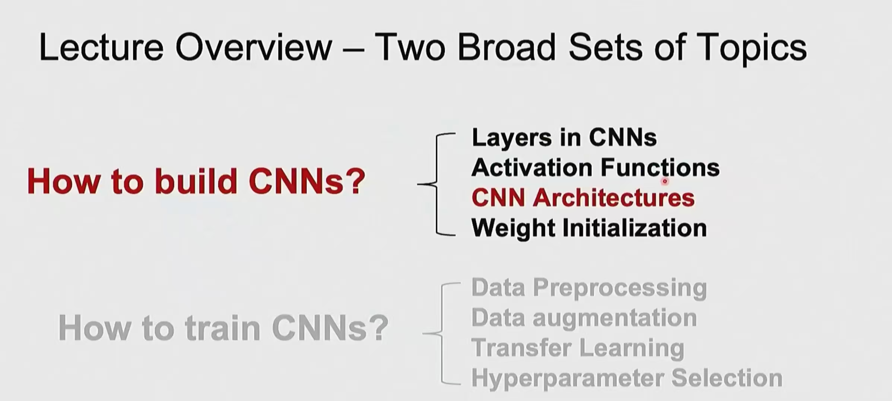

### 两大主题

#### 1️⃣ **如何构建 CNNs？**
- CNN 中的层结构
- 激活函数
- **CNN 架构**（重点）
- 权重初始化

#### 2️⃣ **如何训练 CNNs？**
- 数据预处理
- 数据增强
- 迁移学习
- 超参数选择

---

## Part 1: 如何构建 CNNs

### 1. CNN 的组成部分

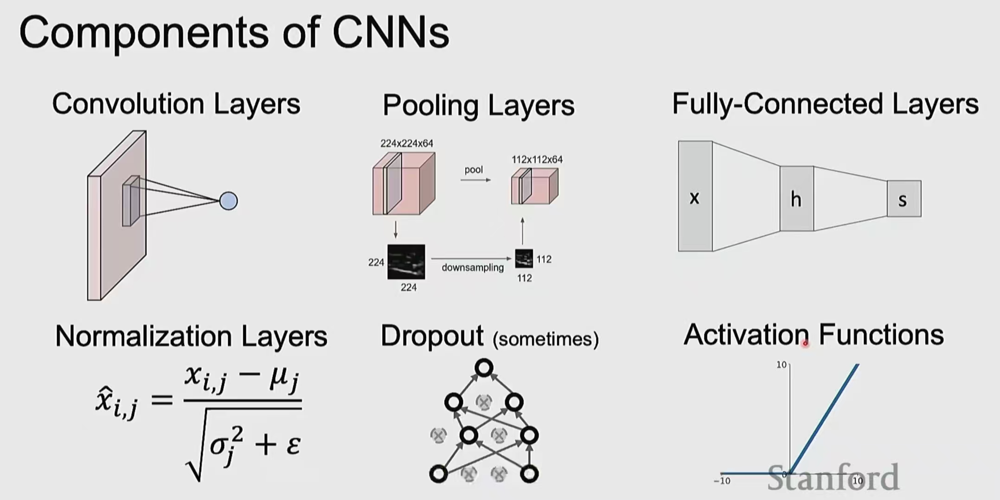

**CNN 的六大核心组件：**

#### 1. **卷积层 (Convolution Layers)**
- 提取空间特征
- 参数共享
- 局部连接

#### 2. **池化层 (Pooling Layers)**
- 降采样操作
- 示例：224×224×64 → pool → 112×112×64
- 减少空间维度，保持通道数

#### 3. **全连接层 (Fully-Connected Layers)**
- 传统神经网络层
- 公式：$s = Wx + b$

#### 4. **归一化层 (Normalization Layers)**
- Batch Normalization
- Layer Normalization
- 公式：$\hat{x}_{i,j} = \frac{x_{i,j} - \mu_j}{\sqrt{\sigma_j^2 + \varepsilon}}$

#### 5. **Dropout（有时使用）**
- 正则化技术
- 随机丢弃神经元

#### 6. **激活函数 (Activation Functions)**
- ReLU: $f(x) = \max(0, x)$
- 引入非线性

---

### 2. 激活函数详解

#### 2.1 激活函数在 CNN 中的位置

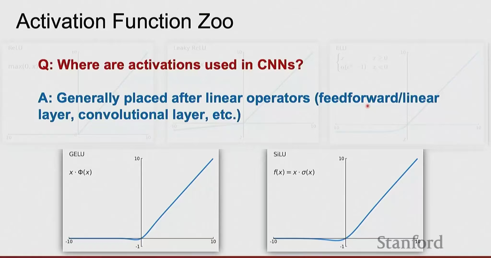

**Q: CNN 中激活函数放在哪里？**

**A: 通常放在线性操作之后**
- 全连接层之后
- 卷积层之后

**常见激活函数：**
- **ReLU**
- **Leaky ReLU**
- **GELU**: $\text{GELU}(x) = x \cdot \Phi(x)$
- **SiLU**: $\text{SiLU}(x) = x \cdot \sigma(x)$

#### 2.2 ReLU 激活函数

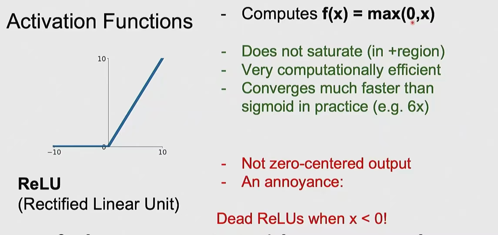

**ReLU (Rectified Linear Unit)**

$$f(x) = \max(0, x)$$

**优点：**
✅ 不饱和（在正区域）  
✅ 计算效率极高  
✅ 收敛速度比 sigmoid 快 6 倍

**缺点：**
❌ 输出不是零中心的  
❌ 存在问题：**Dead ReLUs**（当 x < 0 时神经元"死亡"）

**可视化：**
```
  10 |        /
     |       /
     |      /
   0 |_____/
    -10    0    10
```

---

### 3. 权重初始化

#### 3.1 Kaiming / MSRA 初始化

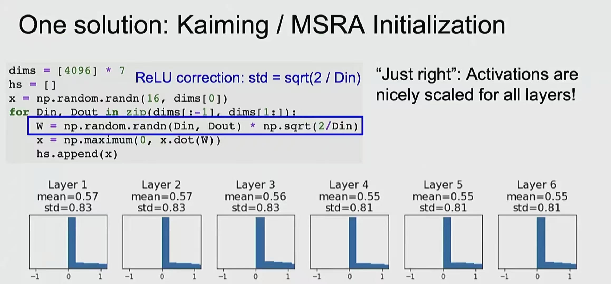

**问题：合适的初始化方法？**

**解决方案：Kaiming 初始化**

```python
dims = [4096] * 7
hs = []
x = np.random.randn(16, dims[0])

for Din, Dout in zip(dims[:-1], dims[1:]):
    # Kaiming/He initialization for ReLU
    W = np.random.randn(Din, Dout) * np.sqrt(2/Din)
    x = np.maximum(0, x.dot(W))  # ReLU activation
    hs.append(x)
```

**关键公式：**
$$W \sim \mathcal{N}(0, \sqrt{2/D_{in}})$$

**效果：激活值在所有层都保持良好的尺度！**

| Layer 1 | Layer 2 | Layer 3 | Layer 4 | Layer 5 | Layer 6 |
|---------|---------|---------|---------|---------|---------|
| mean=0.57 | mean=0.57 | mean=0.56 | mean=0.55 | mean=0.55 | mean=0.55 |
| std=0.83 | std=0.83 | std=0.83 | std=0.81 | std=0.81 | std=0.81 |

#### 3.2 错误的初始化：值过大

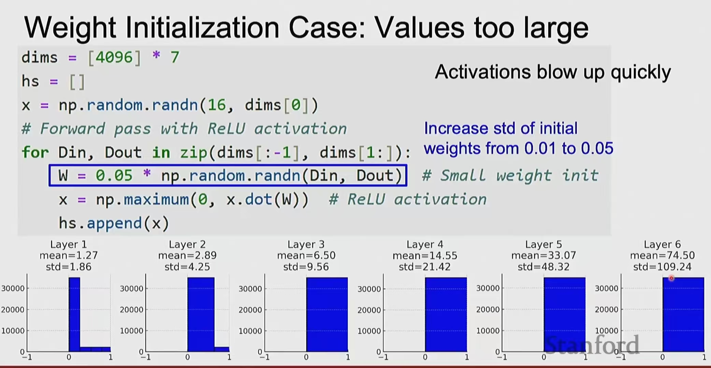

**如果使用过大的初始化：**

```python
W = 0.05 * np.random.randn(Din, Dout)  # 太大了！
```

**结果：激活值爆炸！**

| Layer 1 | Layer 2 | Layer 3 | Layer 4 | Layer 5 | Layer 6 |
|---------|---------|---------|---------|---------|---------|
| mean=1.27 | mean=2.89 | mean=6.50 | mean=14.55 | mean=33.07 | mean=74.50 |
| std=1.86 | std=4.25 | std=9.56 | std=21.42 | std=48.32 | std=109.24 |

**问题：**
- 激活值迅速增加
- 标准差失控
- 梯度爆炸

---

### 4. 经典 CNN 架构

#### 4.1 ResNet（残差网络）

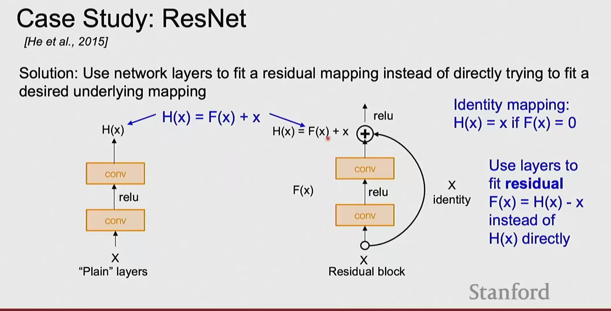

**论文：** [He et al., 2015]

**核心思想：使用残差映射而非直接拟合目标映射**

**普通层 vs 残差块：**

```
普通层:                 残差块:
  x                       x
  ↓                      ↓ ←─────────┐
[conv]                 [conv]        │
  ↓                      ↓            │
[relu]                 [relu]        │
  ↓                      ↓            │
[conv]                 [conv]        │
  ↓                      ↓            │
H(x)                   F(x) ─→ (+) ─→ H(x)
                              └─ x ──┘
                                ↓
                              [relu]
```

**数学表达：**
- 普通层学习：$H(x)$
- 残差块学习：$F(x) = H(x) - x$
- 最终输出：$H(x) = F(x) + x$

**恒等映射：**
- 如果 $F(x) = 0$，则 $H(x) = x$（恒等映射）
- 让层学习残差更容易

#### 4.2 VGGNet

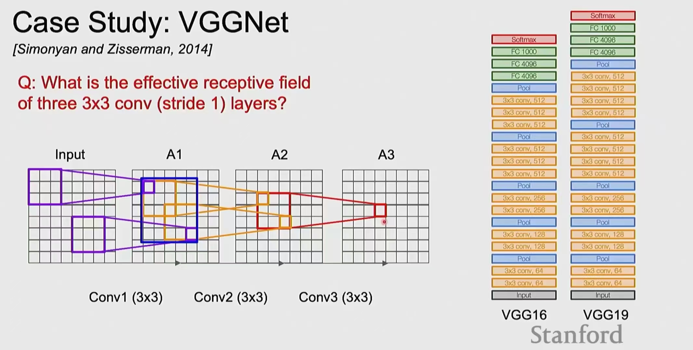

**论文：** [Simonyan and Zisserman, 2014]

**问题：三层 3×3 卷积（stride=1）的有效感受野是多少？**

**分析：**

```
Input → Conv1(3×3) → A1 → Conv2(3×3) → A2 → Conv3(3×3) → A3
```

**感受野计算：**
- 第一层：3×3
- 第二层：5×5（叠加后）
- 第三层：**7×7**

**VGGNet 架构特点：**
- 只使用 3×3 卷积
- 深度：VGG16（16层）、VGG19（19层）
- 简单但有效

**架构对比：**
```
VGG16:                    VGG19:
[Input]                   [Input]
[3×3 conv, 64] ×2         [3×3 conv, 64] ×2
[Pool]                    [Pool]
[3×3 conv, 128] ×2        [3×3 conv, 128] ×2
[Pool]                    [Pool]
[3×3 conv, 256] ×3        [3×3 conv, 256] ×4
[Pool]                    [Pool]
[3×3 conv, 512] ×3        [3×3 conv, 512] ×4
[Pool]                    [Pool]
[3×3 conv, 512] ×3        [3×3 conv, 512] ×4
[Pool]                    [Pool]
[FC-4096]                 [FC-4096]
[FC-4096]                 [FC-4096]
[FC-1000]                 [FC-1000]
[Softmax]                 [Softmax]
```

---

## Part 2: 如何训练 CNNs

### 5. 迁移学习 (Transfer Learning)

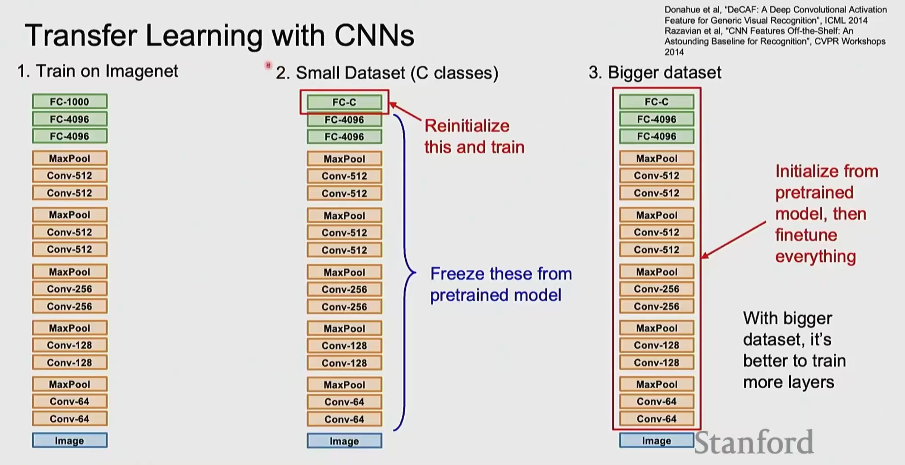

**参考文献：**
- Donahue et al., "DeCAF: A Deep Convolutional Activation Feature for Generic Visual Recognition", ICML 2014
- Razavian et al., "CNN Features Off-the-Shelf: An Astounding Baseline for Recognition", CVPR Workshops 2014

**三种场景的策略：**

#### 场景 1: 在 ImageNet 上预训练
```
[Input]
[Conv-64] ×2
[Conv-128] ×2
[MaxPool]
[Conv-256] ×2
[Conv-256] ×2
[MaxPool]
[Conv-512] ×2
[Conv-512] ×2
[MaxPool]
[FC-4096]
[FC-4096]
[FC-1000]
```

#### 场景 2: 小数据集（C 个类别）
```
[Input]
[Conv-64] ×2 (冻结)
[Conv-128] ×2 (冻结)
[MaxPool]
[Conv-256] ×2 (冻结)
[Conv-256] ×2 (冻结)
[MaxPool]
[Conv-512] ×2 (冻结)
[Conv-512] ×2 (冻结)
[MaxPool]
[FC-C] ← 重新初始化并训练
[FC-4096] (冻结)
[FC-4096] (冻结)
```

**策略：**
- 冻结预训练的卷积层
- 只重新训练最后的全连接层

#### 场景 3: 大数据集
```
[Input]
[Conv-64] ×2 ← 从预训练初始化
[Conv-128] ×2 ← 然后微调
[MaxPool]    ← 所有层
[Conv-256] ×2
...
[FC-C] ← 重新初始化
[FC-4096]
[FC-4096]
```

**策略：**
- 使用预训练权重初始化
- 微调整个网络

---

### 6. 迁移学习决策图

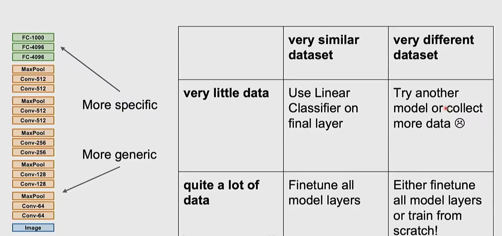

**决策矩阵：**

|  | **数据集非常相似** | **数据集非常不同** |
|---|---|---|
| **数据量很少** | 使用线性分类器<br>在最后一层 | 尝试其他模型<br>或收集更多数据 😢 |
| **数据量很多** | 微调所有<br>模型层 | 微调所有模型层<br>或从头训练！ |

**关键考虑因素：**
1. 数据集大小
2. 数据集与预训练集的相似度

---

### 7. 数据增强 (Data Augmentation)

#### 7.1 随机裁剪和缩放

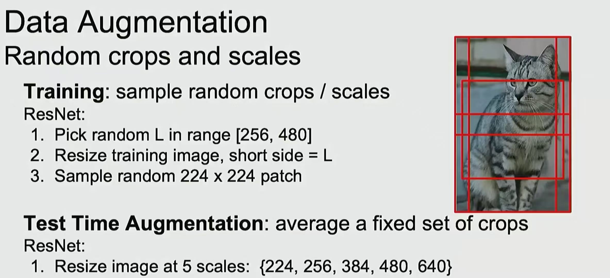

**训练时数据增强（ResNet）：**

1. **随机选择 L ∈ [256, 480]**
2. **调整图像短边 = L**
3. **随机采样 224×224 patch**

**测试时数据增强：**

**固定的多尺度裁剪集合取平均**

1. **在 5 个尺度调整图像：{224, 256, 384, 480, 640}**
2. **对每个尺度，使用 10 crop 评估网络**
3. **平均预测结果**

**可视化：**
```
原始图像
   ↓ [随机缩放]
多个不同尺寸的图像
   ↓ [随机裁剪224×224]
增强后的训练样本
```

#### 7.2 水平翻转

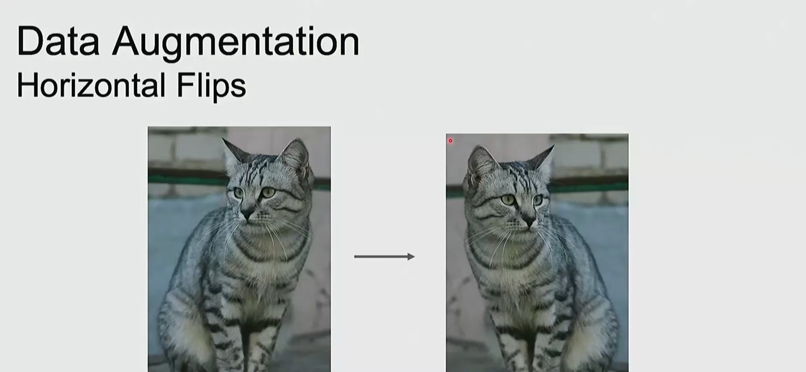

**水平翻转增强：**

```
原始图像           →        翻转后
[猫面向左]        [flip]    [猫面向右]
```

**实现：**
```python
# 50% 概率水平翻转
if random.random() > 0.5:
    image = image.flip(horizontal=True)
```

**注意：**
- 不要使用垂直翻转（大多数情况）
- 水平翻转保持语义不变

---

### 8. 正则化技术

#### 8.1 Dropout

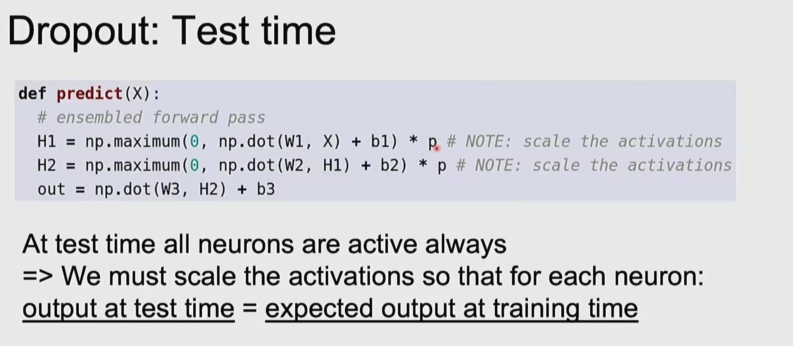

**测试时的 Dropout 处理：**

```python
def predict(X):
    # ensembled forward pass
    H1 = np.maximum(0, np.dot(W1, X) + b1) * p  # 注意：缩放激活
    H2 = np.maximum(0, np.dot(W2, H1) + b2) * p  # 注意：缩放激活
    out = np.dot(W3, H2) + b3
    return out
```

**关键点：**
- 测试时所有神经元都激活
- 必须缩放激活值，使得：
  - **测试时输出 = 训练时期望输出**

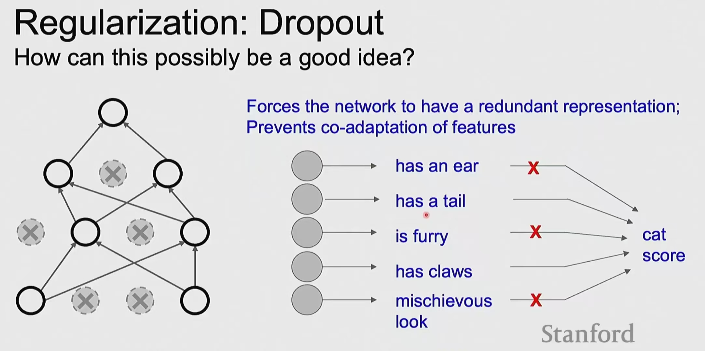

**Dropout 为什么有效？**

**核心思想：**
- **强制网络学习冗余表示**
- **防止特征共适应**

**示例：猫分类器**

```
特征提取器
    ↓
[has an ear] ───✗──→
[has a tail] ───────→ [cat score]
[is furry] ─────✗──→
[has claws] ────────→
[mischievous look] ─✗→
```

**没有 Dropout：**
- 网络可能只依赖部分特征

**有 Dropout：**
- 网络被迫学习所有有用特征
- 提高泛化能力

#### 8.2 Layer Normalization

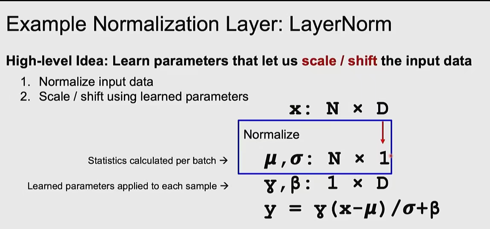

**高层思想：学习对输入数据进行缩放/平移的参数**

**两步过程：**

1. **归一化输入数据**
2. **使用学习的参数进行缩放/平移**

**数学表达：**

**输入：** $x: N \times D$

**步骤 1：归一化**
$$\mu, \sigma: N \times 1$$
$$\text{(统计量按 batch 计算)}$$

**步骤 2：缩放和平移**
$$\gamma, \beta: 1 \times D$$
$$\text{(学习的参数应用于每个样本)}$$

**最终公式：**
$$y = \gamma \frac{x - \mu}{\sigma} + \beta$$

---

## 关键要点总结

### 1. 迁移学习策略

| 数据量 | 相似数据集 | 不同数据集 |
|--------|-----------|-----------|
| 小 | 线性分类器 | 收集更多数据 |
| 大 | 微调所有层 | 从头训练 |

### 2. 数据增强技术

✅ **Random Crops & Scales**
- 训练：随机裁剪 224×224
- 测试：多尺度平均

✅ **Horizontal Flips**
- 50% 概率翻转
- 增加数据多样性

✅ **Color Jitter**
- 亮度、对比度调整
- HSV 空间变换

### 3. 权重初始化

**Kaiming/He 初始化（适用于 ReLU）：**
$$W \sim \mathcal{N}\left(0, \sqrt{\frac{2}{D_{in}}}\right)$$

**Xavier 初始化（适用于 Tanh/Sigmoid）：**
$$W \sim \mathcal{N}\left(0, \sqrt{\frac{1}{D_{in}}}\right)$$

### 4. 正则化方法

🔹 **Dropout**: 训练时随机丢弃，测试时缩放  
🔹 **Batch Normalization**: 按 batch 归一化  
🔹 **Layer Normalization**: 按特征维度归一化  
🔹 **Weight Decay**: L2 正则化

### 5. 经典架构对比

| 架构 | 特点 | 层数 |
|------|------|------|
| **VGGNet** | 只用3×3卷积 | 16-19 |
| **ResNet** | 残差连接 | 50-152 |
| **Inception** | 多尺度特征 | 22+ |

---

## 实践建议

### 训练 CNN 的步骤

1. **预处理数据**
   ```python
   # 减去均值
   X -= np.mean(X, axis=0)
   # 归一化
   X /= np.std(X, axis=0)
   ```

2. **选择架构**
   - 小数据：简单网络 + 迁移学习
   - 大数据：深层网络（ResNet、VGG）

3. **初始化权重**
   ```python
   # Kaiming initialization for ReLU
   nn.init.kaiming_normal_(layer.weight, mode='fan_out', nonlinearity='relu')
   ```

4. **数据增强**
   ```python
   transform = transforms.Compose([
       transforms.RandomResizedCrop(224),
       transforms.RandomHorizontalFlip(),
       transforms.ColorJitter(0.4, 0.4, 0.4),
       transforms.ToTensor(),
       transforms.Normalize(mean, std)
   ])
   ```

5. **训练监控**
   - Loss 曲线
   - 验证准确率
   - 学习率调度

---

