# RNN 与 LSTM（重写版课堂笔记）

本笔记基于提供的 lec6.* 幻灯片重新整理，围绕序列建模从 RNN 基础到 LSTM 的动机、结构与梯度流展开；每节均配有对应图片便于对照理解。

---

## 1. RNN 如何处理不同类型的序列

RNN 支持多种输入/输出对齐方式：one-to-one、one-to-many、many-to-one、many-to-many（对齐或不对齐），覆盖图像描述、机器翻译、视频逐帧分类等任务。

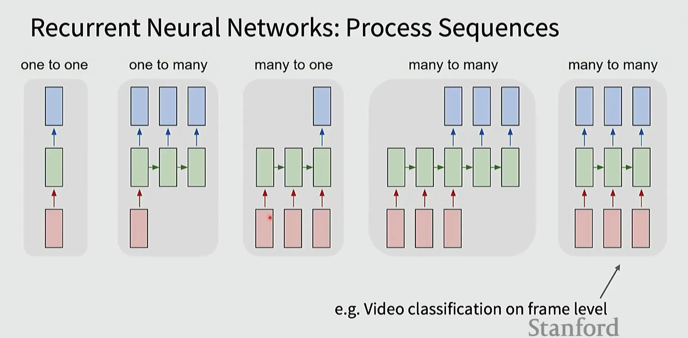

要点：
- 参数按时间共享，序列长度不影响参数规模；
- 输出可以在每个时间步产生，也可以只在末端产生；
- 训练时通常采用教师强制（teacher forcing）或自回归采样策略。

---

## 2. 隐藏状态更新公式（核心）

RNN 在每个时间步维护隐藏状态 ht：

$h_t = f_W(h_{t-1}, x_t)$

常见实例（vanilla RNN）：$h_t = \tanh(W_{hh} h_{t-1} + W_{xh} x_t)$，输出 $y_t = W_{hy} h_t$（或接 Softmax）。

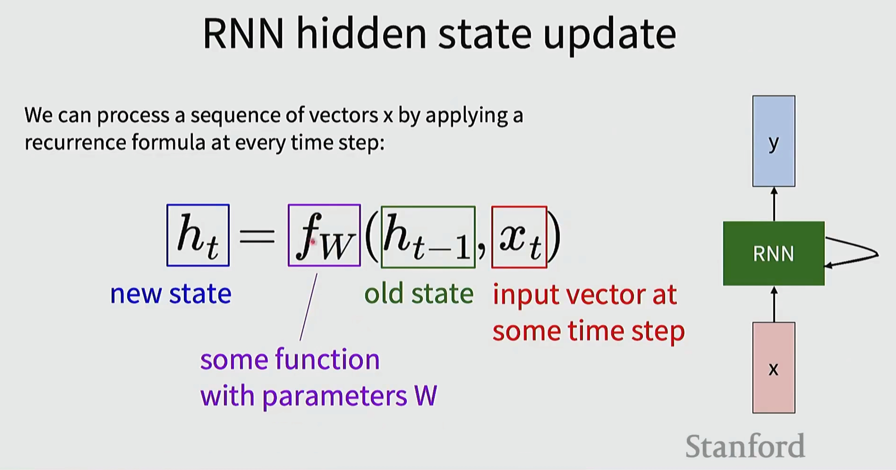

实践提示：选择非线性（tanh/ReLU）与权重初始化（如正交/Glorot）会显著影响梯度流动稳定性。

---

## 3. Vanilla(-ish) RNN 具体示例（手工构造）

这一示例手工设置权重，使网络能在二进制序列中“检测到重复的 1”。

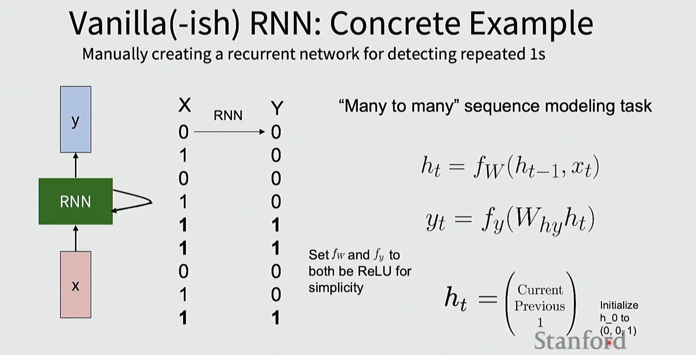

对应的简化代码与权重示意：

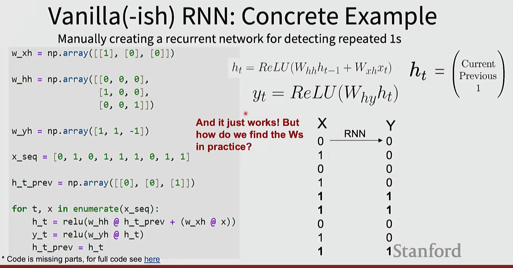

理解要点：
- 通过合适的 $W_{xh}, W_{hh}, W_{hy}$ 可以实现特定逻辑；
- 实际训练中并不手动设计权重，而是依靠损失 + 反向传播（BPTT）学习得到。

---

## 4. 截断的时序反向传播（Truncated BPTT）

RNN 的前向可跨越很长时间，但反向传播一般只回溯有限步（窗口大小为超参），以降低计算/显存开销并提升数值稳定性。

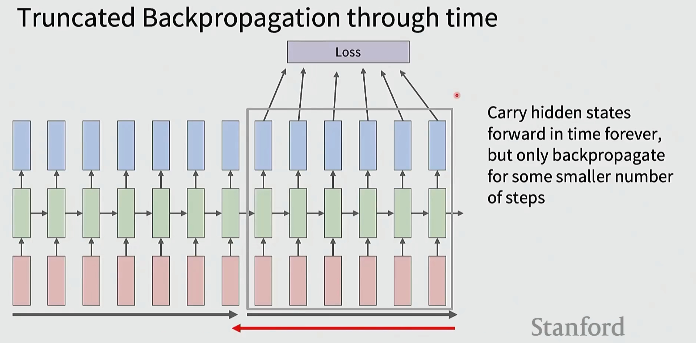

窗口过短会损失长程依赖，过长则训练代价和不稳定性上升；需结合任务调优。

---

## 5. 字符级语言模型与嵌入层（Embedding）

one-hot × 权重矩阵等价于“从权重矩阵中取出对应列”，这也解释了为何使用可训练的嵌入层更高效：

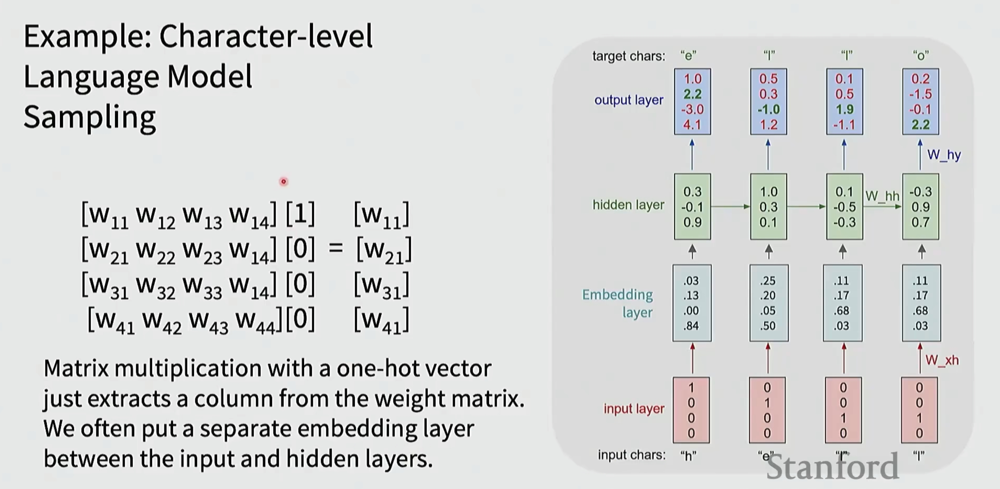

要点：
- 嵌入层将稀疏索引映射为稠密向量，参数共享且更易学习语义关系；
- 训练时通常自回归地采样下一个字符/子词。

---

## 6. RNN 的优缺点与模块组合

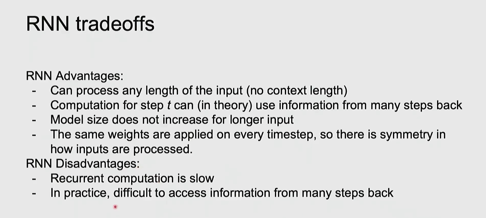

优点：
- 能处理任意长度的序列；参数不随长度线性增长；可在理论上利用远距信息。

缺点：
- 递归依赖导致并行度低；在实践中难以捕捉很远的依赖；易出现梯度消失/爆炸。

组合：常与 CNN/Transformer 等结合（如 CNN 抽特征 → RNN 建模时间关系）。

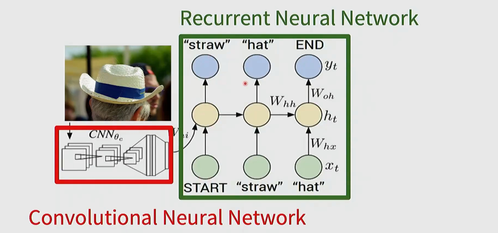

---

## 7. Vanilla RNN 的梯度流与数值问题

跨多个时间步的梯度链式相乘引入一连串雅可比矩阵与激活导数：

$\dfrac{\partial L_T}{\partial W} = \dfrac{\partial L_T}{\partial h_T} \left(\prod_{t=2}^{T} J_t\right) \dfrac{\partial h_1}{\partial W}$，其中 $J_t \approx \operatorname{diag}(\tanh'(\cdot)) W_{hh}^T$。

当 $\|J_t\| < 1$ 累乘趋零（梯度消失），$\|J_t\| > 1$ 累乘发散（梯度爆炸）。

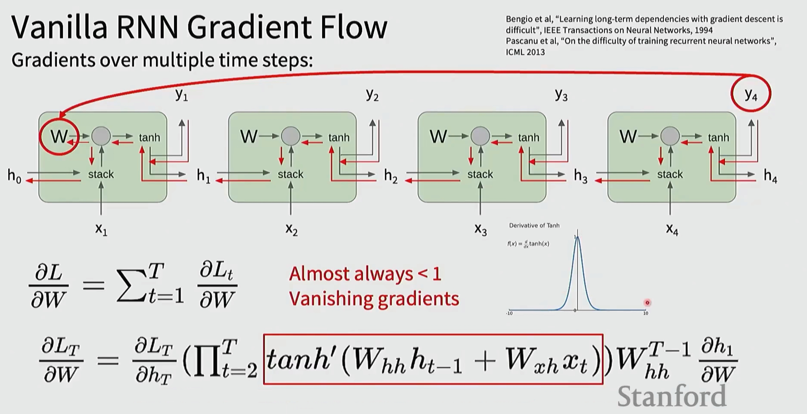

应对策略：
- 梯度爆炸：梯度裁剪（clip-by-norm / clip-by-value）；
- 梯度消失：改用门控结构（LSTM/GRU）、残差/跳连或正交初始化等。

---

## 8. LSTM：动机、结构与信息流

LSTM 通过门控机制控制信息的写入（input gate i）、遗忘（forget gate f）与输出（output gate o），并维护可长期保留的细胞状态 $c_t$：

- 状态更新：$c_t = f \odot c_{t-1} + i \odot g$；
- 隐状态：$h_t = o \odot \tanh(c_t)$。

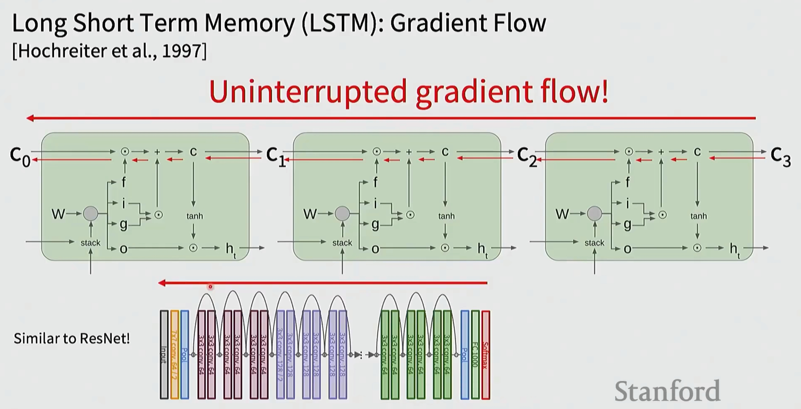

直观理解：细胞状态提供一条较“平坦”的梯度通道，缓解长序列中的梯度衰减，类似残差网络中的“快捷连接”。

---

## 10. 总结

- RNN 为序列建模提供统一框架，但基础 RNN 易遇到梯度消失/爆炸；
- LSTM/GRU 通过门控改善长程依赖的记忆与梯度流；
- 实践中常综合：Embedding +（CNN/特征提取）+ RNN/LSTM + 截断 BPTT + 梯度裁剪；
- 现代大规模任务更多转向 Transformer，但理解 RNN/LSTM 对时序建模与自动微分仍十分关键。

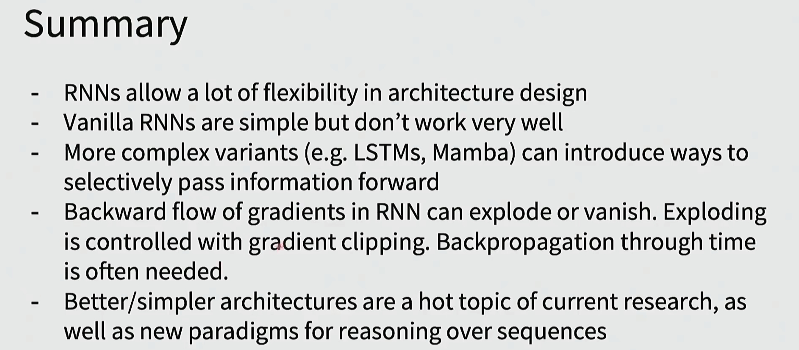
