# Lecture 6: Attention and Transformers


## 课程概览

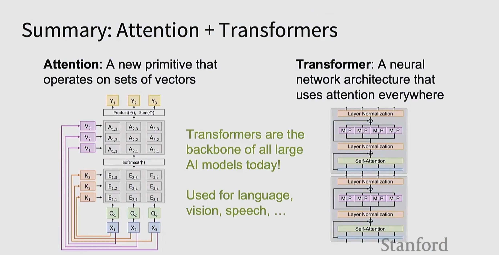

### 两大核心概念

#### 1️⃣ **Attention (注意力机制)**
- 一种新的原语操作，作用于向量集合
- 可以对序列中的不同部分赋予不同的权重

#### 2️⃣ **Transformer**
- 一种神经网络架构，在各处都使用注意力机制
- **Transformers 是当今所有大型 AI 模型的支柱！**
- 用于语言、视觉、语音等多个领域

**架构组成：**
- Layer Normalization（层归一化）
- MLP（多层感知机）
- Self-Attention（自注意力）
- 残差连接

---

## Part 1: Transformer 架构详解

### 1. Transformer 基础结构

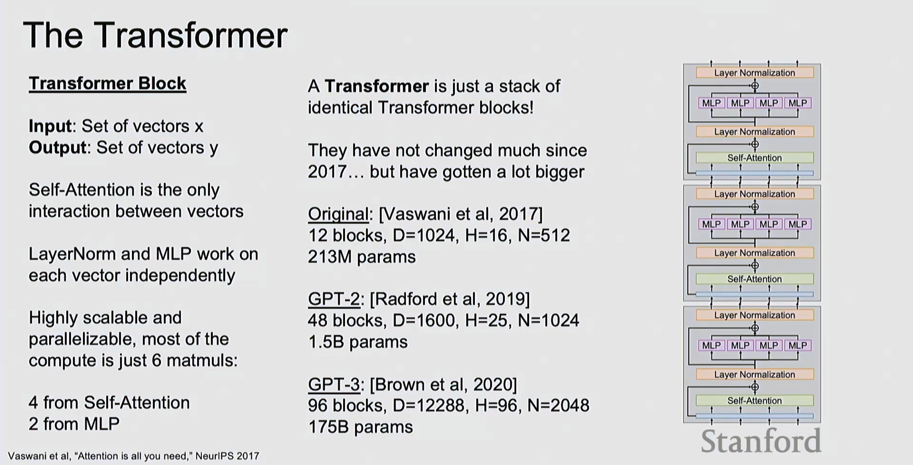

**Transformer Block（Transformer 块）：**

**输入：** 向量集合 x  
**输出：** 向量集合 y

**核心特点：**
- Self-Attention 是向量之间唯一的交互方式
- LayerNorm 和 MLP 独立作用于每个向量
- 高度可扩展和并行化
- 大部分计算只是 **6 个矩阵乘法**：
  - 4 个来自 Self-Attention
  - 2 个来自 MLP

**Transformer = 多个相同 Transformer 块的堆叠**

**发展历程：**

| 模型 | 年份 | 参数 | 配置 |
|------|------|------|------|
| **Original** | [Vaswani et al, 2017] | 213M | 12 blocks, D=1024, H=16, N=512 |
| **GPT-2** | [Radford et al, 2019] | 1.5B | 48 blocks, D=1600, H=25, N=1024 |
| **GPT-3** | [Brown et al, 2020] | 175B | 96 blocks, D=12288, H=96, N=2048 |

**变化趋势：**
- 结构基本不变（自 2017 年以来）
- 但模型规模越来越大

---

### 2. 序列处理的三种方式

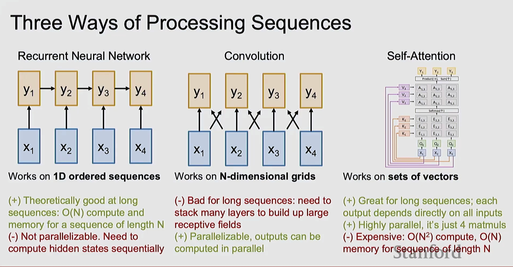

#### 2.1 循环神经网络 (RNN)

```
x₁ → y₁ → y₂ → y₃ → y₄
     ↑    ↑    ↑    ↑
    x₁   x₂   x₃   x₄
```

**适用于：** 1D 有序序列

**优点：**
- ✅ 理论上适合长序列：O(N) 计算和内存

**缺点：**
- ❌ 不可并行化：需要顺序计算隐藏状态

#### 2.2 卷积网络 (CNN)

```
     y₁   y₂   y₃   y₄
     ↑ ╱╲ ↑ ╱╲ ↑ ╱╲ ↑
    x₁   x₂   x₃   x₄
```

**适用于：** N 维网格

**优点：**
- ✅ 可并行化：输出可以并行计算

**缺点：**
- ❌ 不适合长序列：需要堆叠多层才能建立大感受野

#### 2.3 自注意力 (Self-Attention)

```
       Y₁  Y₂  Y₃
       ↑   ↑   ↑
    Product(→), Sum(↑)
         ↑
    [V₃ → A₁,₃ A₂,₃ A₃,₃]
    [V₂ → A₁,₂ A₂,₂ A₃,₂]
    [V₁ → A₁,₁ A₂,₁ A₃,₁]
         Softmax(↑)
    [K₃ → E₁,₃ E₂,₃ E₃,₃]
    [K₂ → E₁,₂ E₂,₂ E₃,₂]
    [K₁ → E₁,₁ E₂,₁ E₃,₁]
         ↑   ↑   ↑
        Q₁  Q₂  Q₃
         ↑   ↑   ↑
        X₁  X₂  X₃
```

**适用于：** 向量集合

**优点：**
- ✅ 适合长序列：每个输出直接依赖所有输入
- ✅ 高度并行：只需 4 个矩阵乘法

**缺点：**
- ❌ 昂贵：O(N²) 计算，O(N) 内存（序列长度为 N）

---

## Part 2: Self-Attention 详解

### 3. Self-Attention 的四个矩阵乘法

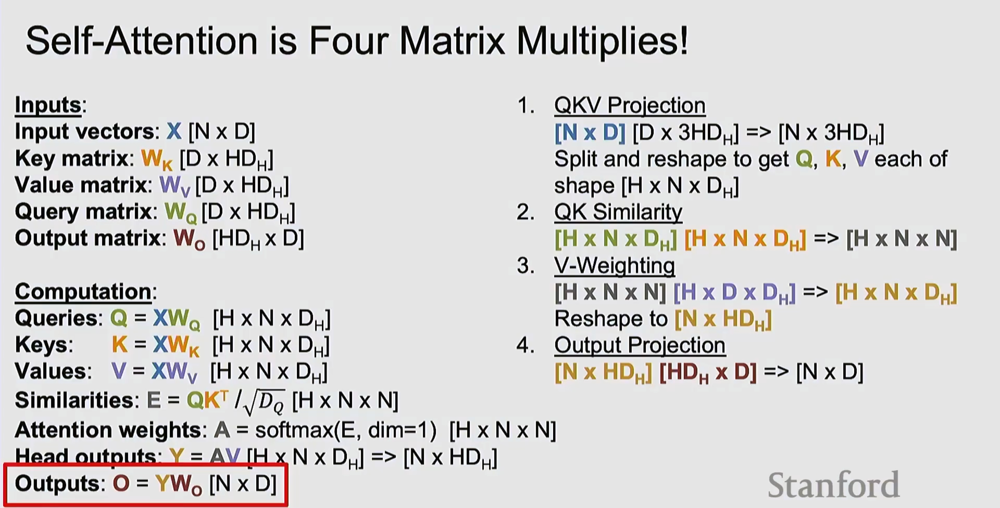

**输入：**
- **Input vectors:** X [N × D]
- **Key matrix:** W_K [D × HD_H]
- **Value matrix:** W_V [D × HD_H]
- **Query matrix:** W_Q [D × HD_H]
- **Output matrix:** W_O [HD_H × D]

**计算步骤：**

#### 步骤 1: QKV 投影
```
[N × D] [D × 3HD_H] => [N × 3HD_H]
```
分割并重塑得到 Q, K, V，每个形状为 [H × N × D_H]

#### 步骤 2: QK 相似度
```
[H × N × D_H] [H × N × D_H] => [H × N × N]
```
计算查询和键之间的相似度

#### 步骤 3: V-加权
```
[H × N × N] [H × D × D_H] => [H × N × D_H]
```
用注意力权重加权 Value 向量，重塑为 [N × HD_H]

#### 步骤 4: 输出投影
```
[N × HD_H] [HD_H × D] => [N × D]
```

**完整公式：**

```python
# 计算
Queries:  Q = XW_Q  [H × N × D_H]
Keys:     K = XW_K  [H × N × D_H]
Values:   V = XW_V  [H × N × D_H]

# 相似度（缩放点积）
Similarities: E = QK^T / √D_Q  [H × N × N]

# 注意力权重
Attention weights: A = softmax(E, dim=1)  [H × N × N]

# 头输出
Head outputs: Y = AV  [H × N × D_H] => [N × HD_H]

# 最终输出
Outputs: O = YW_O  [N × D]
```

---

### 4. 多头自注意力 (Multiheaded Self-Attention)

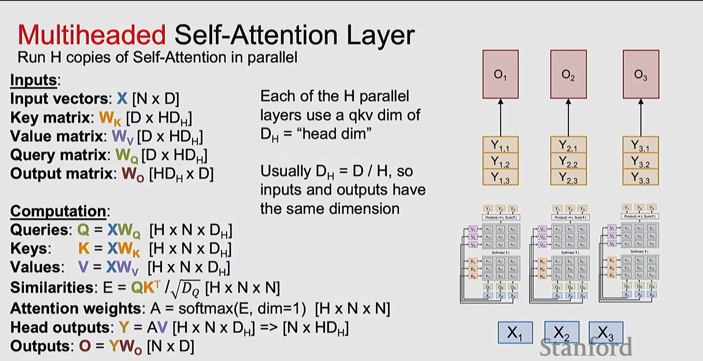

**并行运行 H 个 Self-Attention 副本**

**关键概念：**
- 每个并行层使用的 qkv 维度为 D_H = "head dim"
- 通常 D_H = D / H，因此输入和输出维度相同

**可视化：**

```
      O₁        O₂        O₃
       ↑         ↑         ↑
     Y₁,₁      Y₂,₁      Y₃,₁
     Y₁,₂      Y₂,₂      Y₃,₂
     Y₁,₃      Y₂,₃      Y₃,₃
       
   [各自的 Attention 矩阵]
       
      X₁        X₂        X₃
```

**H 个独立的注意力头，每个处理不同的特征子空间**

---

### 5. Masked Self-Attention（掩码自注意力）

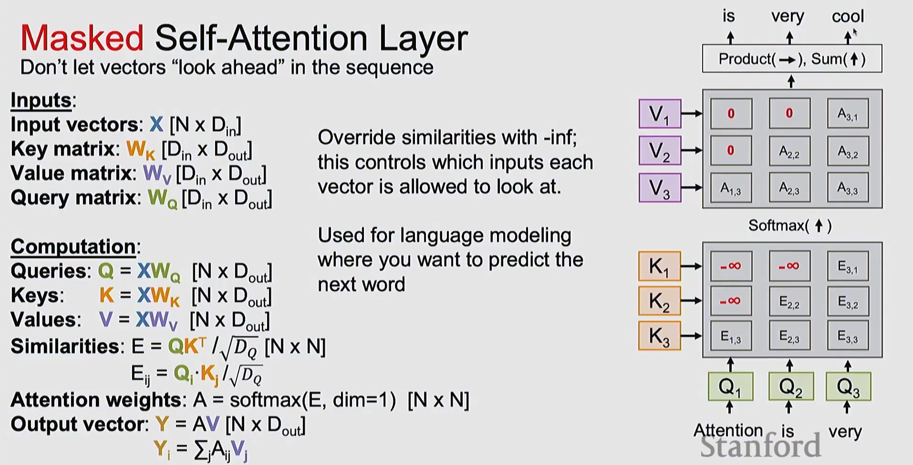

**用途：** 不让向量"向前看"序列中的未来信息

**典型应用：** 语言模型，预测下一个词

**输入：**
- Input vectors: X [N × D_in]
- Key matrix: W_K [D_in × D_out]
- Value matrix: W_V [D_in × D_out]
- Query matrix: W_Q [D_in × D_out]

**关键修改：**

**用 -∞ 覆盖相似度矩阵；这控制每个向量可以看到哪些输入**

```
       is    very   cool
        ↑      ↑      ↑
    Product(→), Sum(↑)
         ↑
[V₁ →  0      0    A₃,₁]
[V₂ →  0    A₂,₂   A₃,₂]
[V₃ → A₁,₃  A₂,₃   A₃,₃]
     Softmax(↑)
[K₁ → -∞     -∞    E₃,₁]
[K₂ → -∞    E₂,₂   E₃,₂]
[K₃ → E₁,₃  E₂,₃   E₃,₃]
      ↑      ↑      ↑
     Q₁     Q₂     Q₃
      ↑      ↑      ↑
  Attention  is   very
```

**效果：**
- V₁ 只能看到自己
- V₂ 可以看到 V₁ 和 V₂
- V₃ 可以看到所有向量

**数学表达：**
```
E_ij = Q_i · K_j / √D_Q

# 但在上三角设置为 -∞
如果 j > i: E_ij = -∞
```

---

### 6. Self-Attention Layer（完整版本）

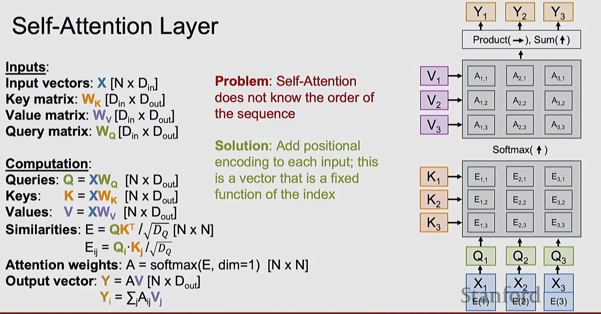

**问题：Self-Attention 不知道序列的顺序！**

**解决方案：添加位置编码**

**位置编码：**
- 为每个输入添加位置编码
- 这是一个固定的向量，是索引的函数

```
输入向量: X [N × D_in]
         ↓
    X + E(位置)
         ↓
      Q, K, V
```

**位置编码示例：**
```
X₁ + E(1)
X₂ + E(2)
X₃ + E(3)
```

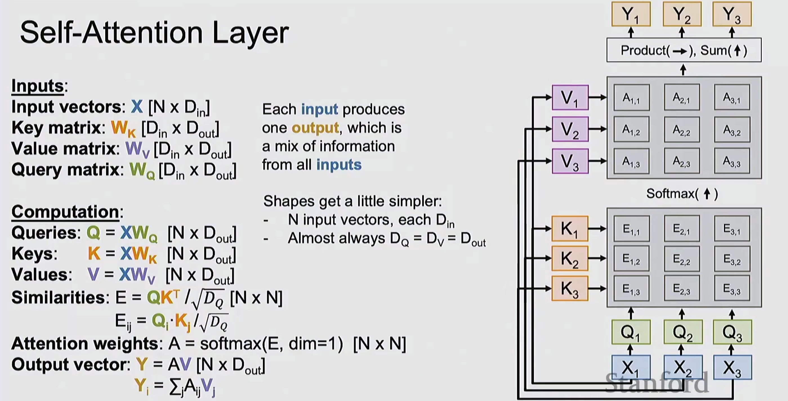

**完整的 Self-Attention 层：**

**每个输入产生一个输出，它是来自所有输入信息的混合**

**维度简化：**
- N 个输入向量，每个 D_in 维
- 几乎总是 D_Q = D_V = D_out

**关键公式：**
```
Y_i = ∑_j A_ij V_j
```

每个输出是所有 Value 向量的加权和。

---

## Part 3: Attention 机制的通用形式

### 7. 通用 Attention Layer

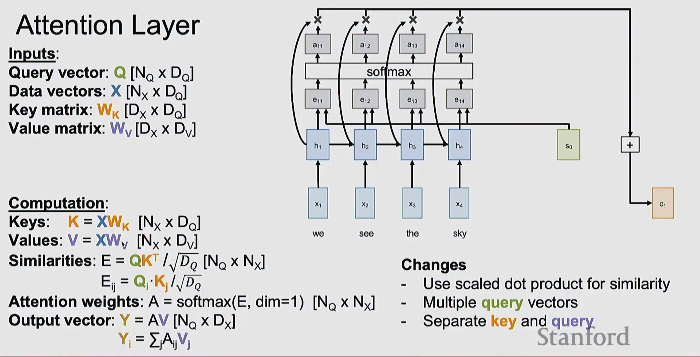

**输入：**
- **Query vector:** Q [N_Q × D_Q]
- **Data vectors:** X [N_X × D_Q]
- **Key matrix:** W_K [D_X × D_Q]
- **Value matrix:** W_V [D_X × D_V]

**计算：**
```
Keys:   K = XW_K  [N_X × D_Q]
Values: V = XW_V  [N_X × D_V]

Similarities: E = QK^T / √D_Q  [N_Q × N_X]
              E_ij = Q_i·K_j / √D_Q

Attention weights: A = softmax(E, dim=1)  [N_Q × N_X]

Output vector: Y = AV  [N_Q × D_X]
               Y_i = ∑_j A_ij V_j
```

**可视化：机器翻译中的 Attention**

```
   a₁₁   a₁₂   a₁₃   a₁₄
    ↑     ↑     ↑     ↑
      softmax
    ↑     ↑     ↑     ↑
   e₁₁   e₁₂   e₁₃   e₁₄
    ↑ ╱   ↑ ╱   ↑ ╱   ↑ ╱
   h₁    h₂    h₃    h₄   s₀  [+]→ c₁
    ↑     ↑     ↑     ↑
   x₁    x₂    x₃    x₄

   we   see   the   sky
```

**变化：**
- 使用缩放点积计算相似度
- 多个查询向量
- 分离的 key 和 query

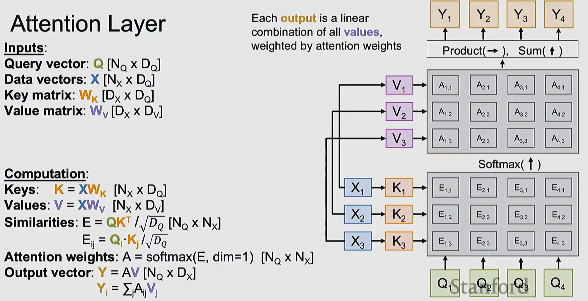

**每个输出是所有 values 的线性组合，由注意力权重加权**

```
      Y₁    Y₂    Y₃    Y₄
       ↑     ↑     ↑     ↑
    Product(→), Sum(↑)
         ↑
[V₁ → A₁,₁  A₂,₁  A₃,₁  A₄,₁]
[V₂ → A₁,₂  A₂,₂  A₃,₂  A₄,₂]
[V₃ → A₁,₃  A₂,₃  A₃,₃  A₄,₃]
     Softmax(↑)
[K₁ → E₁,₁  E₂,₁  E₃,₁  E₄,₁]
[K₂ → E₁,₂  E₂,₂  E₃,₂  E₄,₂]
[K₃ → E₁,₃  E₂,₃  E₃,₃  E₄,₃]
      ↑     ↑     ↑     ↑
 X₁→K₁   X₂→K₂  X₃→K₃    Q₄
  ↓       ↓      ↓
 X₁      X₂     X₃
```

---

## Part 4: RNN + Attention 的序列到序列模型

### 8. Seq2Seq with RNNs and Attention

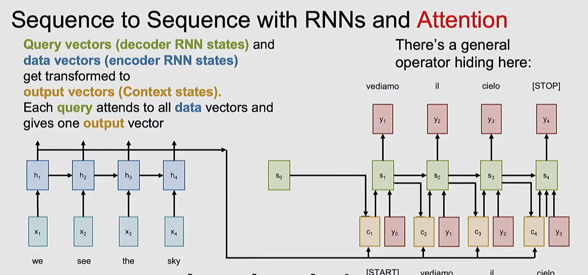

**Query vectors (解码器 RNN 状态)** 和  
**data vectors (编码器 RNN 状态)**  
被转换为  
**output vectors (Context states)**

每个 query 关注所有 data 向量，并给出一个 output 向量

**架构示例：机器翻译**

```
Encoder:              Decoder:
  h₁ → h₂ → h₃ → h₄ → c → s₀ → s₁ → s₂ → s₃ → s₄
  ↑    ↑    ↑    ↑         ↑    ↑    ↑    ↑
 x₁   x₂   x₃   x₄        y₀   y₁   y₂   y₃
                          ↓    ↓    ↓    ↓
 we  see  the  sky   [START] vediamo il cielo [STOP]
```

**这里有一个通用算子隐藏着！**

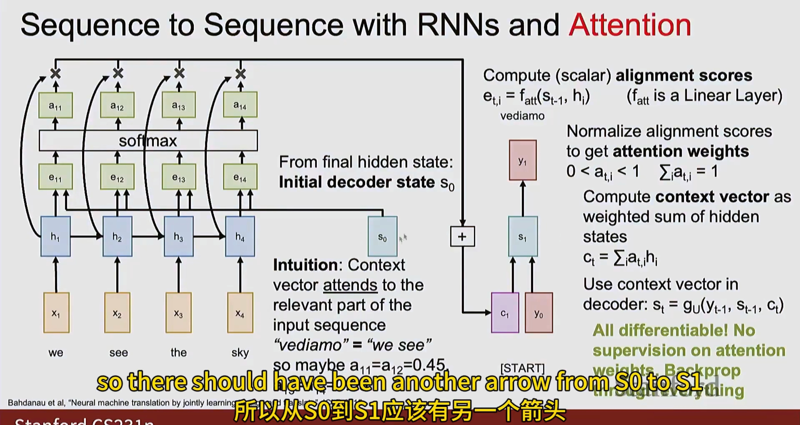

**计算（标量）对齐分数：**
```
e_t,i = f_att(s_t-1, h_i)  (f_att 是线性层)
```

**归一化对齐分数得到注意力权重：**
```
0 < a_t,i < 1    ∑_i a_t,i = 1
```

**将上下文向量计算为隐藏状态的加权和：**
```
c_t = ∑_i a_t,i h_i
```

**在解码器中使用上下文向量：**
```
s_t = g_U(y_t-1, s_t-1, c_t)
```

**全部可微分！注意力权重无需监督即可学习！**

---

### 9. Seq2Seq with RNNs（无 Attention）

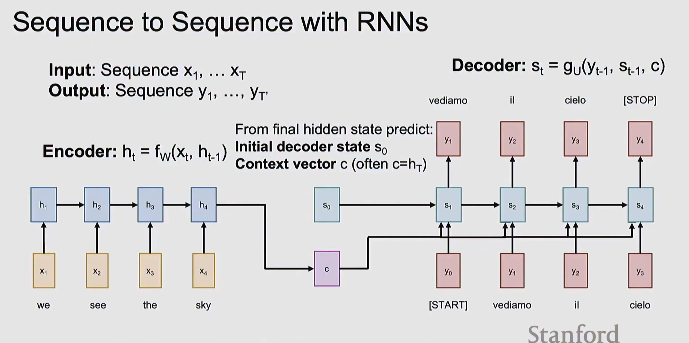

**输入：** 序列 x₁, ..., x_T  
**输出：** 序列 y₁, ..., y_T'

**Encoder:** 
```
h_t = f_W(x_t, h_t-1)
```

从最终隐藏状态预测：
- **初始解码器状态 s₀**
- **上下文向量 c**（通常 c=h_T）

**Decoder:**
```
s_t = g_U(y_t-1, s_t-1, c)
```

```
   h₁ → h₂ → h₃ → h₄
   ↑    ↑    ↑    ↑          c
  x₁   x₂   x₃   x₄          ↓
                         s₀ → s₁ → s₂ → s₃ → s₄
                              ↑    ↑    ↑    ↑
                             y₀   y₁   y₂   y₃
                              ↓    ↓    ↓    ↓
  we  see  the  sky    [START] vediamo il cielo
```

---

## 关键要点总结

### 1. 三种序列处理方式对比

| 方法 | 优点 | 缺点 | 复杂度 |
|------|------|------|--------|
| **RNN** | 理论上适合长序列 | 不可并行化 | O(N) |
| **CNN** | 可并行化 | 需要多层建立感受野 | O(1) per layer |
| **Self-Attention** | 直接建模长程依赖 | 计算昂贵 | O(N²) |

### 2. Self-Attention 的四个步骤

1. **QKV 投影**：将输入投影到 Query、Key、Value 空间
2. **计算相似度**：Q·K^T / √D_Q
3. **加权求和**：softmax(相似度) × V
4. **输出投影**：线性变换得到最终输出

### 3. Transformer 的核心组件

```
[Layer Normalization]
        ↓
   [MLP | MLP | MLP | MLP]
        ↓
[Layer Normalization]
        ↓
  [Self-Attention]
        ↓
[Layer Normalization]
        ↓
   [MLP | MLP | MLP | MLP]
        ↓
[Layer Normalization]
        ↓
  [Self-Attention]
```

### 4. Attention 的数学本质

**核心思想：**
- 每个输出是所有输入的加权组合
- 权重通过相似度计算得到
- 完全可微分，端到端训练

**公式：**
```
E = QK^T / √D_Q
A = softmax(E)
Y = AV
```

