# 课程笔记：Transformer 视觉、分割与检测综述（Lecture 8）

## 一、Vision Transformers（ViT）

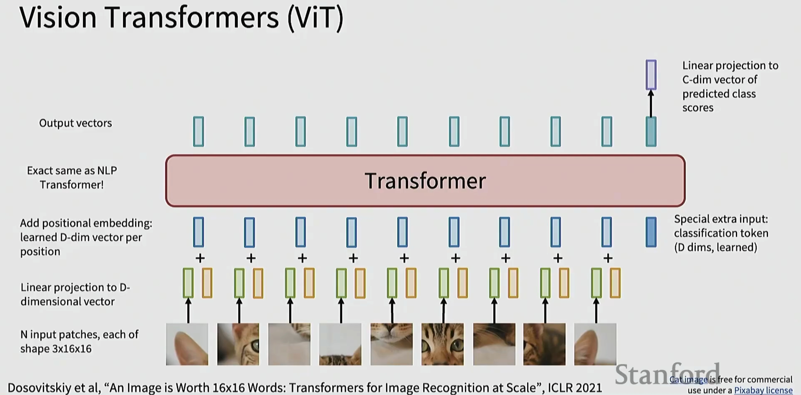

- 将图像切成 N 个 patch（如 16x16），线性投影到 D 维，再加位置编码，送入标准 Transformer 编码器。
- 额外加入 `CLS` token；输出的 `CLS` 向量经线性层得到类别分数。

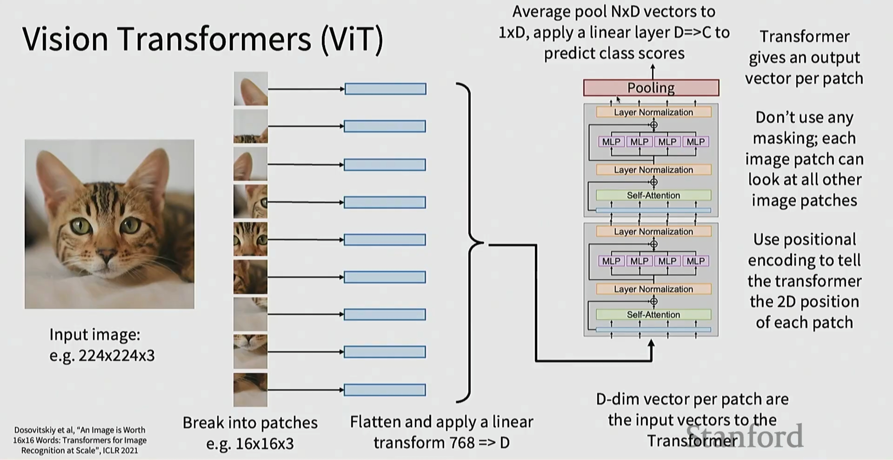

- Patch 展平后线性变换得到 D 维向量，作为 Transformer 的输入序列。
- 编码器对每个 patch 输出一个 D 维向量；可池化或用 `CLS` 进行分类。

## 二、架构细节：归一化与 MLP 变体

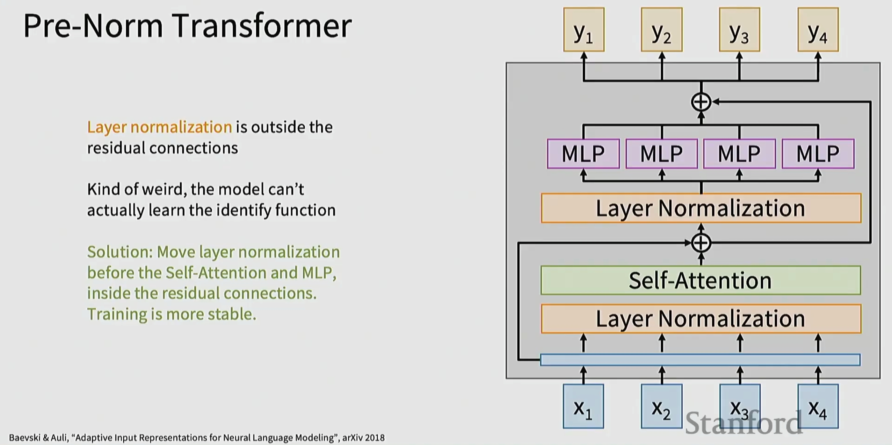

- 将 LayerNorm 放到子层（自注意力/MLP）之前（Residual 内部），训练更稳定，梯度更好传播。

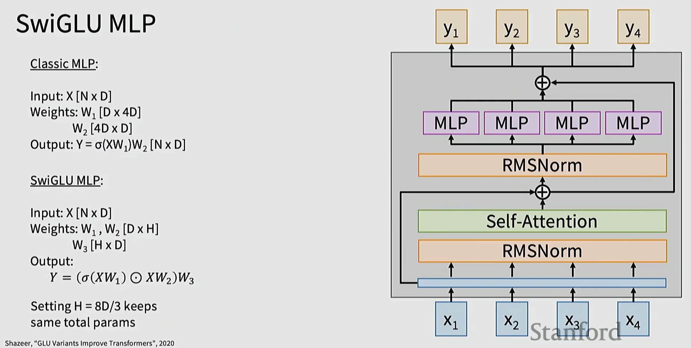

- 以门控方式替代经典 ReLU MLP：输出 `y = (σ(xW1) ⊙ xW2) W3`；在相同参数量下表现更佳。

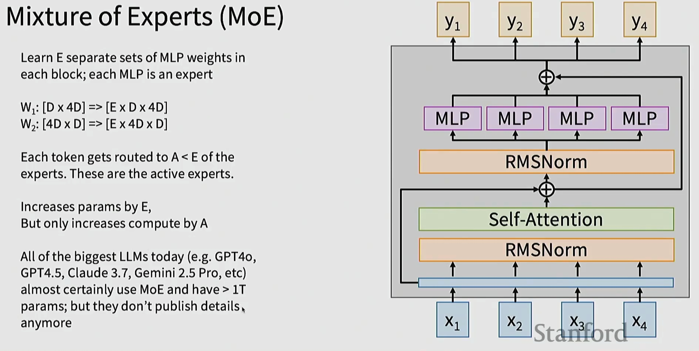

- 为每个块学习 E 组 MLP（专家），路由器将 token 仅送往 A 个活跃专家；参数增多但计算随 A 增加，性价比高。

## 三、语义分割：Fully Convolutional 思想

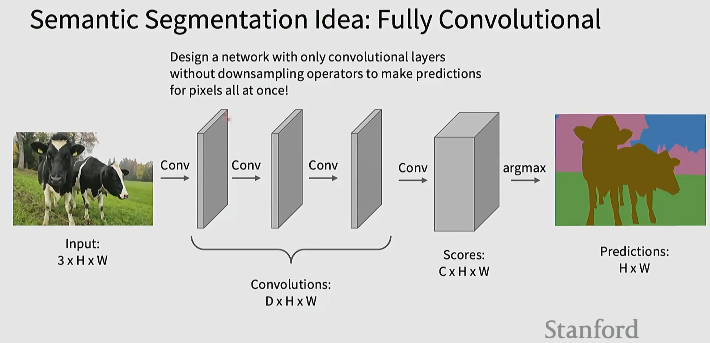

- 仅用卷积产生 `C×H×W` 得分，再对每像素取 `argmax` 得到 `H×W` 预测。

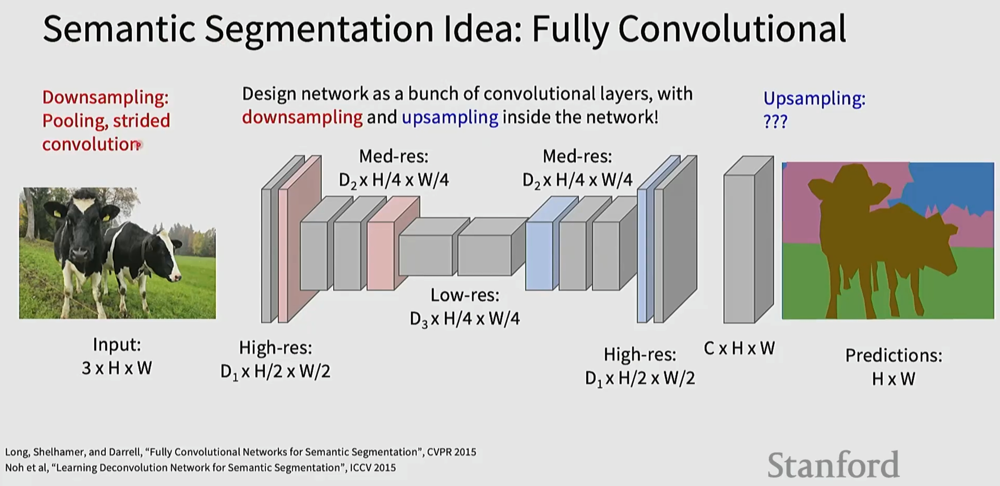

- 网络内部包含下采样与上采样；多尺度特征逐步恢复空间分辨率。

### 上采样方式

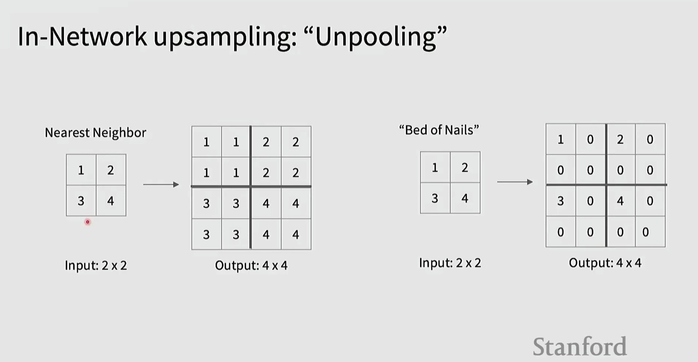

- 最近邻复制与“钉床”插零是最简单的非学习型上采样。

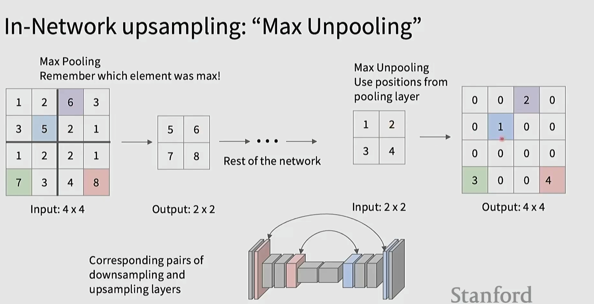

- 记录 MaxPool 的位置索引，在上采样时把值放回原最大位置，其余置零。

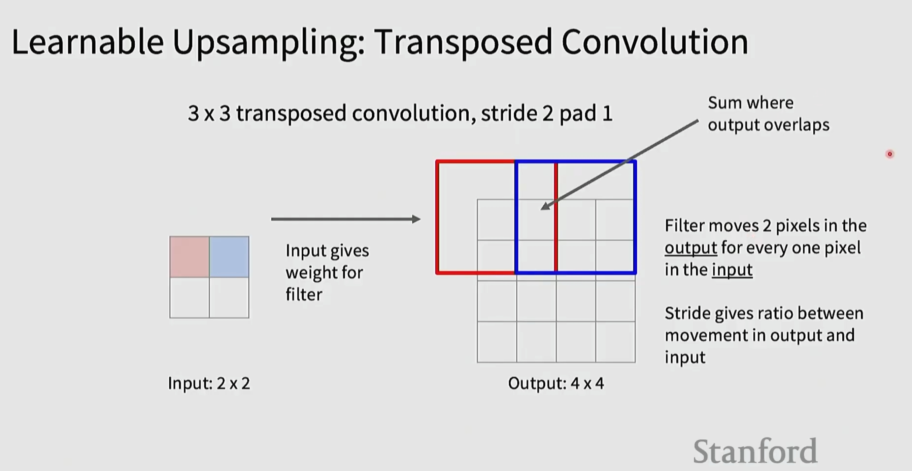

- 可学习的上采样。步幅决定输入输出位移比例；重叠区域求和可能导致棋盘格伪影，需合理设计内核/步幅/填充。

## 四、目标检测基础与两阶段方法

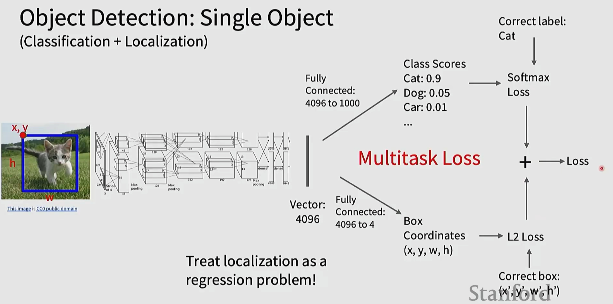

- 将分类（Softmax）与框回归（L2 或 Smooth L1）组合为多任务损失。

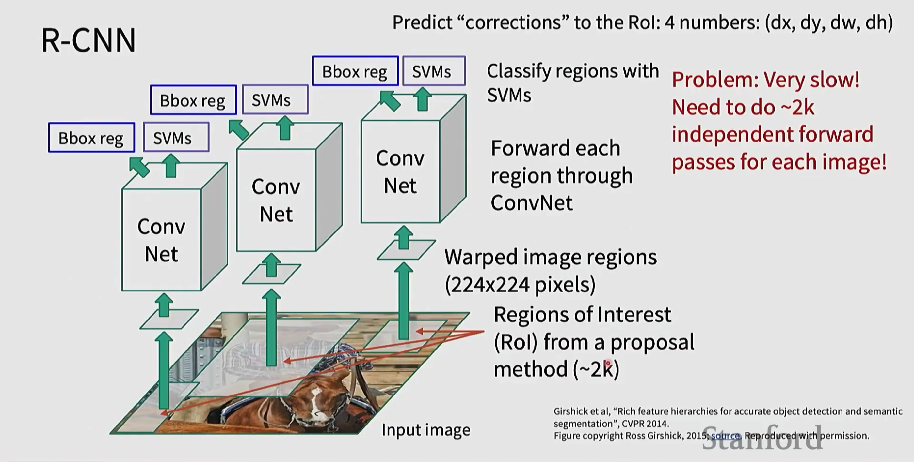

- 对每个候选区域独立前向，极其缓慢（~2k 次/图）。

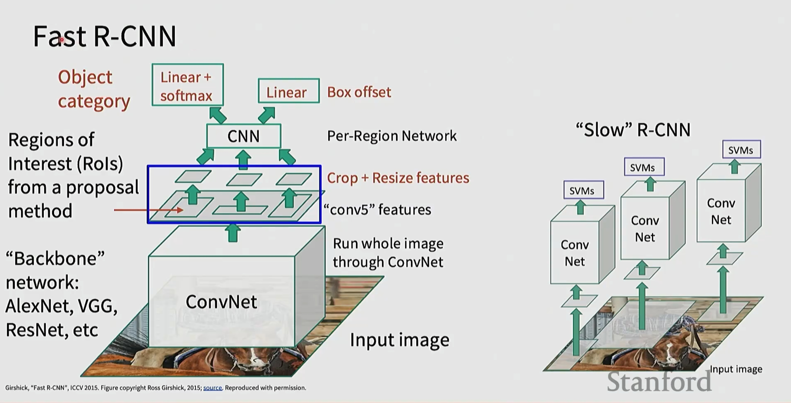

- 先对整图提特征，再 `RoI Align/Pool` 裁剪；共享主干，显著加速。

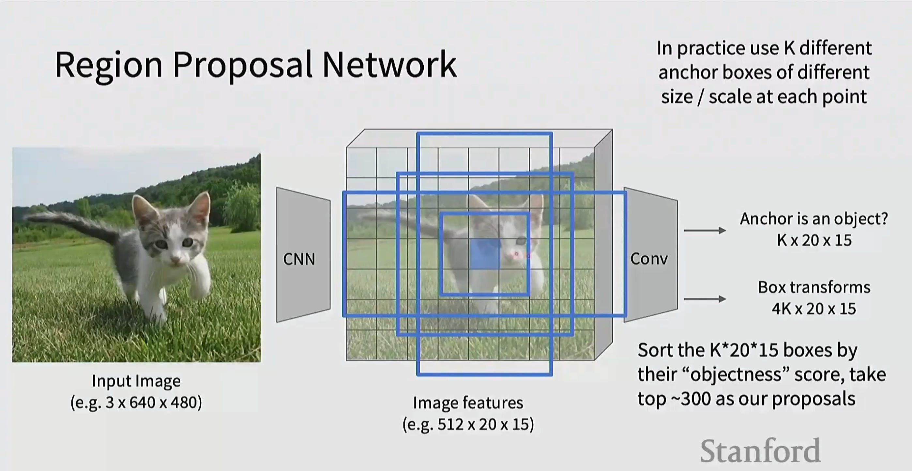

- 在特征图每个位置产生多尺度/多宽高比的锚框，预测“目标性”与框变换；与 Fast R-CNN 结合形成 Faster R-CNN。

## 五、单阶段检测器与 Transformer 检测

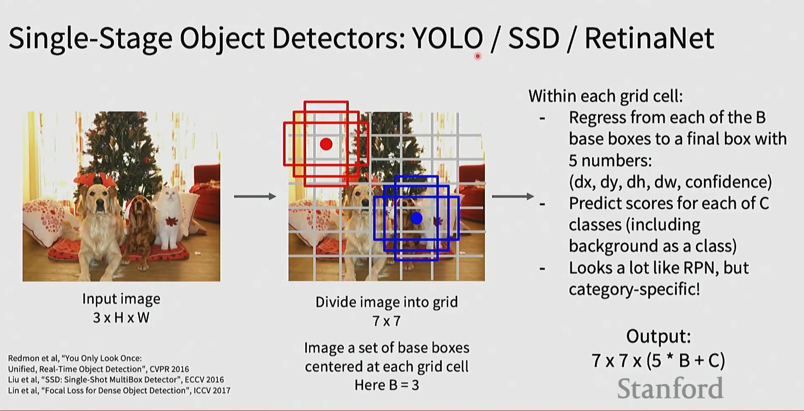

- 将图像划分网格，在每格预测若干基框的类别与偏移；端到端、速度快。RetinaNet 通过 Focal Loss 处理正负样本不平衡。

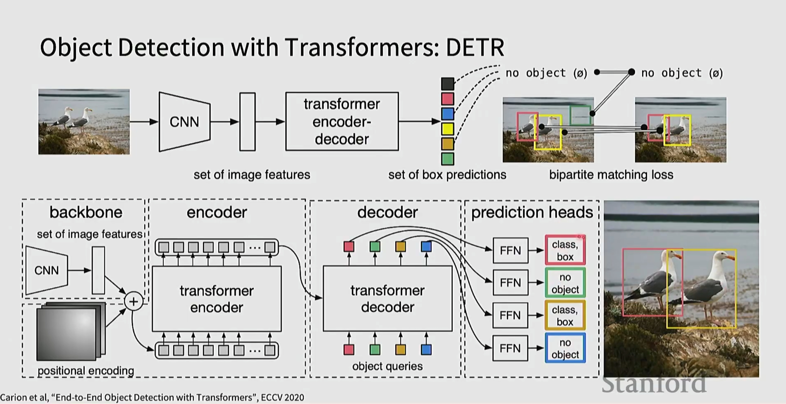

- CNN 提特征 + Transformer 编解码器 + 固定数量查询；通过二分图匹配（Hungarian）对齐预测与真值，实现端到端检测，无需 NMS 与锚框。

## 六、实例分割：Mask R-CNN

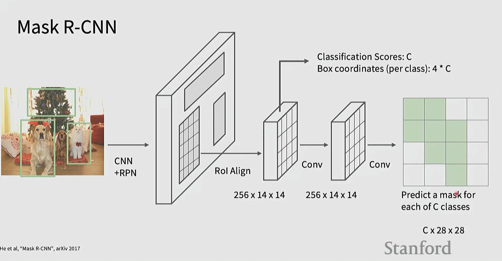

- 在检测分支基础上增加像素级掩码分支；每个 RoI 预测对应类别的二值掩码，实现实例级分割。

## 七、可解释性与可视化

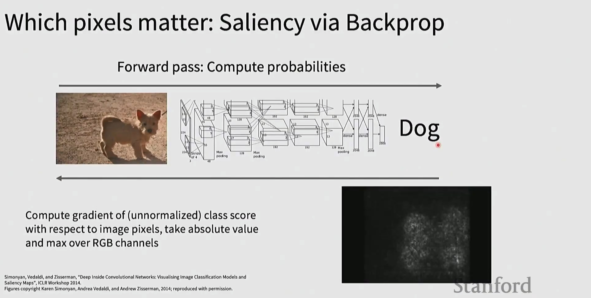

- 对未归一化类别分数对输入像素求梯度并取绝对值，可视化模型关注区域（噪声较大）。

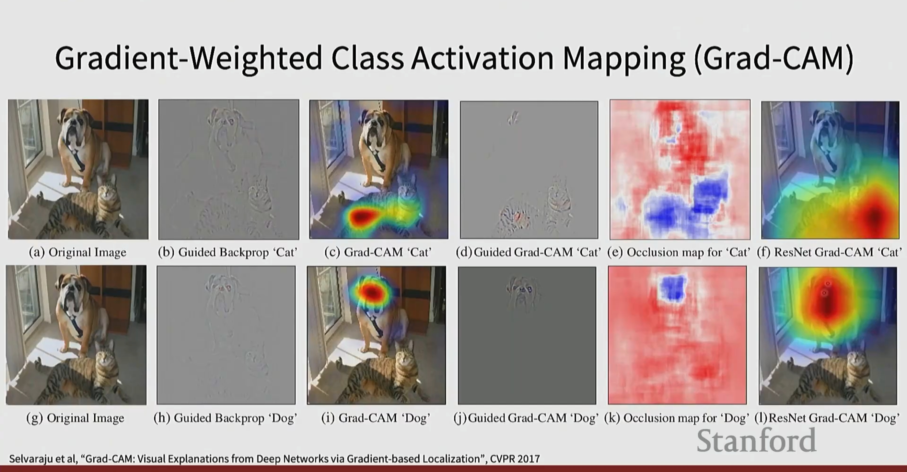

- 以类别梯度对最后一层卷积特征图加权求和并上采样，得到类激活热图；可与 Guided Backprop 结合细化边缘。

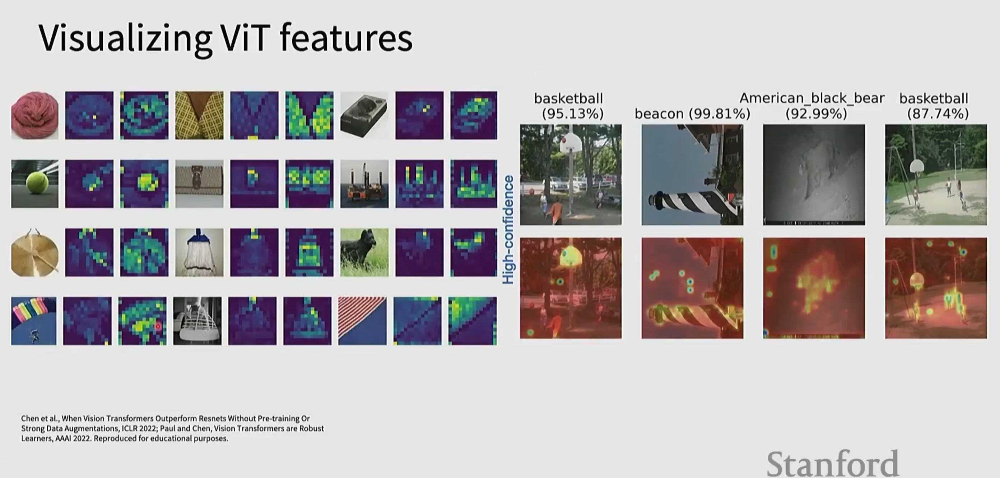

- ViT 在强数据增强下学到更鲁棒的补丁级模式；高置信预测对应的注意/激活可视化显示其关注的关键区域。

---

参考论文与关键词（按出现顺序）：
- Dosovitskiy et al., An Image is Worth 16x16 Words: ViT, ICLR 2021
- Baevski & Auli, Pre-Norm; Shazeer, GLU Variants Improve Transformers, 2020
- Long et al., Fully Convolutional Networks for Semantic Segmentation, CVPR 2015
- He et al., Mask R-CNN, 2017; Ren et al., Faster R-CNN, 2015
- Redmon et al., YOLO; Liu et al., SSD; Lin et al., Focal Loss/RetinaNet
- Carion et al., End-to-End Object Detection with Transformers (DETR), ECCV 2020
- Selvaraju et al., Grad-CAM, CVPR 2017

